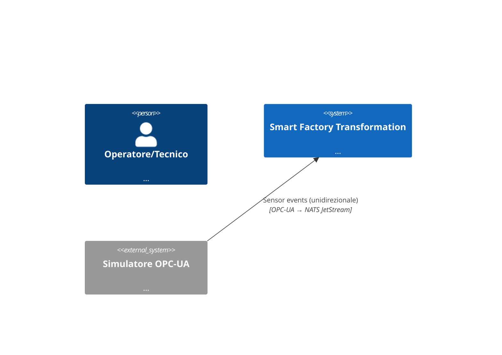

<objective>
Completare Target Architecture (DOC-04/DEL-01) e Analisi Funzionale (DOC-06/DEL-02): arricchire `architecture/overview.md` e creare `c4-context.md`/`c4-container.md`/`c4-component.md` con diagrammi C4 Mermaid (C4Context/C4Container/C4Component, supportati nativamente da Material 9.x via superfences); popolare `functional-analysis/*.md` con i workflow end-to-end OPS/MNT/TRN come diagrammi Mermaid flow/sequence. Tutto tracciabile al codice spedito (SC-3, no aspirational). Aggiungere le 3 nuove pagine C4 al nav (+EN).

Purpose: realizza DEL-01 (Target Architecture) e DEL-02 (End-to-End Workflows) come testo Mermaid (SC-5, zero immagini binarie).
Output: 4 pagine architettura + 4 funzionali IT, mirror EN, nav aggiornato per le 3 nuove pagine C4.

Execution note: SEQUENZIALE su main tree. Wave 3; dipende SOLO da 12-00. File disgiunti da 12-02b (architecture/ + functional-analysis/ vs use-cases/ + adoption-roadmap/). Tocca mkdocs.yml SOLO per aggiungere le 3 pagine C4 sotto Architettura — coordinare: 12-02b NON tocca mkdocs.yml (le sue pagine sono già nel nav da Wave 0).

SC-3 traceability: scrivere SOLO ciò che è implementato (Codebase State Audit del RESEARCH): 16 agenti/4 cluster (Phase 6/7/8/9), HITL interrupt-resume (Phase 4), OEPV (Phase 9), Angular SSR UI (Phase 10), RAG BGE-M3/Qdrant (Phase 5), OPC-UA→NATS unidirezionale.
</objective>

<execution_context>
@$HOME/.claude/get-shit-done/workflows/execute-plan.md
@$HOME/.claude/get-shit-done/templates/summary.md
</execution_context>

<context>
@.planning/PROJECT.md
@.planning/ROADMAP.md
@.planning/phases/12-documentation-economic-model-competition-deliverables/12-CONTEXT.md
@.planning/phases/12-documentation-economic-model-competition-deliverables/12-RESEARCH.md
@.planning/phases/12-documentation-economic-model-competition-deliverables/12-00-SUMMARY.md
@docs/docs/architecture/overview.md

<interfaces>
<!-- Mermaid C4 (RESEARCH Pattern 3 + Code Examples) — supportato da superfences già configurato: -->

<!-- Sistema implementato (SC-3): 16 agenti, 4 cluster OPS/MNT/TRN(Knowledge)/SCM; supervisor LangGraph; HITL 4-tier; RAG hybrid BGE-M3 + Qdrant; OT bridge OPC-UA→NATS. -->
<!-- mkdocs.yml: la sezione Architettura esiste; aggiungere c4-context/container/component sotto di essa + nav_translations già coperte (Overview→Overview presente). -->
</interfaces>
</context>

<tasks>

<task type="auto">
  <name>Task 1: C4 Context/Container/Component Mermaid + overview arricchito + nav</name>
  <files>docs/docs/architecture/overview.md, docs/docs/architecture/c4-context.md, docs/docs/architecture/c4-container.md, docs/docs/architecture/c4-component.md, docs/docs/en/architecture/c4-context.md, docs/docs/en/architecture/c4-container.md, docs/docs/en/architecture/c4-component.md, docs/mkdocs.yml</files>
  <action>Creare `c4-context.md` (C4Context Mermaid: persone Operatore/Tecnico/Manager, sistema SFT, sistemi esterni Simulatore OPC-UA + ERP/MES fuori scope, relazione OPC-UA→NATS unidirezionale), `c4-container.md` (C4Container: api-gateway, ot-bridge, supervisor/agent runtime LangGraph, knowledge-ingest, Qdrant, NATS JetStream, Postgres/Timescale, Ollama, Angular SSR UI — solo container realmente implementati), `c4-component.md` (C4Component dell'agent runtime: supervisor + 4 cluster + HITL interrupt + audit). Arricchire `overview.md` con un paragrafo che lega i 3 livelli C4 + un data-flow Mermaid. Tutti i diagrammi come fenced ```mermaid``` (zero PNG). Creare i mirror EN. Aggiungere al nav (sotto `Architettura`) le 3 pagine C4 (es. C4 Context/C4 Container/C4 Component) — le etichette "C4 Context" ecc. non richiedono traduzione (identiche IT/EN) ma aggiungere comunque in nav_translations se l'etichetta italiana differisce. SC-3: ogni elemento del diagramma deve esistere nel codice spedito.</action>
  <verify>
    <automated>cd docs && for f in c4-context c4-container c4-component; do grep -q "mermaid" "docs/architecture/$f.md" && grep -q "mermaid" "docs/en/architecture/$f.md" || { echo "no mermaid in $f"; exit 1; }; done; grep -q "C4Context" docs/architecture/c4-context.md && grep -q "C4Container" docs/architecture/c4-container.md && grep -q "C4Component" docs/architecture/c4-component.md && python3 -m mkdocs build --strict</automated>
  </verify>
  <done>3 pagine C4 (Context/Container/Component) come Mermaid + overview arricchito; mirror EN; nav aggiornato; zero immagini binarie; build strict verde; elementi tracciabili al codice.</done>
</task>

<task type="auto">
  <name>Task 2: Workflow end-to-end OPS/MNT/TRN come Mermaid (DOC-06/DEL-02)</name>
  <files>docs/docs/functional-analysis/index.md, docs/docs/functional-analysis/operations-workflow.md, docs/docs/functional-analysis/maintenance-workflow.md, docs/docs/functional-analysis/training-workflow.md, docs/docs/en/functional-analysis/index.md, docs/docs/en/functional-analysis/operations-workflow.md, docs/docs/en/functional-analysis/maintenance-workflow.md, docs/docs/en/functional-analysis/training-workflow.md</files>
  <action>Popolare `functional-analysis/index.md` (panoramica dei 3 workflow + tabella agente→cluster), e i 3 file workflow ciascuno con un diagramma Mermaid flowchart o sequenceDiagram end-to-end che mappa gli step ai veri agenti implementati: `operations-workflow.md` (OperatorAssistant/ProductionPlanner/QualityInspector/AnomalyDetector + HITL approval + audit — Phase 6), `maintenance-workflow.md` (PredictiveMaintenance/RCASpecialist/MaintenanceCoach/DowntimeAnalyzer — Phase 7), `training-workflow.md` (cluster Knowledge: ShiftHandover/TrainingCoach/KnowledgeCurator/DocumentationSynthesizer — Phase 8). Ogni workflow deve includere l'evento sensore OPC-UA→NATS, il retrieval RAG dove pertinente, il punto HITL interrupt-resume. SOLO comportamenti implementati (SC-3, citare le SUMMARY di fase). Mirror EN. Nessun ``.</action>
  <verify>
    <automated>cd docs && for f in operations-workflow maintenance-workflow training-workflow; do grep -q "mermaid" "docs/functional-analysis/$f.md" && grep -q "mermaid" "docs/en/functional-analysis/$f.md" || { echo "no mermaid in $f"; exit 1; }; ! grep -q '!\[' "docs/functional-analysis/$f.md" || { echo "binary img ref in $f"; exit 1; }; done; python3 -m mkdocs build --strict</automated>
  </verify>
  <done>4 pagine funzionali IT+EN; ogni workflow OPS/MNT/TRN ha diagramma Mermaid end-to-end tracciabile agli agenti spediti; nessun ``; build strict verde.</done>
</task>

</tasks>

<threat_model>
## Trust Boundaries

| Boundary | Description |
|----------|-------------|
| docs claim → shipped code | Ogni diagramma deve rispecchiare il sistema implementato (SC-3) |

## STRIDE Threat Register

| Threat ID | Category | Component | Disposition | Mitigation Plan |
|-----------|----------|-----------|-------------|-----------------|
| T-12-02a-01 | Repudiation | diagramma descrive feature non implementata (aspirational) | mitigate | Tracciabilità a SUMMARY di fase nel testo; Codebase State Audit del RESEARCH come riferimento; SC-3 verificato in 12-05. |
| T-12-02a-02 | Tampering | immagine binaria iniettata come diagramma | mitigate | Solo fenced ```mermaid```; verify asserisce assenza di ``; zero PNG nuovi.
- `mkdocs build --strict` verde.
</verification>

<success_criteria>
DOC-04/DEL-01 + DOC-06/DEL-02 chiusi: Target Architecture C4 (Context/Container/Component) e workflow OPS/MNT/TRN come testo Mermaid tracciabili al codice spedito (SC-3, SC-5).
</success_criteria>

<output>
Create `.planning/phases/12-documentation-economic-model-competition-deliverables/12-02a-SUMMARY.md` when done.
</output>
