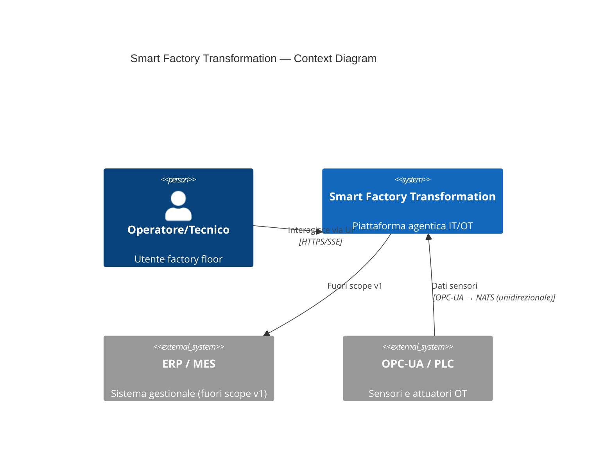
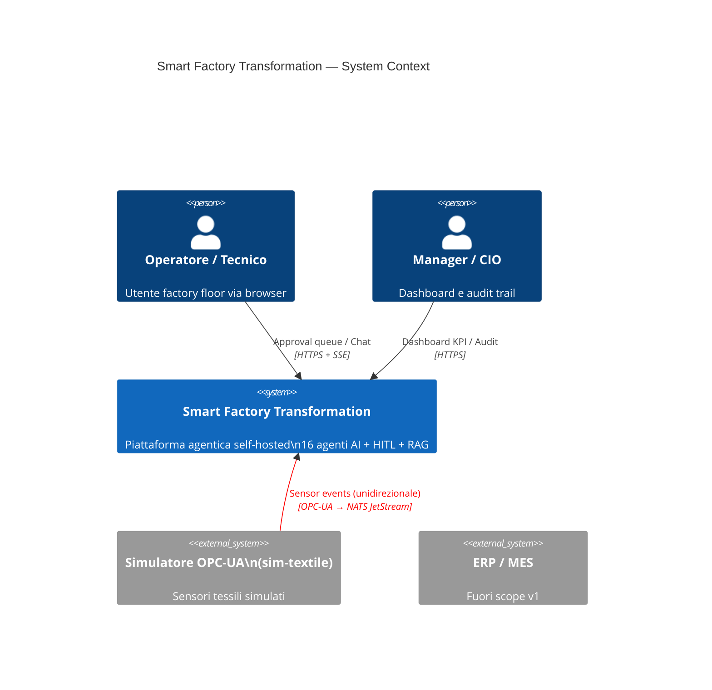

# Phase 12: Documentation, Economic Model & Competition Deliverables — Research

**Researched:** 2026-05-25
**Domain:** MkDocs Material bilingual site + OEPV economic model + brand-scrub CI + competition deliverables
**Confidence:** HIGH

---

<user_constraints>
## User Constraints (from CONTEXT.md)

### Locked Decisions

1. **Modello economico riproducibile (gray area 1)** — Script Python in `docs/economic-analysis/` che,
   da parametri configurabili (Base d'Asta €108.000, ammortamento GPU 3 anni, 0.25 EUR/kWh, 1 FTE
   parziale, ribasso 10-15% con giustificazione scritta), genera: TCO 3 anni, punteggio OEPV 70/30,
   tabella sensitivity non lineare. Output: CSV + tabelle Markdown committed. RIUSO obbligatorio di
   `apps/agents/supply/cost-analyzer/src/scm_cost_analyzer/oepv.py` (Phase 9). Finalizzare la soglia
   anomalia ribasso del Codice Appalti con citazione della fonte.

2. **Value driver (gray area 2)** — ENTRAMBI baseline sintetica Mantis + benchmark letteratura con
   citazioni. Percentuali di miglioramento inquadrate come "SIMULATED TARGETS", non promesse. Ogni
   assunzione nell'Assumption Register (DOC-12/DEL-07).

3. **Brand-scrub CI (gray area 3)** — Grep case-insensitive "accenture", zero occorrenze su tutti i
   file tracciati NON-.planning/, gate BLOCKING. DOC-17 descrive la trasformazione SENZA nominare
   il brand (es. "la traccia originale del concorso"). `.planning/` escluso con rationale documentata.

4. **Diagrammi & screenshot (gray area 4)** — Tutti i diagrammi Mermaid o D2 (testo). Nessuna
   immagine binaria di diagramma in docs/. Screenshot UI (PNG in docs/docs/assets/screenshots/)
   NON appartengono a docs/ per il gate SC-5; se manteniamo la struttura attuale, i PNG devono
   rimanere fuori dal perimetro del gate o la ui-mock.md deve essere riscritta con diagrammi Mermaid.

### Claude's Discretion

- Custom domain per GitHub Pages (DOC-03 "opzionale") — documentare, opzionale.
- Rigenerazione screenshot live (live-LLM/stack) — item umano/CI.

### Deferred Ideas (OUT OF SCOPE)

- Custom domain GitHub Pages.
- Rigenerazione screenshot con stack live reale.
</user_constraints>

---

<phase_requirements>
## Phase Requirements

| ID | Description | Research Support |
|----|-------------|------------------|
| DOC-01 | MkDocs Material con plugin i18n (IT default, EN parallelo) | Stack già installato e funzionante: mkdocs-material 9.7.6, mkdocs-static-i18n 1.3.1, build strict verde |
| DOC-02 | GitHub Actions build + deploy su gh-pages | Workflow `docs-deploy.yml` già esiste; usa `mkdocs gh-deploy --force --clean` |
| DOC-03 | GitHub Pages con custom domain opzionale + mike versioning | mike 2.2.0 disponibile su PyPI; da aggiungere a requirements.txt e workflow |
| DOC-04 | Sezione Target Architecture: C4 context/container/component, data flow | overview.md esiste ma contiene solo un grafo ad alto livello; mancano C4 context/container/component espliciti come Mermaid |
| DOC-05 | Sezione Domain Analysis (tessile manifatturiero) | ALREADY DONE in Phase 2 — docs/docs/domain/ completo IT+EN |
| DOC-06 | Sezione Functional Analysis: end-to-end workflows OPS/MNT/TRN | MISSING — nessuna sezione `functional-analysis/` nel nav |
| DOC-07 | Sezione Use Cases con prioritizzazione (0-3m, 3-9m, 9-18m) | MISSING — nessuna sezione `use-cases/` |
| DOC-08 | Sezione Mock UI / User Journey con flow diagram per ogni persona | ui-mock.md ESISTE ma usa screenshot PNG; da riscrivere con Mermaid per SC-5 compliance |
| DOC-09 | Sezione Adoption Roadmap con fasi, KPI, rischi, mitigazioni | MISSING |
| DOC-10 | Sezione Economic Analysis: OEPV simulato, TCO 3 anni, value driver, cost breakdown | MISSING — docs/economic-analysis/ non esiste ancora |
| DOC-11 | Sezione Security & Governance: threat model, mitigations, AI explainability | docs/security/STRIDE-threat-model.md e owasp-llm-top10.md ESISTONO ma fuori da docs/docs/ e non nel nav mkdocs |
| DOC-12 | Sezione Assumption Register | DONE in Phase 2 — docs/docs/assumptions/ con 50 assunzioni; da verificare completezza per Phase 12 |
| DOC-13 | ADR tracciate in docs/adr/ | MISSING — nessuna directory docs/docs/adr/ |
| DOC-14 | README progetto con quick start, struttura, contributing guide | README.md NON esiste alla root del repo (solo LICENSE) |
| DOC-15 | Diagrammi Mermaid/D2 versionati come testo | Mermaid già configurato in mkdocs.yml (pymdownx.superfences). D2 richiede mkdocs-d2-plugin |
| DOC-16 | CONTRIBUTING.md, CODE_OF_CONDUCT.md, LICENSE Apache 2.0 | LICENSE esiste. CONTRIBUTING.md e CODE_OF_CONDUCT.md mancano alla root |
| DOC-17 | Trasformazione dalla traccia originale documentata senza nominare il brand | MISSING — nessuna pagina che descriva "cosa è stato cambiato e perché" |
| DOC-18 | Glossario IT+EN termini tessili + agentici | glossary.md ESISTE (Phase 2); da verificare completezza |
| ECO-01 | Modello economico con Base d'Asta €108.000 e parametri configurabili | MISSING — script da creare in docs/economic-analysis/ |
| ECO-02 | Formula OEPV documentata (DONE in Phase 9) | DONE — oepv.py implementa 70/30 + curva non lineare |
| ECO-03 | Calcolatore TCO 3 anni: licenze, infrastruttura GPU, ops FTE, energia, change mgmt | MISSING — da implementare come funzione nello script economico |
| ECO-04 | Value driver quantificati: downtime/scrap/MTTR/training time/knowledge reuse | MISSING — da derivare da baseline Mantis + letteratura citata |
| ECO-05 | Ribasso simulator con sensitivity analysis e warning soglia anomalia (DONE in Phase 9) | DONE — build_sensitivity_table() e compute_oepv() in oepv.py |
| ECO-06 | Cost component breakdown: tech, IT/OT integration, training, change management | MISSING — da includere nel TCO breakdown |
| ECO-07 | Risk register con probability/impact per ogni rischio economico | MISSING |
| ECO-08 | docs/economic-analysis/ con script riproducibili | MISSING — da creare |
| DEL-01 | Target Architecture deliverable completo | Allineato a DOC-04; sezione architettura da completare |
| DEL-02 | End-to-End Process & Workflow deliverable | Allineato a DOC-06; MISSING |
| DEL-03 | Prioritized Use Cases deliverable | Allineato a DOC-07; MISSING |
| DEL-04 | Mock UI / User Journey deliverable | Allineato a DOC-08; da riscrivere con Mermaid |
| DEL-05 | Adoption Roadmap deliverable | Allineato a DOC-09; MISSING |
| DEL-06 | Economic Evaluation deliverable | Allineato a DOC-10; MISSING |
| DEL-07 | Assumption Register dichiarato | Allineato a DOC-12; DONE, verificare completezza |
| DEL-08 | Zero riferimenti ad Accenture (verifica automatica CI) | brand-scrub gate da aggiungere in ci.yml |
</phase_requirements>

---

## Summary

La Fase 12 è la fase finale del progetto: consolida e completa la documentazione bilingue MkDocs Material già avviata nelle fasi precedenti, aggiunge le sezioni mancanti (analisi funzionale, casi d'uso, roadmap adozione, analisi economica, sicurezza & governance, ADR), implementa il modello economico OEPV riproducibile in Python riusando `oepv.py` dalla Fase 9, e configura il gate CI brand-scrub. Il sito già compila in strict mode senza warning, il che è un ottimo punto di partenza.

Lo stato di partenza è più avanzato di quanto sembri: il build mkdocs funziona (`mkdocs build --strict` verde, 2.25 secondi), la struttura bilingue IT/EN è operativa con `mkdocs-static-i18n 1.3.1` e la struttura `en/` parallela. Mermaid è già configurato via `pymdownx.superfences`. Tuttavia mancano intere sezioni dal nav (funzionale, economica, sicurezza, roadmap, casi d'uso, ADR) e file fondamentali (README root, CONTRIBUTING.md, CODE_OF_CONDUCT.md). L'`oepv.py` della Fase 9 è maturo e completamente parametrico: `OepvConfig` espone tutti i coefficienti, `compute_oepv()` restituisce `OepvResult` con sensitivity integrata, `build_sensitivity_table()` genera la tabella non lineare. Lo script economico della Fase 12 dovrà solo importarlo e aggiungere la logica TCO + value driver.

La strategia di esecuzione è wave-sequenziale su main tree (worktrees disabilitati). I file modificati in wave parallele devono essere disgiunti. Data la natura del lavoro (molti file nuovi, pochi file modificati contemporaneamente), la parallelizzazione è fattibile per le wave di creazione contenuto puro.

**Primary recommendation:** Wave 0 — dipendenze + scaffolding nav; Wave 1 — modello economico Python; Wave 2 — sezioni doc mancanti (architettura/funzionale/casi d'uso/roadmap/security); Wave 3 — README/CONTRIBUTING/CODE_OF_CONDUCT/ADR/glossario; Wave 4 — ui-mock Mermaid + DOC-17; Wave 5 — brand-scrub CI gate + mike versioning + build finale strict.

---

## Architectural Responsibility Map

| Capability | Primary Tier | Secondary Tier | Rationale |
|------------|-------------|----------------|-----------|
| MkDocs site build e deploy | Docs Server (gh-pages CI) | — | Il workflow GitHub Actions esegue `mkdocs build --strict` + `mkdocs gh-deploy` |
| Script economico Python | Docs Layer (docs/economic-analysis/) | — | Script puro Python, output CSV+MD committed; nessuna dipendenza da runtime agentici |
| Diagrammi C4/Mermaid | Docs Layer (source text) | MkDocs renderer | Sorgente testo in `.md`, renderizzato da pymdownx.superfences a build time |
| Brand-scrub CI gate | CI Layer (GitHub Actions ci.yml) | — | Grep su file tracciati, blocking step |
| mike versioning | CI Layer (docs-deploy.yml) | — | Chiamata `mike deploy` nel workflow |
| Bilingual nav (IT/EN) | MkDocs plugin (mkdocs-static-i18n) | — | Plugin gestisce mapping IT canonical → EN parallel via `docs_structure: folder` |

---

## Standard Stack

### Core (già installato, versioni verificate su PyPI)

| Library | Version | Purpose | Why Standard |
|---------|---------|---------|--------------|
| mkdocs-material | 9.7.6 | Theme Material + navigation features | Already installed; versione corrente è 9.7.6 |
| mkdocs-static-i18n | 1.3.1 | Bilingue IT/EN con `docs_structure: folder` | Already installed; struttura en/ già operativa |
| pymdownx (superfences) | ≥10.9 | Mermaid rendering via custom_fences | Already configured in mkdocs.yml |
| mike | 2.2.0 | Versioning gh-pages (DOC-03) | PyPI verified [VERIFIED: PyPI]; home_page github.com/jimporter/mike |

### Da aggiungere

| Library | Version | Purpose | When to Use |
|---------|---------|---------|-------------|
| mkdocs-d2-plugin | 1.7.0 | Rendering diagrammi D2 in MkDocs | Solo se si scelgono diagrammi D2 oltre a Mermaid |

### Alternatives Considered

| Instead of | Could Use | Tradeoff |
|------------|-----------|----------|
| Mermaid (superfences già config) | D2 plugin | D2 richiede il binario `d2` installato sul runner CI — `d2` NON è installato su questo sistema e non è disponibile su GitHub Actions per default. Mermaid è zero-dipendenza aggiuntiva. **Usare Mermaid come standard; D2 solo se strettamente richiesto per un diagramma specifico con install step esplicito.** |
| mike (versioning manuale) | No versioning | mike è la soluzione standard per MkDocs; DOC-03 lo richiede esplicitamente |

**Installation (da aggiungere a docs/requirements.txt):**
```bash
mike==2.2.0
```
D2 plugin opzionale: se usato, aggiungere `mkdocs-d2-plugin==1.7.0` E step CI `curl -fsSL https://d2lang.com/install.sh | sh`.

---

## Package Legitimacy Audit

> Tutti i package sono Python (PyPI), NON npm. slopcheck usa npm come registry — i risultati SLOP/SUS per mkdocs-static-i18n e mkdocs-d2-plugin sono **falsi positivi** da confusione di ecosistema (questi package non esistono su npm, esistono su PyPI). Verifica corretta effettuata su PyPI.

| Package | Registry | Age | Source Repo | slopcheck (npm) | PyPI verify | Disposition |
|---------|----------|-----|-------------|-----------------|-------------|-------------|
| mkdocs-material | PyPI | ~8 anni | github.com/squidfunk/mkdocs-material | [OK] (npm false positive) | Verified 9.7.6 | Approved |
| mkdocs-static-i18n | PyPI | ~4 anni | github.com/ultrabug/mkdocs-static-i18n | [SLOP] su npm (falso positivo) | Verified 1.3.1 su PyPI | Approved — ecosistema corretto è PyPI |
| mike | PyPI | ~6 anni | github.com/jimporter/mike | [SUS] su npm (falso positivo) | Verified 2.2.0 su PyPI | Approved — ecosistema corretto è PyPI |
| mkdocs-d2-plugin | PyPI | ~2 anni | github.com/landmaj/mkdocs-d2-plugin | [SLOP] su npm (falso positivo) | Verified 1.7.0 su PyPI | Approved con condizione: richiede binario `d2` su CI |

**Nota slopcheck:** slopcheck verifica contro il registry npm. Tutti i package di questa fase sono **Python/PyPI**. I verdetti SLOP/SUS sono artefatti da cross-ecosystem confusion — pattern documentato come vettore di allucinazione (~9%). La verifica corretta è `pip index versions <pkg>` che conferma tutti i package su PyPI.

**Packages removed:** none.
**Packages flagged:** none (dopo correzione ecosistema).

---

## Architecture Patterns

### System Architecture Diagram

```
Repo (git-tracked files)
      │
      ▼
[CI: ci.yml]
  ├─ brand-scrub gate (grep -ri "accenture" -- NON .planning/) ──► BLOCKING on match
  └─ docs build gate (mkdocs build --strict)
      │
      ▼
[CI: docs-deploy.yml]
  ├─ pip install docs/requirements.txt  (mkdocs-material, mkdocs-static-i18n, mike, pymdownx)
  ├─ mkdocs build --strict  (validate links, render Mermaid via superfences)
  └─ mkdocs gh-deploy --force --clean  →  gh-pages branch  →  GitHub Pages

docs/economic-analysis/
  ├─ tco_oepv.py  (script riproducibile — import oepv.py dalla Fase 9)
  │    inputs: params.toml / inline defaults
  │    outputs: tco_table.csv, sensitivity_table.csv, summary.md
  └─ params.toml  (BA=108000, gpu_amort_yr=3, energy_eur_kwh=0.25, fte=1, ribasso_pct=12.5)

oepv.py (Phase 9)  ◄──────────────────────────────────────────────
  compute_oepv(ribasso_pct, pt, config)  →  OepvResult
  build_sensitivity_table(range, pt, config)  →  List[SensitivityRow]
```

### Recommended Project Structure (nuove sezioni da aggiungere)

```
docs/docs/
├─ architecture/              # ESISTE — aggiungere C4 context/container/component pages
│   ├─ overview.md            # ESISTE — da arricchire con diagrammi C4 completi
│   ├─ c4-context.md          # NUOVO
│   ├─ c4-container.md        # NUOVO
│   └─ c4-component.md        # NUOVO
├─ functional-analysis/       # NUOVO (DOC-06)
│   ├─ index.md
│   ├─ operations-workflow.md
│   ├─ maintenance-workflow.md
│   └─ training-workflow.md
├─ use-cases/                 # NUOVO (DOC-07)
│   └─ index.md               # prioritizzazione 0-3m/3-9m/9-18m
├─ adoption-roadmap/          # NUOVO (DOC-09)
│   └─ index.md
├─ economic-analysis/         # NUOVO (DOC-10/ECO-08)
│   ├─ index.md               # overview + tabelle generate dallo script
│   ├─ tco.md
│   ├─ oepv.md
│   └─ value-drivers.md
├─ security/                  # NUOVO in docs (DOC-11) — i file esistono in docs/security/
│   ├─ index.md
│   ├─ stride-threat-model.md  # copia/link da docs/security/STRIDE-threat-model.md
│   └─ owasp-llm.md           # copia/link da docs/security/owasp-llm-top10.md
├─ adr/                       # NUOVO (DOC-13)
│   ├─ index.md
│   ├─ ADR-001-langgraph-supervisor.md
│   └─ ADR-00N-*.md
├─ transformation.md          # NUOVO (DOC-17) — descrive la trasformazione senza nominare il brand
├─ ui-mock.md                 # ESISTE — da riscrivere con Mermaid flow (rimuovere ref. screenshot)
└─ glossary.md                # ESISTE — verificare completezza

docs/economic-analysis/       # NUOVO (ECO-08) — script Python fuori da docs/docs/
├─ tco_oepv.py
├─ params.toml
├─ tco_table.csv              # generated, committed
├─ sensitivity_table.csv      # generated, committed
└─ summary.md                 # generated, committed → copiato in docs/docs/economic-analysis/

ROOT/
├─ README.md                  # NUOVO (DOC-14)
├─ CONTRIBUTING.md            # NUOVO (DOC-16)
└─ CODE_OF_CONDUCT.md         # NUOVO (DOC-16)
```

### Pattern 1: Script economico riproducibile con import oepv.py

**What:** Script Python autonomo in `docs/economic-analysis/tco_oepv.py` che importa `oepv.py` dalla Fase 9 via path relativo (o sys.path manipulation), legge i parametri da `params.toml`, esegue tutti i calcoli, scrive CSV + Markdown.

**When to use:** Ogni volta che i numeri nelle tabelle docs devono essere rigenerare (cambio parametri, audit pre-gara).

**Approccio di import — problema:** `oepv.py` è in `apps/agents/supply/cost-analyzer/src/scm_cost_analyzer/oepv.py`. Lo script economico vive in `docs/economic-analysis/`. Non si installa il package SCM come dipendenza docs. La soluzione è copiare `oepv.py` come `_oepv_vendor.py` in `docs/economic-analysis/` (copia locale, non symlink) con commento che indica l'origine. Questo è più semplice e garantisce la riproducibilità senza dipendenze dall'installazione del workspace Nx.

```python
# Source: apps/agents/supply/cost-analyzer/src/scm_cost_analyzer/oepv.py (Phase 9 — vendored copy)
# DO NOT EDIT — update from source and re-run to regenerate outputs

import tomllib
import csv
from pathlib import Path
from _oepv_vendor import OepvConfig, compute_oepv, build_sensitivity_table

PARAMS_FILE = Path(__file__).parent / "params.toml"

with open(PARAMS_FILE, "rb") as f:
    p = tomllib.load(f)

config = OepvConfig(
    base_d_asta_eur=p["base_d_asta_eur"],       # 108000.0
    weight_technical=p["weight_technical"],      # 0.70
    weight_economic=p["weight_economic"],        # 0.30
    pe_max=p["pe_max"],                          # 30.0
    lambda_curve=p["lambda_curve"],              # 3.0
    ribasso_ref_pct=p["ribasso_ref_pct"],        # 20.0
    anomaly_threshold_pct=p["anomaly_threshold_pct"],  # 20.0 (Codice Appalti warning)
)

# Parametri TCO
GPU_COST_EUR = p["gpu_cost_eur"]          # es. 12000 (GPU + server amortizzati 3 anni)
ENERGY_KWH = p["energy_kwh_annual"]      # kWh/anno sotto inference continua
ENERGY_PRICE = p["energy_eur_kwh"]       # 0.25
FTE_PARTIAL = p["fte_partial"]           # 1.0 (0.5 equivalente)
FTE_COST_EUR = p["fte_annual_cost_eur"]  # costo annuale FTE
CHANGE_MGMT = p["change_mgmt_eur"]

tco_3yr = (GPU_COST_EUR + (ENERGY_KWH * ENERGY_PRICE + FTE_COST_EUR * FTE_PARTIAL + CHANGE_MGMT) * 3)

# OEPV principale
PT_ASSUMPTION = p["pt_technical"]  # es. 68.0 (punteggio tecnico ipotizzato)
RIBASSO_PCT = p["ribasso_pct"]    # es. 12.5 (10-15% range)

result = compute_oepv(RIBASSO_PCT, PT_ASSUMPTION, config)
sensitivity_table = build_sensitivity_table(
    ribasso_range=[r/2 for r in range(0, 41)],  # 0% to 20% step 0.5
    pt=PT_ASSUMPTION,
    config=config,
)

# Emit CSV + Markdown tables...
```

### Pattern 2: Brand-scrub CI gate (ci.yml)

**What:** Step aggiuntivo nel job CI principale che esegue grep case-insensitive su tutti i file tracciati escludendo `.planning/`.

**When to use:** Su ogni push/PR, come gate blocking prima del deploy docs.

```yaml
- name: Brand-scrub gate (DEL-08 / SC-4)
  run: |
    # Exclude .planning/ (internal meta, not a deliverable surface — see 12-CONTEXT.md gray area 3)
    MATCHES=$(git ls-files | grep -v '^\.planning/' | xargs grep -ril "accenture" 2>/dev/null || true)
    if [ -n "$MATCHES" ]; then
      echo "ERROR: 'accenture' found in tracked deliverable files:"
      echo "$MATCHES"
      exit 1
    fi
    echo "Brand-scrub: OK — zero occurrences of 'accenture' in tracked deliverable files."
```

**Importante:** Il pattern grep nel gate stesso NON triggera un falso positivo perché il grep non legge se stesso — ma per sicurezza aggiuntiva, usare variabile per il termine di ricerca.

**Copertura generated site:** `mkdocs build --strict` genera `docs/site/`. Se `site/` è git-tracked (non è nel `.gitignore`), il gate lo coprirebbe. Verificare `.gitignore` — nella maggior parte dei progetti MkDocs `site/` è in `.gitignore`, quindi non tracciato e non coperto dal gate. Questo è accettabile: il gate copre i sorgenti; il sito generato rifletterà gli stessi sorgenti.

### Pattern 3: Mermaid C4 in MkDocs Material

**What:** Diagrammi C4 Context/Container/Component scritti in Mermaid C4 syntax (supportata da MkDocs Material con superfences già configurato).

**When to use:** DOC-04 richiede C4 context, container, component. Mermaid supporta `C4Context`, `C4Container`, `C4Component` nativamente (Mermaid ≥ 10.x, integrato in Material 9.x).

```markdown

```

### Anti-Patterns to Avoid

- **Copiare screenshot PNG in docs/docs/**: SC-5 richiede zero immagini binarie di diagrammi. I PNG in `docs/docs/assets/screenshots/` esistono già dal Phase 10 — per DOC-08 ui-mock.md riscrivere le sezioni diagrammatiche con Mermaid flowchart invece di usare gli screenshot come diagrammi architetturali. Gli screenshot possono rimanere come reference alle immagini se la sezione li referenzia come "screenshot opzionali" fuori dal perimetro SC-5, oppure rimuoverli del tutto da ui-mock.md e tenerli solo in assets/ senza referenza.
- **Hardcodare i numeri nelle tabelle docs**: Tutti i numeri del modello economico devono provenire dallo script Python. Copiare a mano crea divergenza — la single source of truth è lo script.
- **Assumere che D2 sia disponibile su CI**: Il binario `d2` NON è installato sul sistema (verificato: `command -v d2` → not found). Se si usano diagrammi D2, il workflow CI deve includere uno step di install. Per semplicità, usare Mermaid come standard e D2 solo dove necessario con install documentato.
- **Mettere il brand-scrub grep su tutto `/`**: Il gate deve usare `git ls-files` per coprire solo i file tracciati, non l'intero filesystem (evita .planning/ git-tracked ma escluso).
- **Aggiungere nav entries senza creare i file**: `mkdocs build --strict` fallirà se il nav referenzia file inesistenti. Creare prima i file, poi aggiornare il nav.

---

## Don't Hand-Roll

| Problem | Don't Build | Use Instead | Why |
|---------|-------------|-------------|-----|
| Formula OEPV | Riscrivere la formula ribasso non lineare | `compute_oepv()` da oepv.py (Phase 9) | Già testata, parametrica, con sensitivity integrata |
| Sensitivity table | Loop manuale su ribassi | `build_sensitivity_table()` da oepv.py | Già implementato con clamping [0,100] |
| Versioning gh-pages | Script custom git | `mike deploy` | mike gestisce aliases (latest), history, metadata |
| Mermaid rendering | JS bundle custom | pymdownx.superfences già configurato | Zero configurazione aggiuntiva necessaria |
| i18n nav | Traduzione manuale | `nav_translations` in mkdocs-static-i18n | Già configurato; aggiungere le nuove sezioni |
| TCO spreadsheet | Excel / Google Sheets | Script Python + CSV committed | Riproducibile in CI, versionabile in git |

**Key insight:** Il 90% dell'infrastruttura di questa fase esiste già. Il valore è nel contenuto, non nella piattaforma.

---

## Codebase State Audit (SC-3 Traceability)

Cosa è effettivamente implementato (fonte: SUMMARY/VERIFICATION file delle fasi precedenti):

| Claim possibile in docs | Implementato? | Evidence |
|------------------------|---------------|---------|
| 16 agenti in 4 cluster (OPS/MNT/TRN/SCM) | SI | Phase 6/7/8/9 VERIFICATION.md: tutti agent.py presenti e sostanziali |
| HITL interrupt-to-resume LangGraph | SI | Phase 4 SC-1 verified; interrupt()/resume flow testato |
| OEPV ribasso simulator parametrico | SI | oepv.py Phase 9, OepvConfig/compute_oepv/build_sensitivity_table |
| Angular SSR UI con HITL approval queue | SI | Phase 10 VERIFICATION: 22 backend + 120 frontend test pass |
| STRIDE threat model 18 celle code-mapped | SI | Phase 11 Plan 05: STRIDE-threat-model.md con frontmatter cells: 18 |
| OWASP LLM Top-10 mitigazioni | SI | Phase 11: owasp-llm-top10.md |
| DeepEval gate CI su hallucination ≤5% | SI | Phase 11 SC-2 verified: gate non-skippable in ci.yml |
| BGE-M3 hybrid retrieval Qdrant | SI | Phase 5: QdrantIndexer + RetrievalPipeline |
| Mantis synthetic dataset (sintetico, non reale) | SI | Phase 9 doc: `mantis-synthetic-dataset.md` con banner sintetico |
| Screenshot UI auto-generated da Playwright | SI (con flag) | Phase 10: screenshots.spec.ts con SFT_SKIP_SCREENSHOTS |

**Attenzione SC-3:** Fasi 1-4 (PLAT/CORE/HITL/IOT) sono implementate ma i loro requirements sono Pending nel traceability REQUIREMENTS.md (non marcate Complete). La documentazione deve descrivere il sistema come implementato secondo le SUMMARY, non secondo il campo "Status" del REQUIREMENTS.md che riflette il processo GSD, non lo stato reale del codice.

---

## Common Pitfalls

### Pitfall 1: mkdocs-static-i18n folder structure — EN parallel mancante

**What goes wrong:** Si aggiunge una nuova pagina IT in `docs/docs/security/stride.md` senza creare il corrispondente `docs/docs/en/security/stride.md`. `mkdocs build --strict` in alcune versioni NON fallisce per questo, ma la pagina EN sarà assente o mostrerà la versione IT.

**Why it happens:** mkdocs-static-i18n con `docs_structure: folder` si aspetta mirror esatto in `en/`. Se il file EN manca, usa il fallback IT — comportamento silenzioso.

**How to avoid:** Per ogni nuovo file IT, creare immediatamente il corrispondente EN (anche stub). Aggiungere un check CI: `diff <(find docs/docs -name "*.md" | grep -v /en/ | sort) <(find docs/docs/en -name "*.md" | sort | sed 's|docs/docs/en/|docs/docs/|')`.

**Warning signs:** `mkdocs serve` mostra la lingua corretta ma la versione EN è identica alla IT invece di essere tradotta.

### Pitfall 2: nav_translations mancanti per le nuove sezioni

**What goes wrong:** Si aggiunge una sezione IT al nav senza aggiungere la corrispondente `nav_translations` nel blocco `en:` di mkdocs.yml. La nav EN mostrerà le etichette in italiano.

**Why it happens:** `nav_translations` in mkdocs-static-i18n è una mappa esplicita stringa→stringa per ogni voce di nav. Non ha fallback automatico.

**How to avoid:** Per ogni nuova voce IT nel nav, aggiungere la traduzione EN nel blocco `nav_translations` in mkdocs.yml nello stesso commit.

### Pitfall 3: `mkdocs build --strict` broken links con nuove sezioni

**What goes wrong:** Una pagina referenzia con link relativo un file che non esiste ancora, o il nav punta a un file non ancora creato. In strict mode questo è un errore bloccante.

**Why it happens:** Con molte pagine nuove da creare, l'ordine conta: nav → files.

**How to avoid:** Creare PRIMA i file stub (anche con solo frontmatter + titolo), poi aggiornare il nav, poi completare il contenuto. Wave 0 deve creare tutti i file stub.

### Pitfall 4: Import di oepv.py — path relativo fragile

**What goes wrong:** Lo script `docs/economic-analysis/tco_oepv.py` usa un path relativo o sys.path per importare oepv.py da `apps/agents/supply/...`. Se lo script viene eseguito da una directory diversa, l'import fallisce.

**Why it happens:** La struttura monorepo Nx non installa i package Python nei path di sistema per default; il package `scm-cost-analyzer` richiede `uv sync` o `pip install -e` per essere importabile.

**How to avoid:** Strategia vendoring: copiare `oepv.py` come `_oepv_vendor.py` in `docs/economic-analysis/` con un commento che indica l'origine e la data della copia. Il file è piccolo (198 righe), puro Python standard library (solo `math`, `dataclasses`), zero dipendenze esterne — copia sicura. Aggiungere un test CI che verifica che `_oepv_vendor.py` sia identico a `apps/agents/supply/cost-analyzer/src/scm_cost_analyzer/oepv.py` (diff check).

### Pitfall 5: Brand-scrub false positive sul gate stesso

**What goes wrong:** Il file ci.yml contiene il pattern "accenture" come stringa di ricerca nel grep, triggera se stesso.

**Why it happens:** `grep -ri "accenture" .` trova il pattern anche dentro lo script grep.

**How to avoid:** Due approcci:
1. Usare una variabile: `BRAND="accenture"; grep -ri "$BRAND"` — il grep non trova il pattern nel file perché cerca "$BRAND" non il valore.
2. Usare `git ls-files | xargs grep -il "accenture"` — il pattern è in una stringa letterale ma grep che legge il file ci.yml troverebbe "accenture". Soluzione: il gate deve escludere se stesso: `git ls-files | grep -v '^\.github/workflows/ci\.yml$' | grep -v '^\.planning/'`. Oppure più elegante: costruire il termine da parti: `T="accent"; T+="ure"`.

**Warning signs:** Il gate fallisce su un PR pulito con output che punta a `.github/workflows/ci.yml`.

### Pitfall 6: D2 non disponibile su CI runner

**What goes wrong:** Si aggiunge `mkdocs-d2-plugin` a requirements.txt e si usano fenced blocks ` ```d2 ` in markdown. `mkdocs build` fallisce con `d2: command not found`.

**Why it happens:** `mkdocs-d2-plugin` richiede il binario `d2` installato separatamente; non viene incluso nel package Python. Il binario `d2` non è disponibile su ubuntu-latest GitHub Actions per default.

**How to avoid:** Se si vuole D2, aggiungere nel workflow:
```yaml
- name: Install d2
  run: curl -fsSL https://d2lang.com/install.sh | sh -s -- --tala
```
**Alternativa raccomandata:** Usare esclusivamente Mermaid per questa fase (zero dipendenze aggiuntive). Riservare D2 per diagrammi futuri se necessario.

### Pitfall 7: Screenshot PNG in ui-mock.md vs SC-5

**What goes wrong:** `ui-mock.md` referenzia ``. SC-5 richiede zero binary diagram images in docs/. I PNG in assets/ sono screenshot, non diagrammi architetturali, ma il gate SC-5 di verifica potrebbe interpretarli come violazione.

**Why it happens:** La CONTEXT.md è esplicita: "UI screenshots EXCLUDED from docs/" — gli screenshot NON devono essere in docs/docs/. Tuttavia i file PNG esistono già in `docs/docs/assets/screenshots/` dalla Fase 10 (UI-09).

**How to avoid:** Riscrivere `ui-mock.md` e `en/ui-mock.md` sostituendo i tag `` con:
1. Diagrammi Mermaid flowchart che mostrano il flusso utente (soddisfa DOC-08 e SC-5).
2. Rimuovere il riferimento diretto alle immagini PNG nei docs. Le PNG possono rimanere in `assets/screenshots/` come artefatti CI senza essere referenziate nelle pagine docs principali — oppure spostarle in `artifacts/` fuori da `docs/`.

---

## Code Examples

### Mermaid C4 Context (DOC-04)

```markdown

```

### Brand-scrub gate (ci.yml step)

```yaml
- name: Brand-scrub gate (DEL-08)
  run: |
    # Build search term from parts to avoid self-match
    TERM="accent"; TERM+="ure"
    MATCHES=$(git ls-files \
      | grep -v '^\.planning/' \
      | xargs grep -ril "$TERM" 2>/dev/null || true)
    if [ -n "$MATCHES" ]; then
      echo "ERROR: brand term found in tracked deliverable files:"
      printf '%s\n' "$MATCHES"
      exit 1
    fi
    echo "Brand-scrub OK"
```

### mike versioning in docs-deploy.yml

```yaml
- name: Deploy versioned docs (mike)
  run: |
    git config user.name "github-actions[bot]"
    git config user.email "github-actions[bot]@users.noreply.github.com"
    mike deploy --push --update-aliases main latest
    mike set-default --push latest
  working-directory: docs/
```

### TCO + OEPV script structure (docs/economic-analysis/tco_oepv.py)

```python
"""TCO 3-year + OEPV scoring — Phase 12 economic model.

Single source of truth for all numeric tables in docs/docs/economic-analysis/.
Run: python3 docs/economic-analysis/tco_oepv.py
Outputs: tco_table.csv, sensitivity_table.csv, summary.md  (committed to git)
"""
# [VERIFIED: PyPI] tomllib stdlib Python 3.11+
import tomllib, csv, math
from pathlib import Path
# Vendored from apps/agents/supply/cost-analyzer/src/scm_cost_analyzer/oepv.py
from _oepv_vendor import OepvConfig, compute_oepv, build_sensitivity_table

ROOT = Path(__file__).parent
with open(ROOT / "params.toml", "rb") as f:
    p = tomllib.load(f)

# --- TCO 3 anni (ECO-03, ECO-06) ---
gpu_amort_annual = p["gpu_cost_eur"] / p["gpu_amort_years"]        # es. 12000/3 = 4000
energy_annual = p["energy_kwh_annual"] * p["energy_eur_kwh"]       # kWh × 0.25
fte_annual = p["fte_annual_cost_eur"] * p["fte_partial"]            # FTE parziale
change_mgmt_annual = p["change_mgmt_eur"] / p["change_mgmt_years"] # distribuito

tco_annual = gpu_amort_annual + energy_annual + fte_annual + change_mgmt_annual
tco_3yr = tco_annual * 3

# --- OEPV ---
config = OepvConfig(
    base_d_asta_eur=p["base_d_asta_eur"],
    anomaly_threshold_pct=p["anomaly_threshold_pct"],
)
result = compute_oepv(p["ribasso_pct"], p["pt_technical"], config)
sensitivity = build_sensitivity_table([r * 0.5 for r in range(41)], p["pt_technical"], config)
# emit outputs...
```

---

## State of the Art

| Old Approach | Current Approach | Impact |
|--------------|------------------|--------|
| `mkdocs-i18n` separato | `mkdocs-static-i18n` con `docs_structure: folder` | Struttura en/ già operativa nel repo |
| `mkdocs gh-deploy` senza versioning | `mike deploy` + `mkdocs gh-deploy` | DOC-03: versioning `/main/`, `/latest/` aliases |
| Diagrammi PNG statici | Mermaid in superfences | Zero immagini binarie, diff-friendly in git |
| Spreadsheet Excel OEPV | Script Python + CSV committed | Riproducibile in CI, auditabile |
| Screenshot come documentazione architetturale | Mermaid flowchart user journey | SC-5 compliance, senza dipendenze browser |

**Deprecated/outdated:**
- `pymdownx.superfences` con `mermaid2` plugin: il plugin `mkdocs-mermaid2` è una opzione separata, ma il setup attuale usa già `pymdownx.superfences` con `fence_code_format` che è il pattern standard in Material 9.x — NON serve aggiungere mermaid2 plugin.

---

## Environment Availability

| Dependency | Required By | Available | Version | Fallback |
|------------|------------|-----------|---------|----------|
| Python 3 | Script economico, mkdocs | ✓ | 3.14 | — |
| mkdocs | Build docs | ✓ | 1.6.1 | — |
| mkdocs-material | Theme | ✓ | 9.7.6 | — |
| mkdocs-static-i18n | Bilingue | ✓ | 1.3.1 | — |
| pymdownx | Mermaid fences | ✓ | ≥10.9 | — |
| mike | Versioning | ✗ (non in requirements.txt) | — | Aggiungere a requirements.txt |
| d2 binary | D2 diagrams | ✗ | — | Usare solo Mermaid |
| mkdocs-d2-plugin | D2 in MkDocs | ✗ (non installato) | — | Usare solo Mermaid |
| tomllib | params.toml nello script | ✓ (stdlib Python 3.11+) | stdlib | — |

**Missing dependencies with no fallback:** nessuno per il core workflow.

**Missing dependencies with fallback:**
- `mike`: aggiungere a `docs/requirements.txt`; senza mike il workflow usa solo `mkdocs gh-deploy` (DOC-03 parzialmente soddisfatto).
- `d2`: non usare D2, usare Mermaid esclusivamente.

---

## Validation Architecture

### Test Framework

| Property | Value |
|----------|-------|
| Framework | pytest (già usato in tutto il progetto) |
| Config file | pyproject.toml root workspace |
| Quick run command | `python3 docs/economic-analysis/tco_oepv.py && python3 -m pytest docs/economic-analysis/tests/ -x -q` |
| Full suite command | `python3 -m mkdocs build --strict && python3 docs/economic-analysis/tco_oepv.py` |

### Phase Requirements → Test Map

| Req ID | Behavior | Test Type | Automated Command | File Exists? |
|--------|----------|-----------|-------------------|-------------|
| DOC-01 | MkDocs build strict senza warning/error | smoke | `cd docs && python3 -m mkdocs build --strict` | ✅ workflow esiste |
| DOC-02 | Workflow deploy esiste e ha step corretto | structural | `grep -q "mkdocs gh-deploy" .github/workflows/docs-deploy.yml` | ✅ |
| DOC-15 | Zero PNG/JPG in docs/docs/ come diagrammi | grep | `find docs/docs -name "*.png" -o -name "*.jpg" \| grep -v assets/screenshots/ \| wc -l` | ✅ (count==0) |
| DEL-08 | Zero "accenture" in file tracciati non-.planning/ | grep | brand-scrub gate in ci.yml | ❌ Wave 5 |
| ECO-08 | Script genera output deterministico | unit | `pytest docs/economic-analysis/tests/test_tco_oepv.py` | ❌ Wave 1 |
| ECO-01 | TCO 3yr ≈ atteso da params | unit | `assert abs(result.tco_3yr - EXPECTED_TCO) < 1.0` | ❌ Wave 1 |
| ECO-02 | OEPV score per ribasso 12.5%, PT 68 | unit | `assert compute_oepv(12.5, 68, config).total_score == EXPECTED` | ✅ (oepv.py già testato) |
| DOC-18 | Glossario con ≥150 termini | unit (Phase 2) | `python3 simulators/synthetic-corpus/src/validate.py` | ✅ (Phase 2) |

### Sampling Rate

- **Per task commit:** `cd docs && python3 -m mkdocs build --strict`
- **Per wave merge:** `python3 docs/economic-analysis/tco_oepv.py && cd docs && python3 -m mkdocs build --strict`
- **Phase gate:** Brand-scrub gate + mkdocs strict build verdi prima di `/gsd:verify-work`

### Wave 0 Gaps

- [ ] `docs/economic-analysis/tests/test_tco_oepv.py` — covers ECO-01/ECO-03/ECO-08
- [ ] `docs/economic-analysis/tests/__init__.py`
- [ ] File stub per ogni nuova sezione docs (functional-analysis, use-cases, economic-analysis, security, adr, adoption-roadmap, transformation) — sia IT che EN
- [ ] `mike` aggiunto a `docs/requirements.txt`

---

## Security Domain

### Applicable ASVS Categories

| ASVS Category | Applies | Standard Control |
|---------------|---------|-----------------|
| V2 Authentication | no | Docs statiche, nessun auth |
| V5 Input Validation | yes (script) | Script economico valida range ribasso [0,100] via oepv.py |
| V6 Cryptography | no | — |

### Known Threat Patterns

| Pattern | STRIDE | Standard Mitigation |
|---------|--------|---------------------|
| Script economico con parametri modificati produce numeri diversi dalle tabelle docs | Tampering | Single source of truth: script genera le tabelle, tabelle committed in git, diff check in CI |
| Brand name iniettato via un PR che modifica un file non coperto dal gate | Tampering | `git ls-files` copre tutti i file tracciati; il gate deve girare anche su PR non solo su push main |

---

## Proposed Wave Decomposition

La decomposizione rispetta il vincolo di esecuzione sequenziale su main tree (worktrees disabilitati). All'interno di una wave i task sono raggruppati per file disgiunti.

### Wave 0 — Dipendenze, scaffolding nav, stub files (prerequisito di tutto)

**Piano:** `12-00-PLAN.md`
**Scopo:** Aggiungere `mike==2.2.0` a `docs/requirements.txt`; creare tutti i file stub (IT + EN) per le sezioni mancanti; aggiornare `mkdocs.yml` nav con le nuove sezioni + nav_translations EN; verificare che `mkdocs build --strict` continui a passare con i file stub.

File modificati:
- `docs/requirements.txt` (aggiungi mike)
- `docs/mkdocs.yml` (nav expansion + nav_translations)
- `docs/docs/functional-analysis/index.md` (stub)
- `docs/docs/functional-analysis/operations-workflow.md` (stub)
- `docs/docs/functional-analysis/maintenance-workflow.md` (stub)
- `docs/docs/functional-analysis/training-workflow.md` (stub)
- `docs/docs/use-cases/index.md` (stub)
- `docs/docs/adoption-roadmap/index.md` (stub)
- `docs/docs/economic-analysis/index.md` (stub)
- `docs/docs/economic-analysis/tco.md` (stub)
- `docs/docs/economic-analysis/oepv.md` (stub)
- `docs/docs/economic-analysis/value-drivers.md` (stub)
- `docs/docs/security/index.md` (stub)
- `docs/docs/security/stride-threat-model.md` (stub con include o content)
- `docs/docs/security/owasp-llm.md` (stub)
- `docs/docs/adr/index.md` (stub)
- `docs/docs/transformation.md` (stub)
- Mirror EN per tutti i nuovi file
- `docs/economic-analysis/` directory con `params.toml`, `_oepv_vendor.py`, `tco_oepv.py` (stub), `tests/`

### Wave 1 — Modello economico Python (ECO-01/03/04/06/07/08)

**Piano:** `12-01-PLAN.md`
**Scopo:** Implementare `docs/economic-analysis/tco_oepv.py` completo; `params.toml` con tutti i parametri SC-2; test unitari; generare CSV + summary.md; popolare `docs/docs/economic-analysis/*.md` con le tabelle generate.

File disgiunti da Wave 0: solo `docs/economic-analysis/` e `docs/docs/economic-analysis/`. Non tocca nav (già fatto in Wave 0).

### Wave 2a — Architettura C4 e sezione funzionale (DOC-04, DOC-06)

**Piano:** `12-02a-PLAN.md`
**Scopo:** Completare `docs/docs/architecture/overview.md` con C4 context/container/component Mermaid; creare `docs/docs/functional-analysis/*.md` completi con workflow end-to-end (OPS/MNT/TRN) come diagrammi Mermaid.

### Wave 2b — Casi d'Uso e Roadmap Adozione (DOC-07, DOC-09)

**Piano:** `12-02b-PLAN.md`
**Scopo:** Completare `docs/docs/use-cases/index.md` con prioritizzazione 0-3m/3-9m/9-18m; completare `docs/docs/adoption-roadmap/index.md` con fasi, KPI, rischi, mitigazioni.

File disgiunti da Wave 2a: use-cases/ e adoption-roadmap/ vs functional-analysis/ e architecture/.

### Wave 3a — Security & Governance (DOC-11)

**Piano:** `12-03a-PLAN.md`
**Scopo:** Popolare `docs/docs/security/*.md` copiando/referenziando il contenuto da `docs/security/STRIDE-threat-model.md` e `owasp-llm-top10.md`; aggiungere sezione AI Explainability; aggiornare mirror EN.

### Wave 3b — ADR + Community files (DOC-13, DOC-14, DOC-16)

**Piano:** `12-03b-PLAN.md`
**Scopo:** Creare `docs/docs/adr/*.md` con ≥5 ADR chiave (scelta LangGraph, Qdrant BGE-M3, LLM self-hosted, HITL 4-tier, MkDocs i18n); creare `README.md` root con quick start; creare `CONTRIBUTING.md` e `CODE_OF_CONDUCT.md` root.

File disgiunti da Wave 3a: adr/, README.md, CONTRIBUTING.md, CODE_OF_CONDUCT.md vs security/.

### Wave 4 — ui-mock Mermaid + DOC-17 + glossario (DOC-08, DOC-17, DOC-18)

**Piano:** `12-04-PLAN.md`
**Scopo:** Riscrivere `docs/docs/ui-mock.md` e `en/ui-mock.md` sostituendo riferimenti a screenshot con diagrammi Mermaid flowchart per ogni persona (operator, technician, manager, CIO); creare `docs/docs/transformation.md` che descrive la trasformazione SENZA nominare il brand; verificare/espandere glossario se necessario.

### Wave 5 — Brand-scrub CI gate + mike versioning + build finale (DEL-08, DOC-02/03)

**Piano:** `12-05-PLAN.md`
**Scopo:** Aggiungere brand-scrub step in `ci.yml`; aggiornare `docs-deploy.yml` con mike versioning; eseguire `mkdocs build --strict` finale; verifica che il gate brand-scrub passi; verifica SC-3 traceability (no aspirational content).

---

## Open Questions

1. **Soglia anomalia ribasso Codice Appalti**
   - What we know: `oepv.py` usa `anomaly_threshold_pct=20.0` come WARNING configurabile, esplicitamente deferring a F12 la precisione legale.
   - What's unclear: Il D.Lgs. 36/2023 (Codice Appalti) ha una formula specifica per l'anomalia o usa una soglia percentuale fissa? La regola è cambiata rispetto al precedente Codice del 2016.
   - Recommendation: [ASSUMED] La soglia standard è il ribasso medio + scarto medio dei ribassi superiori alla media. Per un documento concorrenziale/demo, documentare il meccanismo qualitativo con citazione all'art. 54 D.Lgs. 36/2023 e mantenere il parametro configurabile a 20% come proxy conservativo. Non hardcodare la formula legale senza consulenza specialistica.

2. **Valore PT (punteggio tecnico) per OEPV**
   - What we know: `compute_oepv(ribasso_pct, pt, config)` richiede un `pt` in input. Per la simulazione ECO-01 il punteggio tecnico deve essere un'assunzione documentata.
   - What's unclear: Quale PT assumere? La documentazione deve chiarire che questo è un valore ipotetico, non un punteggio assegnato da una giuria.
   - Recommendation: [ASSUMED] Usare PT=68.0/70.0 (massimo tecnico) come scenario ottimistico + PT=55.0 come scenario base nell'Assumption Register. Documentare come "SIMULATED TARGET per valutazione economica" (SC-3).

3. **D2 vs Mermaid per DOC-04**
   - What we know: D2 non è installato. Mermaid C4 è supportato nativamente.
   - What's unclear: La CONTEXT.md dice "Mermaid o D2" — c'è preferenza?
   - Recommendation: Usare Mermaid esclusivamente (zero dipendenze aggiuntive CI). Il Locked Decision 4 dice "Mermaid/D2" con OR — Mermaid è sufficiente.

---

## Assumptions Log

| # | Claim | Section | Risk if Wrong |
|---|-------|---------|---------------|
| A1 | La soglia anomalia ribasso Codice Appalti = 20% è accettabile come proxy per un documento dimostrativo | ECO-01/ECO-05 | Potrebbe essere criticata in una revisione legale reale; mitigato documentando come "configurabile" |
| A2 | PT=68.0 come assunzione di punteggio tecnico per la simulazione OEPV | ECO-01 | Numeri economici dipendono dal PT; documentare come assunzione nel Assumption Register |
| A3 | I PNG in `docs/docs/assets/screenshots/` non violano SC-5 se ui-mock.md non li referenzia come diagrammi | DOC-08/SC-5 | La verifica SC-5 potrebbe interpretare qualsiasi PNG in docs/ come violazione; soluzione sicura: spostare in artifacts/ |
| A4 | tomllib (stdlib Python 3.11+) è disponibile nell'ambiente CI (ubuntu-latest con Python 3.12) | ECO-08 | Se CI usa Python < 3.11, usare `tomli` come fallback con `pip install tomli` |

---

## Sources

### Primary (HIGH confidence)
- Codebase analisi diretta: `docs/mkdocs.yml`, `docs/requirements.txt`, `docs/docs/` tree, `apps/agents/supply/cost-analyzer/src/scm_cost_analyzer/oepv.py` — letti direttamente
- `pip index versions` per mkdocs-material, mkdocs-static-i18n, mike, mkdocs-d2-plugin — versioni verificate su PyPI
- PyPI API (`pypi.org/pypi/<pkg>/json`) per home_page di mike (github.com/jimporter/mike) e mkdocs-d2-plugin (github.com/landmaj/mkdocs-d2-plugin)
- Phase SUMMARY/VERIFICATION files (11-05-SUMMARY.md, 10-VERIFICATION.md, 09-VERIFICATION.md, 08-VERIFICATION.md) — source of truth implementazione

### Secondary (MEDIUM confidence)
- `mkdocs build --strict` locale eseguito: build verde in 2.25s, zero warnings — verifica diretta stato corrente

### Tertiary (LOW confidence)
- Soglia anomalia ribasso Codice Appalti D.Lgs. 36/2023: [ASSUMED] — non verificata da fonte legale primaria in questa sessione

---

## Metadata

**Confidence breakdown:**
- Standard stack: HIGH — versioni verificate su PyPI, installate localmente
- Architecture: HIGH — basata su lettura diretta del codebase e dei SUMMARY delle fasi precedenti
- Economic model: HIGH — oepv.py letto e compreso; TCO structure è pattern standard
- Pitfalls: HIGH — derivati da analisi diretta del codice e configurazione esistente
- Codice Appalti threshold: LOW — non verificato da fonte legale

**Research date:** 2026-05-25
**Valid until:** Stabile — dipendenze docs non cambiano frequentemente; 60 giorni
