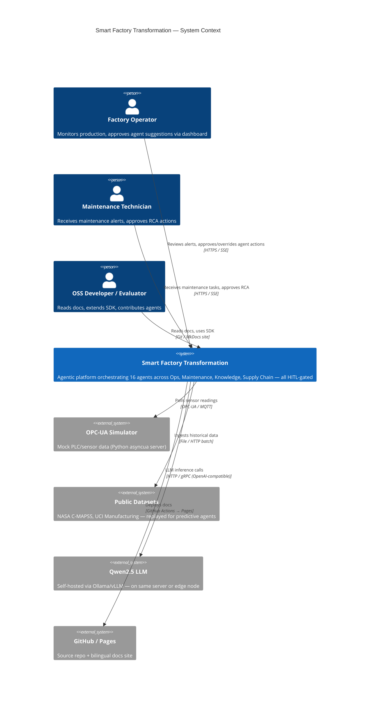
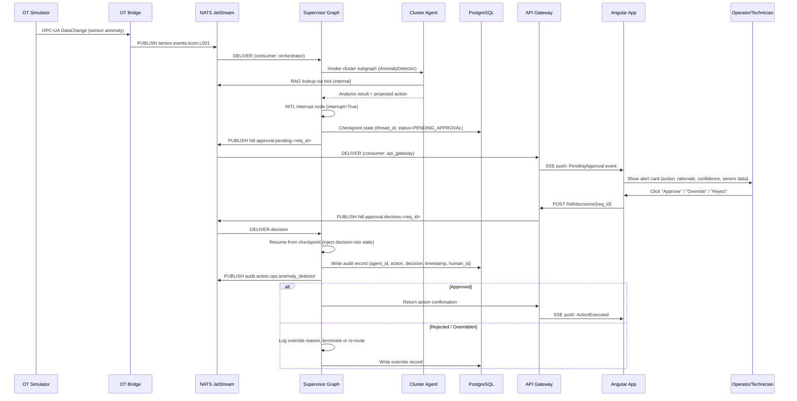

# Architecture Research

**Domain:** Opensource agentic platform — textile smart factory (HITL, self-hosted LLM, IT/OT simulation)
**Researched:** 2026-05-16
**Confidence:** HIGH (LangGraph, Nx, Qdrant, NATS from official docs + verified sources); MEDIUM (ISA-95 placement for agentic systems — standard is updated but agentic AI placement is inferred from edge-computing patterns)

---

## 1. Industrial Reference Model Mapping

### Purdue / ISA-95 Layer Placement

The ISA-95 Purdue reference model remains the canonical vocabulary for IT/OT boundary reasoning even in 2025/2026, with the April 2025 ANSI/ISA-95.00.01-2025 update adding explicit support for containerized workloads and cloud-hybrid architectures.

For a HITL agentic platform, agents belong **entirely on the IT side** (Levels 3–5). They must never have write-back capability into Level 2 or below in the PoC; they read through a one-way data pipeline.

```
┌──────────────────────────────────────────────────────────────────┐
│  LEVEL 5 — Enterprise / Cloud  (ERP, BI, external APIs)          │
├──────────────────────────────────────────────────────────────────┤
│  LEVEL 4 — Site Business Planning  (APS, order mgmt, financials) │
├──────────────────────────────────────────────────────────────────┤
│  LEVEL 3.5 — IT/OT DMZ  ← THE CRITICAL BOUNDARY                 │
│    OPC-UA Gateway · MQTT/NATS Bridge · Data Diode (sim)          │
├──────────────────────────────────────────────────────────────────┤
│  LEVEL 3 — Manufacturing Operations  (MES, historian, OEE)       │
│    ← agents READ from here via the DMZ gateway; never write      │
├──────────────────────────────────────────────────────────────────┤
│  LEVEL 2 — Control Systems  (PLC, DCS, SCADA, HMI)              │
│    Simulated in this PoC via mock OPC-UA server                  │
├──────────────────────────────────────────────────────────────────┤
│  LEVEL 1/0 — Field / Process  (sensors, actuators, motors)       │
│    Simulated via custom Python textile factory simulator          │
└──────────────────────────────────────────────────────────────────┘
```

**Implication for build order:** The OT Simulation Layer (Levels 0–2 mock) must be built before agents can exercise real data flows. The DMZ bridge is a Phase 1 deliverable.

---

## 2. System Overview — C4 Context Diagram



---

## 3. Container Diagram — Internal Component Boundaries

```mermaid
C4Container
    title Smart Factory Transformation — Container View

    Person(operator, "Operator / Technician")

    Container(angular_app, "Angular SSR App", "Angular 18 + SSR", "Operator dashboard, HITL approval flows, KPI widgets. Server-side rendered for initial load; hydrates to SPA.")
    Container(api_gateway, "Agent API Gateway", "FastAPI + uvicorn", "REST + SSE endpoints. Receives HITL decisions, queries agent status, exposes agent health. Talks to orchestrator via NATS.")
    Container(orchestrator, "Agentic Orchestrator", "LangGraph + Python 3.12", "Supervisor graph routing requests to 4 sub-cluster graphs. Manages state checkpoints, HITL interrupt nodes, retry logic.")
    Container(agent_ops, "Ops & Production Agents", "Python + LangGraph subgraph", "OperatorAssistant, ProductionPlanner, QualityInspector, AnomalyDetector")
    Container(agent_maint, "Maintenance Agents", "Python + LangGraph subgraph", "PredictiveMaintenance, RCASpecialist, MaintenanceCoach, DowntimeAnalyzer")
    Container(agent_know, "Knowledge Agents", "Python + LangGraph subgraph", "KnowledgeCurator, TrainingCoach, ShiftHandover, DocumentationSynthesizer")
    Container(agent_sc, "Supply Chain Agents", "Python + LangGraph subgraph", "InventoryManager, EnergyOptimizer, CostAnalyzer, DemandForecaster")
    Container(event_bus, "Event Bus", "NATS JetStream", "Sensor events, agent command/response, HITL approval notifications. Durable streams for audit replay.")
    Container(ot_bridge, "OT Ingestion Bridge", "Python asyncua + NATS publisher", "Reads mock OPC-UA, publishes normalized SensorEvent to NATS. One-way: bridge cannot receive write commands from agents.")
    Container(simulator, "OT Simulator", "Python asyncua server", "Simulates loom, spinner, warper sensors. Emits realistic sensor streams including fault injection.")
    Container(llm_server, "LLM Server", "Ollama (dev) / vLLM (prod)", "Serves Qwen2.5 7B/14B/32B. OpenAI-compatible HTTP API.")
    Container(vector_store, "Vector Store", "Qdrant", "Dense + sparse hybrid search. Stores SOP chunks, technical manual embeddings, shift-log summaries.")
    Container(graph_db, "Knowledge Graph", "Neo4j (or Memgraph OSS)", "Entity-relationship graph: machines → parts → failure-modes → SOPs. Traversal for GraphRAG.")
    Container(relational_db, "Relational DB", "PostgreSQL 16", "Orders, BOM, work centers, HITL approval records, agent audit log, user accounts.")
    Container(timeseries_db, "Time-Series Store", "TimescaleDB (PG extension)", "Sensor readings, OEE metrics, energy counters — co-located with PG or separate hypertable schema.")
    Container(doc_ingest, "Document Ingest Pipeline", "Python + unstructured.io / docling", "Parses PDF/DOCX SOPs → chunks → embeddings → Qdrant + Neo4j dual-write.")
    Container(observability, "Observability", "Langfuse (self-hosted) + OTEL Collector", "Agent trace/span collection. OTEL spans fan-out to Langfuse and optional Prometheus/Grafana.")

    Rel(operator, angular_app, "Uses browser", "HTTPS")
    Rel(angular_app, api_gateway, "REST + SSE", "HTTPS")
    Rel(api_gateway, event_bus, "Publish HITL decisions, subscribe agent events", "NATS")
    Rel(orchestrator, event_bus, "Subscribe commands, publish completions", "NATS")
    Rel(orchestrator, agent_ops, "Delegates via subgraph call", "In-process")
    Rel(orchestrator, agent_maint, "Delegates via subgraph call", "In-process")
    Rel(orchestrator, agent_know, "Delegates via subgraph call", "In-process")
    Rel(orchestrator, agent_sc, "Delegates via subgraph call", "In-process")
    Rel(agent_ops, llm_server, "LLM inference", "HTTP OpenAI-compat")
    Rel(agent_maint, llm_server, "LLM inference", "HTTP OpenAI-compat")
    Rel(agent_know, llm_server, "LLM inference", "HTTP OpenAI-compat")
    Rel(agent_sc, llm_server, "LLM inference", "HTTP OpenAI-compat")
    Rel(agent_ops, vector_store, "RAG retrieval", "gRPC")
    Rel(agent_ops, graph_db, "GraphRAG traversal", "Bolt/HTTP")
    Rel(agent_maint, timeseries_db, "Sensor history queries", "SQL/JDBC")
    Rel(orchestrator, relational_db, "State checkpoints, audit log", "SQL")
    Rel(ot_bridge, event_bus, "Publishes SensorEvent", "NATS JetStream")
    Rel(ot_bridge, simulator, "Reads OPC-UA subscriptions", "OPC-UA TCP")
    Rel(doc_ingest, vector_store, "Writes embeddings", "gRPC")
    Rel(doc_ingest, graph_db, "Writes entity graph", "Bolt")
    Rel(orchestrator, observability, "OTEL spans", "OTLP/HTTP")
```



---

## 4. IT/OT Segmentation — Explicit Boundary Rules

### The DMZ Pattern

The OT Ingestion Bridge is the **only component** that touches the simulated OT network. It enforces a strict data-diode semantic:

```
OT Zone (Simulated)          DMZ Bridge              IT Zone
─────────────────────        ──────────────          ────────────────────
mock OPC-UA server    ──→    asyncua client   ──→    NATS JetStream
(loom, spinner,              + normalizer             (sensor.events.*)
 warper sensors)             + schema validation
                             + rate limiter
                                   ↑
                        AGENTS CANNOT WRITE HERE
                        (no NATS subscription that
                         routes back into OPC-UA)
```

**Enforcement mechanism (in code):**
- The bridge process has a NATS subject ACL that permits `PUBLISH sensor.>` but denies all `SUBSCRIBE` from agent subjects.
- No agent holds an OPC-UA client session reference.
- All OPC-UA write capability is commented out with a `# HITL_REQUIRED: real deploy only` marker.

### NATS Subject Topology

```
sensor.events.loom.<machine_id>          ← OT Bridge publishes
sensor.events.spinner.<machine_id>
sensor.events.warper.<machine_id>

agent.command.<cluster>.<agent_id>       ← Orchestrator publishes
agent.response.<cluster>.<agent_id>      ← Agent publishes back

hitl.approval.pending.<request_id>       ← Orchestrator publishes (HITL interrupt)
hitl.approval.decision.<request_id>      ← API Gateway publishes (human answer)

audit.action.<cluster>.<agent_id>        ← All agents publish on action
```

JetStream stream configuration:
- `SENSOR_STREAM`: retention=limits, max_age=24h, replicas=1 (dev) / 3 (prod)
- `AGENT_STREAM`: retention=workqueue, ack_policy=explicit
- `AUDIT_STREAM`: retention=limits, max_age=90d, no-delete policy

---

## 5. Agent Memory Architecture

LangGraph's native memory model maps cleanly to the three memory tiers required for a production factory agent:

| Memory Tier | Implementation | Scope | Persistence |
|-------------|---------------|-------|-------------|
| **In-context (working)** | LangGraph `TypedDict` state | Current agent run | Ephemeral — lost on completion |
| **Short-term (session)** | LangGraph checkpointer → PostgreSQL `langgraph_checkpoints` table | Multi-turn session / HITL pause-resume | Days; cleaned by TTL job |
| **Episodic** | NATS `AUDIT_STREAM` + PG `agent_actions` table | Ordered sequence of past agent decisions | 90 days rolling |
| **Semantic (long-term)** | Qdrant collections per domain + Neo4j graph | General knowledge, SOPs, machine manuals | Permanent; updated by `doc_ingest` pipeline |
| **Procedural (skills)** | Agent tool definitions (Python functions) | Static | Changed only via code deploy |

**Key design rule:** Agents do not write directly to Qdrant or Neo4j during inference. Only the `doc_ingest` pipeline (a separate process, batch-triggered) writes to knowledge stores. This prevents hallucination contamination of the knowledge base.

---

## 6. Multi-Agent Coordination Pattern

**Chosen pattern: Hierarchical Supervisor with Cluster Subgraphs**

This is the pattern with the best fit for HITL constraints because:
1. The supervisor is the single HITL interrupt point — human approval is centralized
2. Cluster subgraphs are independently testable units
3. Each subgraph maintains its own state (scratchpad) while the supervisor holds cross-cluster state

```
                    ┌─────────────────────────┐
                    │    Supervisor Graph      │
                    │  (top-level LangGraph)   │
                    │                          │
                    │  route → delegate →      │
                    │  collect → HITL check →  │
                    │  respond                 │
                    └──────────┬──────────────┘
                               │ subgraph calls
            ┌──────────────────┼──────────────────┐
            │                  │                  │                  │
    ┌───────┴──────┐  ┌────────┴────┐  ┌──────────┴───┐  ┌─────────┴──────┐
    │  Ops Cluster  │  │ Maint Cluster│  │ Know Cluster │  │  SC Cluster    │
    │  subgraph     │  │  subgraph    │  │  subgraph    │  │  subgraph      │
    │               │  │              │  │              │  │                │
    │ Operator      │  │ Predictive   │  │ Knowledge    │  │ Inventory      │
    │ ProductionPl. │  │ RCA          │  │ Training     │  │ Energy         │
    │ QualityInsp.  │  │ MaintCoach   │  │ Handover     │  │ CostAnalyzer   │
    │ AnomalyDet.   │  │ DowntimeAn.  │  │ DocSynth.    │  │ DemandFore.    │
    └───────────────┘  └──────────────┘  └──────────────┘  └────────────────┘
```

**Why not blackboard or contract-net?**
- Blackboard requires a shared mutable workspace — conflicts with immutability rules and harder to audit
- Contract-net is suitable for autonomous negotiation, but HITL platforms need deterministic, traceable routing
- Swarm patterns are explicitly anti-HITL (emergent behavior resists approval gating)

---

## 7. HITL Approval Flow — Sequence Diagram



**HITL pause durability:** LangGraph checkpointer (PostgresSaver) serializes the full graph state to PG. The workflow can be paused for hours or days without losing context. Thread ID is the primary key for resume.

---

## 8. Data Layer Architecture

### Four Data Planes (Separate Concerns)

```
┌─────────────────────────────────────────────────────────────────────────┐
│ DATA PLANE 1 — Real-Time Sensor (OT-derived)                            │
│   Source: OT Bridge → NATS SENSOR_STREAM                                │
│   Sink:   TimescaleDB hypertable (sensor_readings)                       │
│   Latency target: <1s OT→NATS, <5s NATS→TimescaleDB                    │
│   Query by: agents via SQL (window functions, LTTB downsampling)         │
├─────────────────────────────────────────────────────────────────────────┤
│ DATA PLANE 2 — Relational / Transactional                               │
│   Source: MES mock API, HITL decisions, agent audit writer               │
│   Sink:   PostgreSQL 16 (orders, bom, work_centers, hitl_decisions,     │
│           agent_actions, langgraph_checkpoints)                          │
│   Latency target: OLTP — <50ms writes                                    │
│   Query by: API Gateway, Orchestrator, reporting                         │
├─────────────────────────────────────────────────────────────────────────┤
│ DATA PLANE 3 — Document / Knowledge (batch ingested)                    │
│   Source: SOPs (PDF/DOCX), tech manuals, shift logs                     │
│   Sink:   Qdrant (dense bge-m3 + sparse BM42) + Neo4j (entities)       │
│   Latency target: Ingestion batch — minutes; retrieval <200ms            │
│   Query by: All agents via RAG tool                                      │
├─────────────────────────────────────────────────────────────────────────┤
│ DATA PLANE 4 — Event / Audit (append-only)                              │
│   Source: All agents (audit.action.*), HITL decisions                   │
│   Sink:   NATS AUDIT_STREAM (90d retention) → PG audit_events table    │
│   Latency target: Async — eventual write to PG via stream consumer      │
│   Query by: Compliance reports, HITL review UI                           │
└─────────────────────────────────────────────────────────────────────────┘
```

**TimescaleDB vs InfluxDB decision:** TimescaleDB chosen because (a) it is a PostgreSQL extension — single database process for both relational and time-series planes, (b) SQL compatibility allows agents to query sensor history with the same tooling as order data, (c) InfluxDB 3 (Rust rewrite) is still maturing for production self-host.

**Qdrant hybrid search:** Use dense (bge-m3, 1024-dim) + sparse (BM42) vectors with reciprocal-rank fusion at query time. This prevents semantic-only retrieval from missing keyword-critical SOP text (e.g., exact machine codes, part numbers).

**Neo4j scope:** Limit graph to machine → part → failure-mode → SOP relationships. Do not attempt to graph-encode sensor data or transaction history (wrong tool). Memgraph OSS is an alternative if Neo4j community license is insufficient.

---

## 9. Knowledge Ingestion Pipeline

```
Raw Document (PDF/DOCX SOP, tech manual, shift log)
        │
        ▼
┌──────────────────┐
│  unstructured.io │  Parse: layout-aware chunking, table extraction,
│  or docling      │  header hierarchy, image alt-text
└────────┬─────────┘
         │  chunks: [{text, metadata: {source, page, section}}]
         ▼
┌──────────────────┐
│  Entity Extractor│  LLM call (Qwen2.5 7B) → extract: machines,
│  (LangChain)     │  parts, failure modes, procedures, relationships
└────────┬─────────┘
         │
    ┌────┴────────────────────┐
    │                         │
    ▼                         ▼
┌───────────┐         ┌──────────────┐
│  Qdrant   │         │  Neo4j       │
│  Write    │         │  Write       │
│  (dense + │         │  (nodes +    │
│   sparse) │         │   edges)     │
└───────────┘         └──────────────┘
    │                         │
    └────────────┬────────────┘
                 │  shared external_id for cross-DB linking
                 ▼
         Ingestion complete
         → notify doc_ingest_events NATS subject
```

**Atomicity note:** Qdrant is not transactional. Write to Neo4j first (transactional), obtain IDs, then write to Qdrant with those IDs as payload. On failure, a reconciliation job can query Neo4j for entities missing from Qdrant and re-embed them.

---

## 10. Observability Architecture

```
Agent Code (Python)
    │
    │  opentelemetry-sdk + opentelemetry-instrumentation-langchain
    ▼
OTEL Collector (sidecar)
    │
    ├──→ Langfuse OTLP endpoint  (LLM traces: prompts, completions, latency, cost)
    ├──→ Prometheus /metrics      (system: CPU, memory, NATS lag, Qdrant latency)
    └──→ Grafana Loki             (structured logs from all services)

Langfuse self-hosted:
  - Trace every LangGraph node execution as a span
  - Record: model, prompt tokens, completion tokens, latency, agent_id, thread_id
  - HITL events logged as custom span attributes: hitl_decision, human_id, latency_to_approval
  - Dataset integration: flag low-confidence outputs for evaluation
```

**LangSmith vs Langfuse:** Langfuse is chosen because it is fully self-hostable (Docker Compose / Helm), open-source (MIT), and natively accepts OTEL spans. LangSmith requires a cloud account and sends data to Langchain's servers — incompatible with on-premise data requirement.

---

## 11. Monorepo Package Boundaries (Nx)

```
smart-factory-transformation/           ← Nx workspace root
├── apps/
│   ├── angular-shell/                  ← Angular 18 SSR host app (operator UI)
│   ├── api-gateway/                    ← FastAPI service (Python)
│   ├── agent-orchestrator/             ← LangGraph supervisor process (Python)
│   └── ot-bridge/                      ← OPC-UA → NATS bridge (Python)
│
├── packages/
│   ├── sdk-agent-python/               ← Public SDK: AgentBase, ToolBase, HITLHook
│   ├── sdk-agent-types/                ← Shared Pydantic models (SensorEvent, AgentAction, HITLRequest)
│   ├── ui-components/                  ← Angular shared component library (HITL cards, KPI widgets)
│   ├── ui-design-tokens/               ← Tailwind config + Angular Material theme
│   └── config-shared/                  ← Shared constants, environment schema
│
├── services/
│   ├── agents-ops/                     ← Ops cluster agents (4 agents as subgraph)
│   ├── agents-maintenance/             ← Maintenance cluster agents
│   ├── agents-knowledge/               ← Knowledge cluster agents
│   ├── agents-supply-chain/            ← Supply Chain cluster agents
│   └── doc-ingest-pipeline/            ← Document ingestion worker (Python)
│
├── simulators/
│   ├── textile-factory-sim/            ← Custom Python OPC-UA server + fault injection
│   └── dataset-replay/                 ← NASA C-MAPSS + UCI dataset replay scripts
│
├── infra/
│   ├── docker/                         ← docker-compose.yml (dev), .env.example
│   │   ├── docker-compose.yml
│   │   ├── docker-compose.observability.yml
│   │   └── docker-compose.databases.yml
│   └── helm/                           ← Helm chart for production (single chart, values per env)
│       ├── Chart.yaml
│       ├── values.yaml
│       └── templates/
│
└── docs/                               ← MkDocs Material (IT/EN) → GitHub Pages
    ├── mkdocs.yml
    ├── en/
    └── it/
```

**Nx project graph rules (enforced via `project.json` tags):**
- `apps/*` can depend on `packages/*` and `services/*`
- `services/*` can depend on `packages/sdk-agent-python` and `packages/sdk-agent-types`
- `packages/*` cannot depend on `apps/*` or `services/*` (no circular deps)
- `simulators/*` are standalone — no dependency on agent code
- CI uses `nx affected --base=origin/main` to run only changed subgraphs

---

## 12. Deployment Topology

### Development (docker-compose)

```
docker-compose.yml (core services):
  angular-shell         → port 4200 (SSR dev server with SSR)
  api-gateway           → port 8000
  agent-orchestrator    → internal only
  ot-bridge             → internal only
  nats                  → port 4222 / 8222 (monitoring)
  postgresql+timescale  → port 5432
  qdrant                → port 6333
  neo4j                 → port 7474 / 7687
  ollama                → port 11434 (GPU passthrough)

docker-compose.observability.yml (opt-in):
  langfuse-web          → port 3000
  langfuse-worker       → internal
  clickhouse            → port 8123 (Langfuse backend)
  otel-collector        → port 4317
  prometheus            → port 9090
  grafana               → port 3001

docker-compose.simulators.yml (opt-in):
  textile-factory-sim   → OPC-UA port 4840
  dataset-replay        → CLI only (no port)
```

### Production (Helm / Kubernetes)

```
Namespace: smart-factory

Deployments:
  angular-shell     (1 replica → 2, HPA on CPU)
  api-gateway       (2 replicas, HPA on RPS)
  agent-orchestrator (2 replicas; stateless — checkpoints in PG)
  ot-bridge         (1 replica; single writer to NATS)
  doc-ingest-worker (1 replica; batch job / CronJob)
  nats              (StatefulSet, 3 replicas JetStream cluster)
  qdrant            (StatefulSet, 1 replica dev / 3 prod sharded)
  neo4j             (StatefulSet, 1 replica — community edition)
  postgresql        (StatefulSet + TimescaleDB, 1 primary)
  ollama-or-vllm    (Deployment with GPU nodeSelector)
  langfuse          (Deployment + ClickHouse StatefulSet)

Ingress: NGINX Ingress Controller
  /           → angular-shell
  /api/       → api-gateway
  /langfuse/  → langfuse-web (internal network only)

PVCs:
  qdrant-data     (ReadWriteOnce, fast SSD)
  neo4j-data      (ReadWriteOnce)
  postgresql-data (ReadWriteOnce, fast SSD)
  nats-data       (ReadWriteOnce × 3)
  ollama-models   (ReadWriteOnce, large — 20–50 GB)
```

**Edge vs cloud split guidance:**
- Ollama (7B model) can run on a factory-floor edge server (NVIDIA Jetson AGX Orin or equivalent) for air-gapped deployments
- All other services run on the main on-premise server or private cloud
- In the PoC, everything runs on one machine via docker-compose to minimize setup friction

---

## 13. Persona / Subsystem Matrix

| Persona | Primary Subsystems Used | HITL Role | Agent Clusters |
|---------|------------------------|-----------|---------------|
| **Factory Operator** (floor, shift-based) | Angular dashboard (touch), HITL approval cards, KPI OEE/downtime | Approver for production actions | Ops, Maintenance (alerts) |
| **Maintenance Technician** | Angular dashboard, maintenance task list, RCA report viewer | Approver for maintenance actions, escalation | Maintenance, Knowledge |
| **Shift Supervisor** | Shift handover summary, production overview | Reviewer of handover reports | Ops, Knowledge |
| **Quality Manager** | Quality inspection alerts, defect trend dashboard | Approver for quality interventions | Ops (QualityInspector) |
| **Supply Chain / Warehouse** | Inventory alerts, demand forecasts, cost reports | Approver for procurement suggestions | Supply Chain |
| **CIO / Plant Manager** | Executive KPI dashboard, AI governance audit log | Policy setter, override auditor | All (read-only audit) |
| **OSS Developer** | SDK docs, agent scaffolding, MkDocs site | N/A | All (dev/test) |

---

## 14. Architectural Patterns Applied

### Pattern 1: Supervisor + Cluster Subgraphs (LangGraph)

**What:** A top-level LangGraph graph routes incoming events to one of four cluster subgraphs based on event type. Each subgraph contains its cluster's agents as inner nodes.

**When to use:** When agents in different clusters need different state schemas and tool sets, but a single HITL gate must cover all of them.

**Trade-offs:** Adds one indirection layer (routing latency ~10ms in-process); simplifies HITL because the supervisor is the sole checkpoint owner.

### Pattern 2: CQRS + Event Sourcing for Agent Actions

**What:** Agent actions are commands (write side). Each action is published as an immutable event to NATS AUDIT_STREAM and written to PG `agent_actions`. Query side (read model) is PG views and Angular dashboard.

**When to use:** Any time explainability and audit are requirements — which is always for a HITL industrial platform.

**Trade-offs:** Slightly more infrastructure (stream + DB write); completely eliminates "what did the agent do and why" questions.

### Pattern 3: Saga Orchestration for Multi-Step Approvals

**What:** Long-running approval flows (e.g., a maintenance action requiring supervisor sign-off then spare-part order) use the Saga pattern via LangGraph's durable execution. Each step is a node; compensating events handle rollback.

**When to use:** Any cross-cluster or multi-human-approval workflow.

**Trade-offs:** Harder to debug than simple request-response; LangGraph's checkpointer and NATS AUDIT_STREAM provide sufficient visibility.

### Pattern 4: Provider-Agnostic LLM Adapter

**What:** All agents call LLM via a thin adapter class that wraps the OpenAI-compatible HTTP API. Ollama and vLLM both expose this API. Swap LLM provider by changing one environment variable.

**When to use:** Always — prevents vendor lock-in and allows benchmarking Qwen2.5 7B vs 14B vs 32B without code changes.

---

## 15. Anti-Patterns to Avoid

### Anti-Pattern 1: Agents writing directly to OT / PLC

**What people do:** Give agents an OPC-UA write client to "close the loop" automatically.
**Why it's wrong:** Bypasses HITL; a hallucinated action can damage machinery or raw material.
**Do this instead:** Agents publish a `ProposedAction` to NATS; the HITL flow gates all execution; only a separate, human-approved actuator service (out of scope for PoC) would ever write to OPC-UA.

### Anti-Pattern 2: Single monolithic LangGraph graph for all 16 agents

**What people do:** Put all agents as nodes in one flat graph to simplify wiring.
**Why it's wrong:** State schema becomes an untyped blob; cross-agent state mutations cause debugging nightmares; impossible to test clusters independently.
**Do this instead:** Four cluster subgraphs + one supervisor; each subgraph owns a typed state schema.

### Anti-Pattern 3: Agents mutating the knowledge base during inference

**What people do:** Allow agents to write to Qdrant/Neo4j when they "learn" something during a conversation.
**Why it's wrong:** Hallucinations corrupt the ground truth; no review gate; violates immutability principle.
**Do this instead:** Knowledge updates go through the `doc_ingest` pipeline with a human-review step.

### Anti-Pattern 4: Storing sensor data in PostgreSQL plain tables

**What people do:** INSERT sensor readings into a regular PG table with a `timestamp` column.
**Why it's wrong:** Query performance degrades rapidly; no automatic compression; no downsampling functions.
**Do this instead:** TimescaleDB hypertable with chunk_time_interval=1h; use `time_bucket` for aggregation.

### Anti-Pattern 5: Bypassing NATS for direct HTTP between agents

**What people do:** Agent A calls Agent B directly via FastAPI for speed.
**Why it's wrong:** Creates tight coupling, breaks the audit trail, prevents replay.
**Do this instead:** All inter-agent communication goes through NATS subjects; API Gateway is the only external-facing HTTP entry point.

---

## 16. Build Order — Dependency Graph

Components must be built in dependency order to unblock downstream work:

```
Phase 1 — Foundation (unblocks everything)
  [1] Nx monorepo scaffold + CI/CD pipeline
  [2] Docker compose stack (NATS, PG+TimescaleDB, Qdrant)
  [3] OT Simulator (asyncua server + sensor emitter)
  [4] OT Bridge (OPC-UA → NATS publisher)
  [5] sdk-agent-types (Pydantic shared models)

Phase 2 — Agentic Core (requires Phase 1)
  [6] LLM server (Ollama + Qwen2.5 first run)
  [7] sdk-agent-python (AgentBase, tool runner, HITL hook interface)
  [8] Supervisor graph skeleton (routing only, no real agents yet)
  [9] API Gateway (FastAPI + NATS consumer + SSE endpoint)
  [10] HITL approval loop (PG checkpoint → NATS → API → resume)

Phase 3 — Knowledge Layer (requires Phase 1 + Phase 2 partially)
  [11] Neo4j setup + schema
  [12] doc_ingest pipeline (unstructured.io → Qdrant + Neo4j)
  [13] RAG tool for agents (Qdrant + Neo4j hybrid retrieval)

Phase 4 — Agent Clusters (requires Phase 2 + Phase 3)
  [14] Ops cluster (OperatorAssistant first — simplest RAG agent)
  [15] Maintenance cluster (PredictiveMaintenance — needs TimescaleDB queries)
  [16] Knowledge cluster (KnowledgeCurator — needs full doc_ingest)
  [17] Supply Chain cluster (DemandForecaster — needs relational data)

Phase 5 — Frontend (requires Phase 2 API contract stable)
  [18] Angular shell + SSR setup
  [19] HITL approval UI (cards, SSE listener)
  [20] KPI dashboard (OEE, MTTR, downtime)

Phase 6 — Observability + Docs (can run in parallel with Phase 4-5)
  [21] Langfuse self-hosted + OTEL instrumentation
  [22] MkDocs Material setup + bilingual structure
  [23] Architecture docs (this research → docs/)
```

**Critical path:** Items 1→4→8→10→14 are the minimum to demonstrate one full HITL loop end-to-end. Everything else extends that core loop.

---

## Sources

- [LangGraph production architecture — alphabold.com](https://www.alphabold.com/langgraph-agents-in-production/)
- [LangGraph multi-agent orchestration guide 2025 — latenode.com](https://latenode.com/blog/ai-frameworks-technical-infrastructure/langgraph-multi-agent-orchestration/langgraph-ai-framework-2025-complete-architecture-guide-multi-agent-orchestration-analysis)
- [LangGraph hierarchical agent teams — langchain-ai.github.io](https://langchain-ai.github.io/langgraph/tutorials/multi_agent/hierarchical_agent_teams/)
- [LangGraph memory overview — docs.langchain.com](https://docs.langchain.com/oss/python/langgraph/memory)
- [OPC UA + AI data feeding — opcconnect.opcfoundation.org](https://opcconnect.opcfoundation.org/2025/09/feeding-opc-ua-data-to-ai-models/)
- [OPC UA cybersecurity — trout.software](https://www.trout.software/resources/tech-blog/opc-ua-security-what-every-ot-engineer-should-know)
- [ISA-95 Purdue model explained — itotinsider.substack.com](https://itotinsider.substack.com/p/isa-95-and-the-purdue-model-explained)
- [ANSI/ISA-95.00.01-2025 update — industrialcyber.co](https://industrialcyber.co/regulation-standards-and-compliance/new-isa-95-standard-enhances-it-ot-convergence-for-industrial-automation/)
- [GraphRAG with Qdrant and Neo4j — qdrant.tech](https://qdrant.tech/documentation/examples/graphrag-qdrant-neo4j/)
- [NATS JetStream vs Kafka vs Redis Streams 2026 — javacodegeeks.com](https://www.javacodegeeks.com/2026/03/nats-vs-kafka-vs-redis-streams-for-java-microservices-when-simpler-actually-wins.html)
- [Langfuse OpenTelemetry integration — langfuse.com](https://langfuse.com/integrations/native/opentelemetry)
- [TimescaleDB vs InfluxDB for IoT — lavapi.com](https://www.lavapi.com/blog/influxdb-vs-timescaledb-iot-sensor-data)
- [Nx monorepo CI/CD GitHub Actions — warpbuild.com](https://www.warpbuild.com/blog/github-actions-monorepo-guide)
- [Event-driven architecture for AI agents — atlan.com](https://atlan.com/know/event-driven-architecture-for-ai-agents/)
- [Event sourcing for agentic AI — akka.io](https://akka.io/blog/event-sourcing-the-backbone-of-agentic-ai)
- [Agentic design patterns 2026 — sitepoint.com](https://www.sitepoint.com/the-definitive-guide-to-agentic-design-patterns-in-2026/)

---

*Architecture research for: Opensource Agentic Smart Factory Transformation Platform (Textile)*
*Researched: 2026-05-16*
