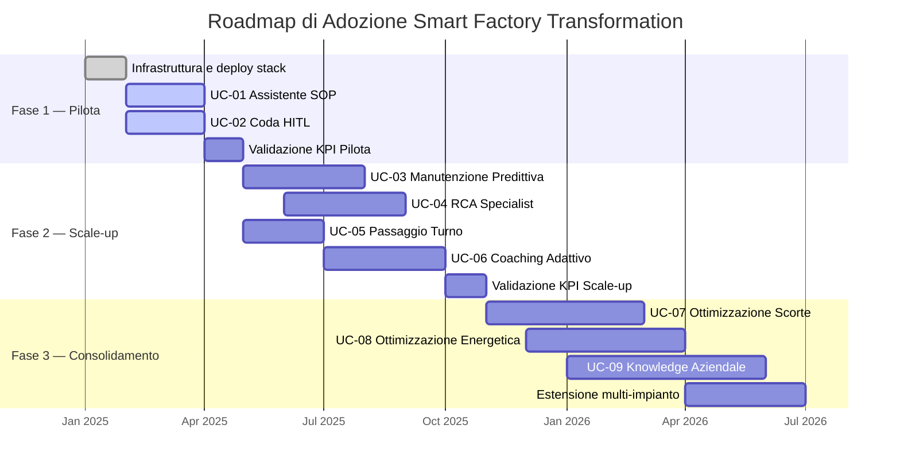
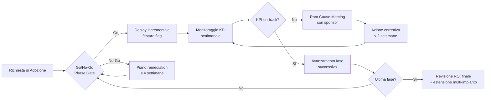
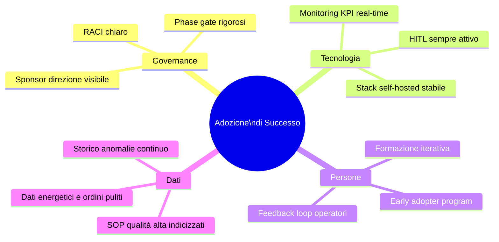

# Roadmap di Adozione

Piano di adozione progressiva della piattaforma Smart Factory Transformation in tre fasi allineate agli orizzonti dei [Casi d'Uso](../use-cases/index.md). Ogni fase include KPI di successo, rischi specifici e relative mitigazioni. I target numerici sono **SIMULATED TARGET** derivati dal dataset sintetico Mantis (Phase 9) — non costituiscono promesse contrattuali.

---

## Panoramica delle Fasi

---

## Fase 1 — Pilota (mesi 0–3)

**Obiettivo:** Dimostrare il valore della piattaforma su un singolo impianto pilota con le funzionalità core (UC-01, UC-02). Costruire fiducia degli operatori e del management nel sistema HITL.

**Prerequisiti organizzativi:**
- Nomina di un project sponsor a livello di direzione
- Identificazione di 2–3 operatori "early adopter" disponibili al feedback
- Formazione base HITL per supervisori (½ giornata)
- Accesso VPN/rete all'impianto pilota per il team di deployment

### KPI Fase 1

| KPI | Baseline (SIMULATED) | Target al mese 3 (SIMULATED TARGET) | Metodo di misura |
|-----|---------------------|--------------------------------------|-----------------|
| Tempo medio ricerca SOP | 8 min/ricerca | ≤ 5,6 min (−30%) | Log interazioni OperatorAssistant |
| Deviazioni SOP per turno | 3,2 / turno | ≤ 2,7 (−15%) | Audit HITL + supervisore |
| Decisioni critiche revisionate | 0% (processo manuale) | 100% | Coda approvazioni HITL |
| Adoption rate operatori | 0% | ≥ 60% utilizzo settimanale | Log sessioni UI |
| Soddisfazione operatori (NPS) | — | ≥ 40 | Survey post-pilota |

### Milestone Fase 1

1. **Settimana 2:** Stack Docker Compose attivo su server pilota; Qdrant indicizzato con SOP esistenti
2. **Settimana 4:** UC-01 in produzione; 5 operatori formati
3. **Settimana 6:** UC-02 HITL attivo; supervisori formati
4. **Mese 3:** Revisione KPI; go/no-go per Fase 2

---

## Fase 2 — Scale-up (mesi 3–9)

**Obiettivo:** Estendere la piattaforma al cluster manutenzione e formazione (UC-03..06). Ridurre il MTTR e strutturare il passaggio turno. Aumentare l'adoption rate a tutto il personale di reparto.

**Prerequisiti organizzativi:**
- Integrazione OPC-UA simulator (o sensori reali) configurata per firma tessile
- Storico anomalie ≥ 30 giorni (da Fase 1)
- Neo4j popolato con failure modes YAML dell'impianto
- Responsabile formazione dedicato per UC-06

### KPI Fase 2

| KPI | Baseline Fase 1 | Target al mese 9 (SIMULATED TARGET) | Metodo di misura |
|-----|----------------|--------------------------------------|-----------------|
| MTTR (Mean Time To Repair) | 4,8 h | ≤ 3,6 h (−25%) | CMMS / work order log |
| Guasti non pianificati / mese | 12 / mese | ≤ 9,6 (−20%) | PredictiveMaintenance audit |
| Disponibilità impianto | 82% | ≥ 94% (+15 pp) | Uptime telaio/filatoi |
| Omissioni di handover rilevate | 8 / settimana | ≤ 2,4 (−70%) | ShiftHandover report |
| Tempo certificazione nuovi operatori | 40 h | ≤ 26 h (−35%) | TrainingCoach tracking |
| Adoption rate cluster manutenzione | 0% | ≥ 70% | Log sessioni tecnici |

### Milestone Fase 2

1. **Mese 4:** AnomalyDetector + OPC-UA attivi; prime anomalie classificate
2. **Mese 5:** PredictiveMaintenance HITL in produzione; RCASpecialist attivato
3. **Mese 6:** ShiftHandover attivo; prime sessioni handover strutturate
4. **Mese 8:** TrainingCoach attivo; primi percorsi personalizzati generati
5. **Mese 9:** Revisione KPI Fase 2; go/no-go per Fase 3

---

## Fase 3 — Consolidamento (mesi 9–18)

**Obiettivo:** Attivare il cluster SCM (UC-07, UC-08) e capitalizzare la conoscenza aziendale (UC-09). Valutare l'estensione a impianti aggiuntivi. Chiudere il ciclo di valore con ottimizzazione economica dimostrabile.

**Prerequisiti organizzativi:**
- 18 mesi di storico ordini in `scm.historical_orders`
- Energy manager dedicato per UC-08
- Knowledge manager per governance UC-09
- Decision e governance framework per approvazione AI su ordini di acquisto

### KPI Fase 3

| KPI | Baseline Fase 2 | Target al mese 18 (SIMULATED TARGET) | Metodo di misura |
|-----|----------------|--------------------------------------|-----------------|
| Capitale immobilizzato in scorte | 100% (base) | −20% | Confronto valore inventario mensile |
| Rotture di stock / trimestre | 8 | ≤ 6,8 (−15%) | SCM / ERP |
| Costi acquisto d'urgenza | 100% (base) | −10% | Fatture fornitori |
| Costo energia annuale | 100% (base) | −12% | Bollette energetiche |
| Consumi in fascia off-peak | 55% | ≥ 63% (+8 pp) | TimescaleDB energy_readings |
| Documenti SOP riusati nelle ricerche | 30% | ≥ 42% (+40%) | Qdrant retrieval log |
| Tempo produzione nuove SOP | 8 h/SOP | ≤ 6 h (−25%) | DocumentationSynthesizer tracking |

### Milestone Fase 3

1. **Mese 10:** DemandForecaster + InventoryManager attivi; prime proposte ordine HITL
2. **Mese 12:** EnergyOptimizer attivo; piano di shift off-peak condiviso con energy manager
3. **Mese 14:** KnowledgeCurator + DocumentationSynthesizer attivi; primo batch SOP aggiornato
4. **Mese 16:** Valutazione estensione multi-impianto (architettura già distribuita by design)
5. **Mese 18:** Revisione KPI complessivi; report ROI finale

---

## Flusso di Governance

---

## Registro Rischi di Adozione

| ID | Categoria | Rischio | Probabilità | Impatto | Mitigazione |
|----|-----------|---------|-------------|---------|-------------|
| R-01 | Change Management | Resistenza operatori all'adozione del sistema AI | Alta | Alto | Early adopter program (2–3 campioni per reparto); sessioni Q&A; dashboard trasparenza AI; HITL visibile come garanzia |
| R-02 | Tecnico | Qualità SOP indicizzati insufficiente per RAG efficace | Media | Alto | Audit qualità documenti SOP prima dell'indicizzazione; ciclo di feedback operatori per segnalare risposte errate |
| R-03 | Organizzativo | Sponsor direzione non disponibile per decisioni escalation | Bassa | Alto | Definire backup sponsor prima dell'avvio Fase 1; matrice RACI documentata |
| R-04 | Tecnico | Integrazione OPC-UA reale (vs simulatore) più complessa del previsto | Media | Medio | Mantienere il simulatore in parallelo durante la transizione; test di accettazione OT prima del go-live |
| R-05 | Tecnico | Deriva del modello LLM su SOP specifici del dominio tessile | Bassa | Medio | DeepEval gate CI (Phase 11); hallucination rate ≤ 5% monitorato continuamente; human-in-the-loop obbligatorio su decisioni critiche |
| R-06 | Change Management | Supervisori che bypassano la coda HITL per urgenza percepita | Media | Alto | Policy aziendale esplicita; audit trail completo; metriche bypass visibili su dashboard manager |
| R-07 | Economico | Risparmio energetico UC-08 inferiore al target per variazioni tariffarie | Bassa | Medio | EnergyOptimizer parametrico: aggiornare fasce orarie e prezzi energetici in params.toml senza redeploy |
| R-08 | Organizzativo | Turnover del knowledge manager compromette UC-09 | Bassa | Alto | Processo di succession planning documentato; KnowledgeCurator autonomo riduce dipendenza da singola persona |
| R-09 | Tecnico | Scalabilità stack Docker Compose su più impianti | Media | Medio | Architettura già progettata per multi-tenant; valutare migrazione a Kubernetes per Fase 3 estensione |
| R-10 | Compliance | Nuovi requisiti normativi AI Act EU durante la fase di adozione | Bassa | Alto | STRIDE threat model e HITL obbligatorio per decisioni critiche (Phase 11) già allineati ai principi AI Act; monitorare aggiornamenti normativi ogni 6 mesi |

---

## Fattori Critici di Successo

> **Nota SIMULATED TARGET:** tutti i valori KPI sono stimati sul dataset sintetico Mantis (Phase 9) e su benchmark letteratura Industry 4.0 tessile. Non costituiscono garanzie contrattuali. Vedere l'[Assumption Register](../assumptions/index.md) per le assunzioni sottostanti.
