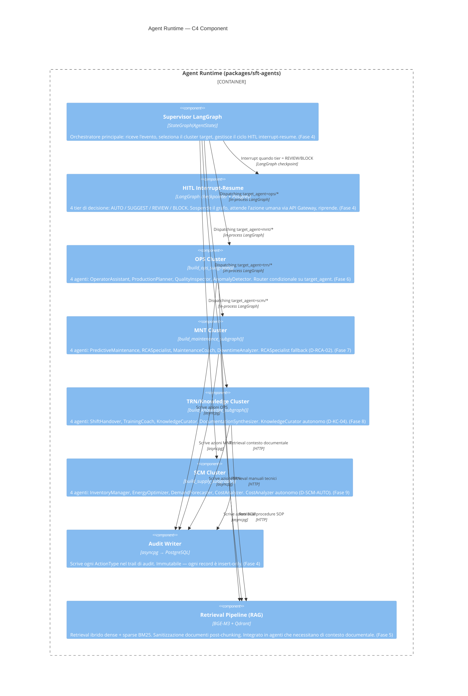

# C4 — Diagramma di Componente

Il livello componente mostra la struttura interna dell'**Agent Runtime**:
supervisor LangGraph, 4 cluster subgraph, meccanismo HITL interrupt-resume.

> **SC-3 — Tracciabilità:** ogni componente corrisponde a codice implementato in
> `packages/sft-agents/` (Fasi 4–9). I nomi dei cluster corrispondono a
> `VALID_CLUSTERS` in `sft_agents/runtime/state.py`.

## HITL — Livelli di decisione

| Tier | Label | Comportamento |
|------|-------|--------------|
| 0 | AUTO | Esegue senza approvazione (agenti autonomi: CostAnalyzer, KnowledgeCurator) |
| 1 | SUGGEST | Propone all'operatore, esegue se non rigettato entro timeout |
| 2 | REVIEW | Sospende, attende approvazione esplicita dell'operatore |
| 3 | BLOCK | Sospende, richiede approvazione del manager |

## Navigazione C4

- [C4 Context](c4-context.md) — attori e confini
- [C4 Container](c4-container.md) — applicazioni e database
