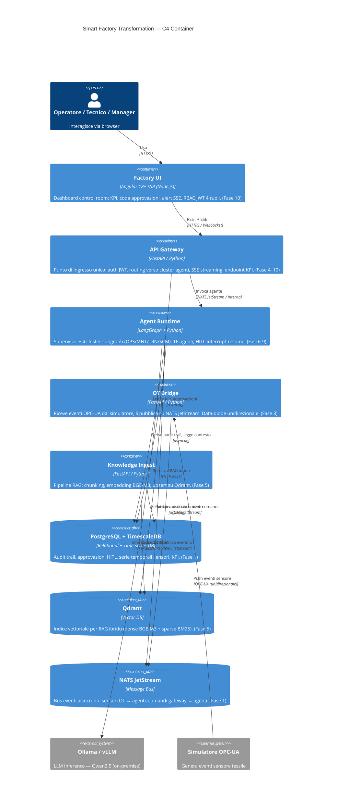

# C4 — Diagramma di Container

Il livello container mostra i **processi/applicazioni** che compongono la piattaforma,
le tecnologie e le comunicazioni principali.

> **SC-3 — Tracciabilità:** ogni container corrisponde a un'applicazione o servizio
> implementato nelle fasi 1–11. Nessun container pianificato ma non spedito.

## Mappa tecnologica

| Container | Tecnologia | Fase |
|-----------|-----------|------|
| Factory UI | Angular 18+ SSR | 10 |
| API Gateway | FastAPI 0.115+ | 4, 10 |
| Agent Runtime | LangGraph 0.4+ | 4, 6–9 |
| OT Bridge | FastAPI / asyncio | 3 |
| Knowledge Ingest | FastAPI + BGE-M3 | 5 |
| PostgreSQL + TimescaleDB | PG 16 + TimescaleDB 2.x | 1 |
| Qdrant | Qdrant 1.x | 5 |
| NATS JetStream | NATS 2.x | 1 |
| Ollama | Ollama — Qwen2.5 | 1 |

## Navigazione C4

- [C4 Context](c4-context.md) — attori esterni e confini
- [C4 Component](c4-component.md) — struttura interna dell'agent runtime
