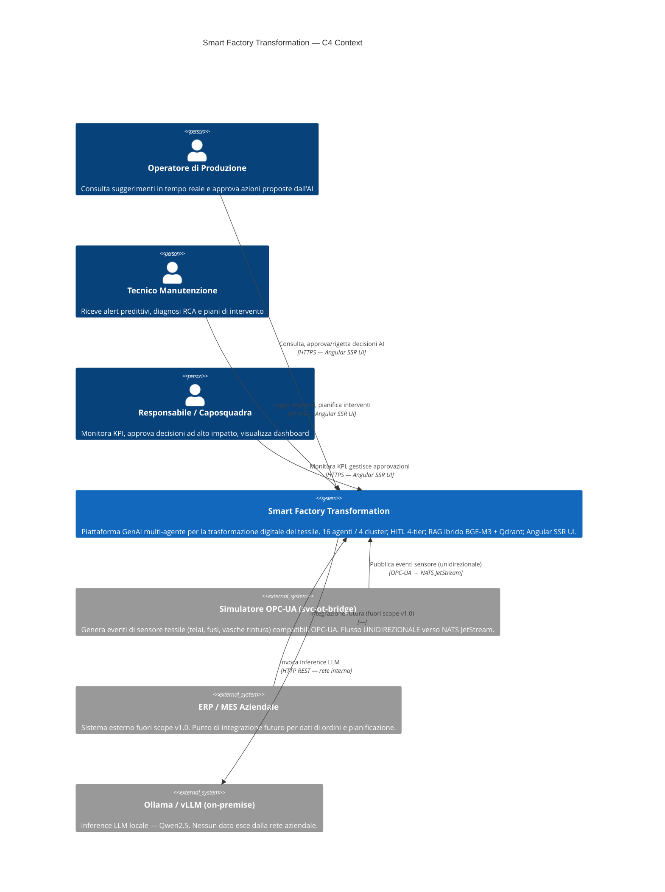

# C4 — Diagramma di Contesto

Il livello di contesto mostra **chi** interagisce con la piattaforma Smart Factory Transformation
e quali sistemi esterni ne costituiscono il confine operativo.

> **SC-3 — Tracciabilità:** ogni elemento corrisponde a un componente implementato
> (Fase 1–11) o a un sistema esterno reale. Nessun elemento aspirazionale.

## Principi di confine

| Principio | Implementazione |
|-----------|----------------|
| **Data-diode OT** | `svc-ot-bridge` riceve da OPC-UA e pubblica su NATS — il flusso inverso (agenti → OT) è bloccato a livello NetworkPolicy Kubernetes (Fase 1) |
| **Self-hostable** | Ollama/vLLM on-premise: nessun dato industriale esce dalla rete aziendale |
| **HITL 4-tier** | Ogni decisione critica transita per approvazione umana prima dell'esecuzione (Fase 4) |

## Prossimi livelli C4

- [C4 Container](c4-container.md) — componenti interni e loro comunicazione
- [C4 Component](c4-component.md) — struttura interna dell'agent runtime
