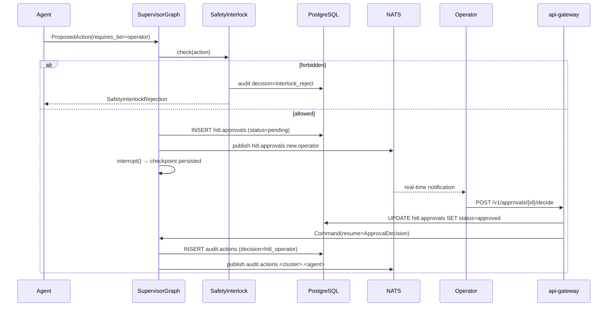

# HITL Cycle (Human-in-the-Loop)

## Overview

The HITL cycle is the **core value** of the platform: every critical AI
decision passes through an informed human, but no human is ever alone facing
an operational problem. Phase 4 ships the full mechanical substrate covering
**HITL-01 through HITL-10** (see `.planning/REQUIREMENTS.md`):

- HITL-01: agent `interrupt()` → state persists → `Command(resume=)` resumes
- HITL-02: approval queue persisted in PG (`hitl.approvals`)
- HITL-03: Safety Interlock — whitelist-enforced action rejection
- HITL-04: REST API for decision (`/v1/approvals/{id}/decide`)
- HITL-05: audit replay via NATS `AUDIT_STREAM` (90d retention)
- HITL-06: `EvidencePanel` attached to every AI decision
- HITL-07: motivation required for any HITL override
- HITL-08: replay tool as rollback substrate (event-sourcing replay)
- HITL-09: approval rate Governor (>80% auto → alert)
- HITL-10: GDPR redaction on checkpointed state

For the supervisor + cluster + checkpointer topology, see
[Core Agentic Runtime](./agentic-runtime.md).

---

## Sequence Diagram

The full interrupt-to-resume cycle, end to end:



The checkpoint persisted at `interrupt()` survives `docker compose restart` —
when the operator decides hours later, the supervisor reads the checkpoint,
applies the `Command(resume=)`, and continues execution.

---

## Approval Queue (D-55)

The approval queue is a PG table — append-only audit-style with only the
decision-related columns mutable (`status`, `decided_at`, `decided_by`,
`decision_json`, `escalated_to_id`):

```sql
CREATE TABLE hitl.approvals (
  id              UUID PRIMARY KEY DEFAULT gen_random_uuid(),
  agent_id        TEXT NOT NULL,
  thread_id       TEXT NOT NULL,
  tier            TEXT NOT NULL CHECK (tier IN ('operator','supervisor','manager','safety_interlock')),
  action_type     TEXT NOT NULL,
  payload_json    JSONB NOT NULL,
  status          TEXT NOT NULL DEFAULT 'pending'
                    CHECK (status IN ('pending','approved','rejected','escalated','timed_out')),
  created_at      TIMESTAMPTZ NOT NULL DEFAULT NOW(),
  sla_deadline    TIMESTAMPTZ NOT NULL,
  decided_at      TIMESTAMPTZ,
  decided_by      TEXT,
  decision_json   JSONB,
  escalated_to_id UUID REFERENCES hitl.approvals(id)
);

CREATE INDEX idx_approvals_tier_status
  ON hitl.approvals (tier, status, sla_deadline)
  WHERE status = 'pending';
```

The partial index covers the dominant query: `SELECT ... WHERE tier=$1 AND
status='pending' ORDER BY sla_deadline`.

Notifications are pushed via NATS subject `hitl.approvals.new.<tier>` so the
Phase 11 Angular UI receives near-real-time updates without WebSocket
infrastructure. UI poll via REST `GET /v1/approvals?tier=...&status=pending`
is the fallback path.

---

## Escalation Chain (D-57)

Auto-escalation timers run as a background asyncio task
(`EscalationSupervisor`) scanning `hitl.approvals WHERE status='pending'
AND sla_deadline < NOW()` every 30s. The SLA matrix is loaded from
`packages/sft-agents/src/sft_agents/policies/escalation-sla.yaml`:

| Tier | SLA | On timeout |
| --- | --- | --- |
| `operator` | 2 minutes | escalate → `supervisor` |
| `supervisor` | 15 minutes | escalate → `manager` |
| `manager` | 60 minutes | alert (decision=`timed_out`); no further escalation |
| `safety_interlock` | **no timeout** | manual-only; never auto-escalates |

The `escalated_to_id` FK links escalated rows to their target tier, so the
full history is queryable by recursive CTE. The Safety Interlock tier
deliberately has **no timeout** — silently bypassing a safety check after a
clock tick is the anti-pattern this design refuses to enable.

---

## Safety Interlock (D-58, HITL-03)

`SafetyInterlockMiddleware` is a LangGraph middleware node inserted **before**
every `ToolNode`. It refuses _a priori_ any action whose
`target_subject` matches the forbidden NATS subject patterns, or whose
`action_type` matches the forbidden enum, declared in
`packages/sft-agents/src/sft_agents/policies/safety-interlock.yaml`:

```yaml
forbidden_subjects:
  - "cmd.plc.setpoint.>"      # OPC-UA writes forbidden by Phase 3 diode
  - "cmd.actuator.>"          # actuator commands
  - "cmd.firmware.deploy"     # firmware deployment
  - "cmd.network.acl.>"       # network ACL mutations

forbidden_action_types:
  - WRITE_PLC_SETPOINT
  - ACTUATOR_COMMAND
  - FIRMWARE_DEPLOY
  - NETWORK_ACL_CHANGE
```

A forbidden action triggers:

1. `INSERT audit.actions (decision='interlock_reject', ...)`
2. `raise SafetyInterlockRejection` (the agent thread terminates)
3. The `ApprovalRequest` (if one existed) auto-fails

There is **no UI override path** for Safety Interlock — disabling a forbidden
entry requires a code change + PR review + audit trail. This is intentional
defense-in-depth: even after Phase 7+ wires a real `cmd.*` subscriber, the
agentic layer cannot reach the actuator without an explicit policy edit.

---

## Audit Dual-Write (D-56)

The dual-write invariant for `audit.actions`:

1. **PG sync first.** Any PG failure re-raises and aborts the agent. A
   NATS-only audit is impossible by construction (T-04-Audit-Tamper).
2. **NATS async second.** On NATS publish failure, the row is enqueued in
   `audit.outbox` with exponential-backoff retry (2s..3600s cap, max 10
   attempts before dead-letter logging).

`AuditWriter` in `packages/sft-agents/src/sft_agents/audit/writer.py`
composes `AuditPgWriter` + `AuditNatsPublisher` + `OutboxWriter` and enforces
the ordering. PG is the source of truth (7-year retention); NATS is the
telemetry replica (90-day retention).

The `audit.actions` table is a TimescaleDB hypertable partitioned by `ts`
(30-day chunks). The `agent_role` PostgreSQL role has `INSERT, SELECT` only —
`UPDATE` and `DELETE` are explicitly REVOKED. Phase 11 will bind login users
to `agent_role` via SealedSecrets.

---

## Governor (D-58, HITL-09)

`Governor` is a background asyncio task scanning `audit.actions` over a
1-hour sliding window every 60s. It computes:

```
auto_rate = count(decision='auto') / count(*)
```

When `auto_rate > 0.80` AND `count(*) >= 20` (minimum sample) AND no
governor alert fired in the last 5 minutes (cooldown anti-thrash):

1. `INSERT audit.actions (decision='governor_alert', ...)` with payload
   containing the rate stats + top agents.
2. NATS publish `hitl.governor.alert` so the UI surfaces a banner.
3. Create a Manager-tier `ApprovalRequest` so a human explicitly accepts
   the rate or disables an agent.

The window is naturally self-resetting: once HITL approvals re-balance the
denominator, `auto_rate` drops below 80% without manual intervention.

---

## Decision Matrix

| Decision (audit.actions.decision) | When | Required fields |
| --- | --- | --- |
| `auto` | LLM ran end-to-end, no HITL needed | `motivation=NULL`, `approval_id=NULL` |
| `hitl_operator` | Operator tier approved | `motivation` non-empty, `approval_id` set |
| `hitl_supervisor` | Supervisor tier approved | `motivation` non-empty, `approval_id` set |
| `hitl_manager` | Manager tier approved | `motivation` non-empty, `approval_id` set |
| `interlock_reject` | Safety Interlock refused the action | `approval_id=NULL` |
| `rolled_back` | Replay-driven rollback (HITL-08) | `motivation` describing rollback context |
| `timed_out` | Manager tier timeout (no further escalation) | `approval_id` set |
| `governor_alert` | >80% auto rate over last hour | `approval_id` set (Manager review) |
| `escalated` | Tier auto-escalated due to SLA expiry | `escalated_to_id` set on PRIOR row |

The Pydantic `AuditRecord._check_decision_consistency` model_validator
enforces the per-row invariants, mirrored by a CHECK constraint on the table
for defense-in-depth.

---

## Cross-references

- [Core Agentic Runtime](./agentic-runtime.md) — supervisor + cluster topology, checkpointer, replay
- [LLM Serving](./llm-serving.md) — backend adapter, Langfuse tracing
- [Architecture Overview](./overview.md) — full system C4 diagrams
