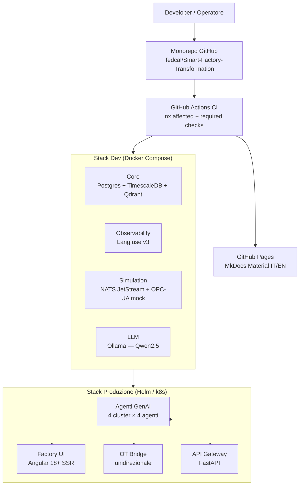

# Architettura: Overview

!!! info "Dettagli in espansione"
    Questa pagina mostra l'architettura ad alto livello del sistema. I dettagli
    per ogni layer verranno documentati nelle fasi successive.

## Schema ad alto livello

## Principi guida

### Human-in-the-Loop (HITL)

Il principio fondamentale dell'architettura: **nessuna azione critica viene eseguita senza approvazione umana**. Ogni agente che propone un'azione rilevante espone un nodo di approvazione nella sua state machine LangGraph. L'operatore può approvare, modificare o rigettare prima dell'esecuzione.

### Unidirezionalità del layer OT

Il componente `svc-ot-bridge` implementa un principio **data-diode**: riceve segnali dall'ambiente OT (PLC, sensori, OPC-UA) e li pubblica su NATS JetStream verso il layer agenti. Il flusso inverso (agenti verso OT) è bloccato a livello di NetworkPolicy Kubernetes — gli agenti non possono inviare comandi diretti ai simulatori o all'hardware.

### Stack self-hostable

Tutto lo stack è progettato per deploy **on-premise single-tenant**: nessun dato industriale esce dalla rete aziendale. I modelli LLM girano localmente via Ollama/vLLM. La piattaforma cloud (GitHub) è usata solo per versionamento e CI pubblici.

## Layer dell'architettura

| Layer | Componenti | Piano di fase |
|-------|-----------|---------------|
| **Monorepo & CI** | Nx, GitHub Actions, pre-commit | Fase 1 |
| **Dev Stack** | Docker Compose, Langfuse, NATS, Qdrant | Fase 1 |
| **Simulazione OT** | Simulatore tessile, mock OPC-UA, NASA C-MAPSS | Fase 3 |
| **Core Agentico** | LangGraph supervisor, SDK, 16 agenti | Fase 4 |
| **Frontend** | Angular 18+ SSR, dashboard control room | Fase 5 |
| **Produzione** | Helm charts, Kubernetes, SealedSecrets | Fase 1 + 6+ |

---

!!! note "Aggiornamento progressivo"
    Questo diagramma verrà arricchito con i dettagli di ogni componente man mano
    che le fasi successive vengono completate.
