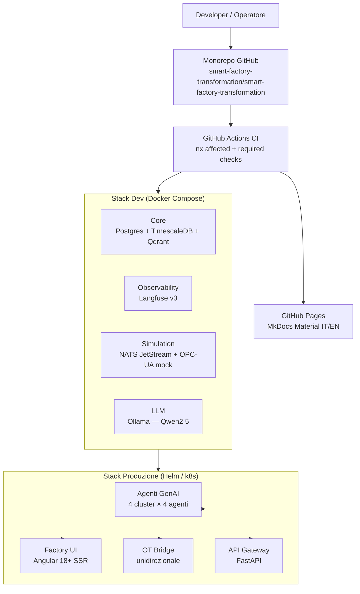
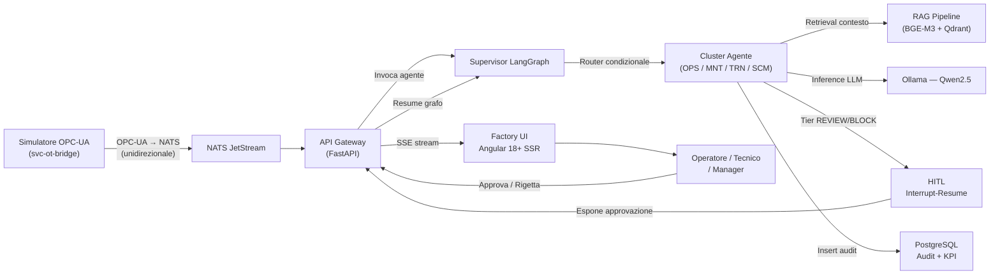

# Architettura: Overview

Questa pagina illustra l'architettura ad alto livello di Smart Factory Transformation,
con il data-flow end-to-end e i collegamenti ai tre livelli C4.

## Stack e layer

## Data-flow end-to-end

Il flusso principale da evento sensore a risposta operatore:

## Principi guida

### Human-in-the-Loop (HITL)

Il principio fondamentale dell'architettura: **nessuna azione critica viene eseguita senza approvazione umana**. Ogni agente che propone un'azione rilevante espone un nodo di approvazione nella sua state machine LangGraph. L'operatore può approvare, modificare o rigettare prima dell'esecuzione.

### Unidirezionalità del layer OT

Il componente `svc-ot-bridge` implementa un principio **data-diode**: riceve segnali dall'ambiente OT (PLC, sensori, OPC-UA) e li pubblica su NATS JetStream verso il layer agenti. Il flusso inverso (agenti verso OT) è bloccato a livello di NetworkPolicy Kubernetes — gli agenti non possono inviare comandi diretti ai simulatori o all'hardware.

### Stack self-hostable

Tutto lo stack è progettato per deploy **on-premise single-tenant**: nessun dato industriale esce dalla rete aziendale. I modelli LLM girano localmente via Ollama/vLLM. La piattaforma cloud (GitHub) è usata solo per versionamento e CI pubblici.

## Layer dell'architettura

| Layer | Componenti | Piano di fase |
|-------|-----------|---------------|
| **Monorepo & CI** | Nx, GitHub Actions, pre-commit | Fase 1 |
| **Dev Stack** | Docker Compose, Langfuse, NATS, Qdrant | Fase 1 |
| **Simulazione OT** | Simulatore tessile, mock OPC-UA, NASA C-MAPSS | Fase 3 |
| **Core Agentico** | LangGraph supervisor, SDK, 16 agenti | Fase 4 |
| **Knowledge Layer** | RAG ibrido BGE-M3 + Qdrant | Fase 5 |
| **Agenti OPS** | OperatorAssistant, ProductionPlanner, QualityInspector, AnomalyDetector | Fase 6 |
| **Agenti MNT** | PredictiveMaintenance, RCASpecialist, MaintenanceCoach, DowntimeAnalyzer | Fase 7 |
| **Agenti TRN** | ShiftHandover, TrainingCoach, KnowledgeCurator, DocumentationSynthesizer | Fase 8 |
| **Agenti SCM** | InventoryManager, EnergyOptimizer, DemandForecaster, CostAnalyzer | Fase 9 |
| **Frontend** | Angular 18+ SSR, dashboard control room | Fase 10 |
| **Osservabilità** | Langfuse v3, OpenTelemetry, Grafana | Fase 11 |

## Livelli C4

| Livello | Contenuto |
|---------|-----------|
| [C4 Context](c4-context.md) | Attori (operatore, tecnico, manager) e sistemi esterni (OPC-UA, ERP) |
| [C4 Container](c4-container.md) | Applicazioni interne: API Gateway, Agent Runtime, OT Bridge, Qdrant, NATS |
| [C4 Component](c4-component.md) | Struttura interna Agent Runtime: supervisor, 4 cluster, HITL, audit, RAG |
