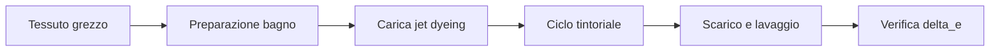

# Tintura

La **tintura** è il processo chimico di colorazione delle fibre, filati o tessuti mediante immersione in **bagno_colorante** a temperatura e pH controllati. Il **jet_dyeing** è la macchina prevalente per la tintura di tessuti a corda: il **tessuto_grezzo** viene trasportato attraverso il **bagno_colorante** da getti di liquido ad alta pressione, garantendo un contatto uniforme tra fibra e colorante. La qualità del risultato è misurata con il **delta_e** rispetto allo standard di colore concordato.

## Process flow

## Asset coinvolti

- **jet_dyeing** — Macchina per tintura a corda; rapporto **bagno_colorante** tipico 1:4-1:8 per sintetici e misto; temperatura operativa fino a 130°C per poliestere
- **spettrofotometro** — Strumento per la misurazione della riflessione spettrale; misura **delta_e** CMC o CIEDE2000 con precisione 0.01 unità su campioni di tessuto
- **igrometro** — Controllo umidità in area stoccaggio tessuto pre/post tintura per evitare variazioni dimensionali
- **magazzino_automatizzato** — Stoccaggio rotoli **tessuto_grezzo** pre-tintura e rotoli tinti in attesa di **finissaggio**; tracciabilità lotto obbligatoria

## KPI

- **delta_e** (CMC) — range accettabile <1.0 per produzione standard, <0.5 per campionario; misura la differenza di colore tra campione tinto e standard colorimetrico
- **oee** (%) — range 72-80% per impianti **jet_dyeing** moderni; le perdite principali sono i cicli di lavaggio e i rigetti per **deviazione_tono**
- **mttr** (ore) — range 1-4 ore per guasto al sistema di riscaldamento o pompa di circolazione del **jet_dyeing**
- **mtbf** (ore) — range 400-800 ore per **jet_dyeing** in cotone; usura su ugelli e guarnizioni è il failure mode principale

## Pain point

- **deviazione_tono** tra lotti — Una **deviazione_tono** con **delta_e** CMC >1.0 tra rotoli dello stesso lotto causa il rifiuto del batch tintoriale; le cause principali sono variazioni di pH, temperatura o rapporto **bagno_colorante** non costante durante il ciclo.
- **screziatura** da movimento lento — La **screziatura** (variazione non uniforme del colore in superficie) si manifesta quando il tessuto si muove troppo lentamente nel **jet_dyeing** o il rapporto bagno non è uniforme; il difetto è rilevato all'**ispezione_rotolo** e richiede ritintura o declassamento.
- Solidità colore insufficiente — Un **delta_e** stabile dopo prima misurazione può decadere in fase di test di solidità (lavaggio, luce, sfregamento); la causa è la scelta del colorante o il fissaggio incompleto nel ciclo di **tintura**; il danno è il rifiuto dell'intera partita.
- Gestione **bagno_colorante** esausto — Lo smaltimento del **bagno_colorante** esausto è soggetto a normativa ambientale; la concentrazione di agenti chimici residui richiede trattamento prima dello scarico, con costi operativi variabili in funzione del carico tintoriale.

!!! note "Mantis context"
    Il reparto tintura Mantis lavora principalmente con coloranti reattivi (cotone/lino) e acidi (lana). Il target di **delta_e** per le collezioni outdoor è <0.8 CMC per garantire la coerenza cromatica tra stagioni. Il **jet_dyeing** Thies iMaster è la macchina principale per tessuti tecnici misti. La tintura opera su turni 2×12h per ottimizzare i cicli lunghi (4-8 ore per ciclo completo).

## Riferimenti

- [Glossario: tintura, jet_dyeing, delta_e, bagno_colorante](../../glossary.md)
- [Procedure SOP — Dyeing](../../sop/index.md)
