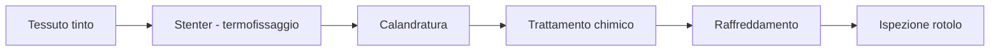

# Finissaggio

Il **finissaggio** è l'insieme di trattamenti chimici e meccanici applicati al **tessuto_grezzo** tinto per migliorarne handle (mano), aspetto, dimensioni stabili e proprietà funzionali (impermeabilità, antipiega, antibatterico). L'**impianto_finissaggio** è una linea integrata che può includere stenter, calandre, sanforizzatori e impianti per trattamenti chimici. Il **finissaggio** è l'ultima fase produttiva prima dell'**ispezione_rotolo** e della consegna al cliente.

## Process flow

## Asset coinvolti

- **impianto_finissaggio** — Linea Monforts/Brückner: stenter a catene con 8-12 campi, velocità 20-80 m/min in funzione del tessuto; trattamento termico 130-200°C
- **magazzino_automatizzato** — Stoccaggio rotoli finiti in attesa di spedizione; ogni rotolo è tracciato con lotto, **titolo_filato** e parametri di **finissaggio**
- **tavolo_ispezione** — Piano luminoso per classificazione difetti finali (**aloni**, **pilling**, **difetto_orlatura**) prima della consegna
- **igrometro** — Controllo umidità in ingresso per garantire stabilità dimensionale durante termofissaggio; variazioni >5% RH alterano il restringimento finale

## KPI

- **oee** (%) — range 75-85% per linea stenter moderna; perdite principali sono i setup cambio ricetta e i fermi per **aloni** o difetti chimici emersi in ispezione
- **mtbf** (ore) — range 500-1000 ore per stenter industriale; catene di trasporto e ugelli di spruzzatura sono i componenti più critici
- **mttr** (ore) — range 1-3 ore per guasto a riscaldatori o pompe dosaggio chimico
- **pilling** (grado ICI) — target ≥4 ICI per tessuti outdoor Mantis; misurato su campione a 5000 cicli Martindale

## Pain point

- **aloni** post-trattamento chimico — Gli **aloni** causati da gocciolamenti di agenti impermeabilizzanti durante il passaggio in stenter sono difetti major che portano a declassamento del rotolo; l'origine è spesso usura degli ugelli di spruzzatura o viscosità errata della formulazione.
- **pilling** elevato — Un **pilling** inferiore a grado 3 ICI non è accettabile per abbigliamento outdoor; la causa è una formulazione di **finissaggio** insufficiente o una tensione di calandratura non ottimale; il test richiede 24-48 ore, allungando il ciclo di qualifica.
- Restringimento **tessuto_grezzo** fuori tolleranza — Il **tessuto_grezzo** perde 3-8% in larghezza durante il termofissaggio per cotone; una variazione non controllata della temperatura stenter produce lotti con dimensioni fuori tolleranza, portando a resi dal cliente.
- **rigatura** da stenter — Tensioni non uniformi sui pin laterali dello stenter producono **rigatura** orizzontale nel tessuto finito; il difetto è rilevato all'**ispezione_rotolo** ma origina da setup iniziale errato, rendendo costoso il rimedio a posteriori.

!!! note "Mantis context"
    Il **finissaggio** Mantis include trattamenti impermeabilizzanti DWR (Durable Water Repellency) per la linea outdoor e trattamenti antistatici per i tessuti tecnici. Il target di restringimento è <1.5% per cotone sanforizzato. La linea finissaggio opera su turno singolo 8h con fermata settimanale per pulizia ugelli e sostituzione catene. I tessuti destinati al segmento sportswear richiedono test **pilling** aggiuntivi su protocollo cliente.

## Riferimenti

- [Glossario: finissaggio, impianto_finissaggio, pilling, tessuto_grezzo](../../glossary.md)
- [Procedure SOP — Finishing](../../sop/index.md)
