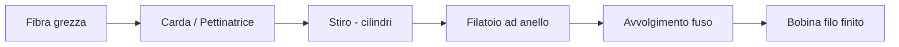

# Filatura

La **filatura** è il processo di trasformazione delle fibre tessili (cotone, lana, lino) in filo continuo mediante stiro, torsione e avvolgimento. Il **filatoio_anello** è la macchina principale per la filatura di fibre corte: il nastro proveniente dalla **cardatura** o **pettinatura** viene stirato dai cilindri di stiro, torto dall'anello rotante e avvolto sul **fuso**. Il **titolo_filato** risultante determina la grammatura e le proprietà meccaniche del tessuto finale.

## Process flow

## Asset coinvolti

- **filatoio_anello** — Macchina principale per filatura fibre corte; 500-1500 fusi per macchina, velocità fuso 8.000-20.000 rpm
- **carda** — Apre e parallelizza le fibre corte producendo il nastro di alimentazione; velocità cilindro principale 200-350 m/min
- **pettinatrice** — Elimina le fibre corte per produrre **titolo_filato** fine (Nm >60); fino a 500 nips/min in configurazione moderna
- **fuso** — Elemento rotante che imprime la torsione al filo; un **fuso** sbilanciato genera vibrazioni rilevabili a 50-200 Hz
- **igrometro** — Monitora l'umidità relativa (55-65% RH) per ridurre **rottura_filo** e cariche elettrostatiche

## KPI

- **oee** (%) — range 60-72% in reparti filatura; la perdita principale è dovuta a **rottura_filo** e manutenzione fusi
- **titolo_filato** (Nm) — range 20-80 Nm per cotone da tessuto; formula: lunghezza(km)/massa(kg); determina grammatura finale
- **mtbf** (ore) — range 200-500 ore per **filatoio_anello** moderno; fusi e anelli rotanti sono i componenti più critici
- **irregolarita_filato** (CVm%) — range accettabile <12% per cotone pettinato; misurato con Uster Tester su ogni bobina

## Pain point

- **rottura_filo** frequente — Una frequenza di **rottura_filo** superiore a 10 rotture/1000 fusi-ora indica usura degli anelli rotanti o qualità fibra insufficiente; ogni rottura richiede l'intervento dell'operatore per il rincorso manuale.
- **irregolarita_filato** elevata — Un CVm% superiore a 15% produce **slub** e **neps** nel filo, che si trasformano in difetti visibili nel tessuto dopo **tessitura**; la causa principale è uno **stiro** disomogeneo nei cilindri.
- Usura **fuso** — Un **fuso** sbilanciato aumenta la vibrazione meccanica, degradando la qualità del filo e incrementando le **rottura_filo**; la manutenzione preventiva richiede calibrazione con **calibro_digitale** ogni 500 ore.
- Accumulo **neps** da **cardatura** — La velocità di **cardatura** eccessiva aumenta i **neps** nel nastro, che diventano irregolarità visibili nel tessuto finito; il bilanciamento tra produttività e qualità fibra è la decisione critica quotidiana del capoturno.

!!! note "Mantis context"
    Il reparto filatura Mantis produce principalmente filati Nm 40-60 in cotone pettinato e blend lana/cotone per tessuti tecnici outdoor. L'obiettivo di **irregolarita_filato** CVm% è <10% per cotone pettinato. I turni 3×8h garantiscono continuità produttiva; la manutenzione fusi è pianificata nel turno notturno del venerdì per minimizzare l'impatto sull'**oee** settimanale.

## Riferimenti

- [Glossario: filatura, filatoio_anello, titolo_filato, irregolarita_filato](../../glossary.md)
- [Procedure SOP — Spinning](../../sop/index.md)
