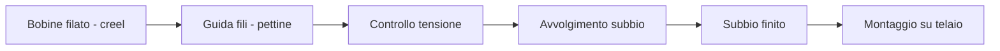

# Orditura

L'**orditura** è l'operazione preliminare alla tessitura che dispone in parallelo i fili di **ordito** sul **subbio** con tensione e densità controllate. Il **subbio** così preparato viene poi montato sul **telaio**. Una corretta orditura è condizione necessaria per evitare **difetto_catena** e **rottura_filo** durante la **tessitura**: qualsiasi irregolarità di tensione o densità si riflette direttamente sulla qualità del tessuto finale.

## Process flow

## Asset coinvolti

- **subbio** — Cilindro di avvolgimento dei fili di **ordito**; diametro 800-1200 mm, capacità fino a 1200 m di filo in cotone Nm 40
- **misuratore_tensione_ordito** — Sensore che rileva la tensione filo durante l'avvolgimento; valore tipico 10-30 N per cotone, con soglie di allarme per deviazioni >±20%
- **igrometro** — Controllo umidità in reparto (55-65% RH) per evitare variazioni di tensione causate dall'assorbimento idrico del filato
- **calibro_digitale** — Verifica diametro **subbio** e tolleranze di montaggio dei componenti meccanici dell'orditrice

## KPI

- **oee** (%) — range 70-82% in orditura (processo meno frammentato rispetto a tessitura e filatura); le perdite principali sono i setup cambio **subbio** e le **rottura_filo** durante l'avvolgimento
- **titolo_filato** (Nm) — Verifica del **titolo_filato** sui lotti in ingresso per garantire coerenza con specifiche di produzione; deviazione >5% Nm porta a rifiuto del lotto
- **mtbf** (ore) — range 300-600 ore per orditrice settoriale/a sezioni; componenti critici sono i pettini e i freni di tensione
- **mttr** (ore) — range 0.5-1.5 ore per rotto filo in orditura; la riparazione è manuale e richiede rincorso preciso

## Pain point

- **difetto_catena** da tensione non uniforme — Una tensione non uniforme durante l'**orditura** produce un **difetto_catena** visibile nel tessuto finito come striscia verticale; la causa è spesso usura dei freni tensore o bobina difettosa nel creel.
- **rottura_filo** in avvolgimento — Ogni **rottura_filo** interrompe il ciclo di avvolgimento e richiede rincorso manuale; in **orditura** settoriale il costo è elevato perché il difetto si propaga su tutta la sezione.
- **contaminazione_fibra** in ingresso — La presenza di **contaminazione_fibra** nelle bobine di **ordito** non viene rilevata in **orditura** ma emerge come punto scuro nel tessuto tinto; la verifica visiva del lotto bobine è il presidio critico.
- Pianificazione cambio articolo — Il setup per cambio articolo (passo, densità, **titolo_filato**) richiede 2-4 ore; la frammentazione degli ordini di piccola taglia aumenta il rapporto setup/produzione con impatto diretto sull'**oee**.

!!! note "Mantis context"
    L'orditura Mantis gestisce principalmente orditi da 2000-3600 fili per articoli outdoor in cotone/lana. L'orditrice settoriale è preferita per i lotti brevi (300-800 m) tipici del campionario stagionale. La tensione di orditura target è 15-20 N per blend cotone/lana Nm 40. Il reparto è climatizzato a 22°C ±1°C e 60% RH per garantire stabilità del **titolo_filato**.

## Riferimenti

- [Glossario: orditura, subbio, ordito, tensione](../../glossary.md)
- [Procedure SOP — Loom](../../sop/index.md)
