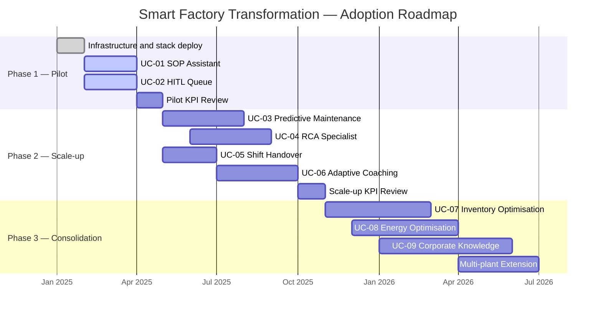
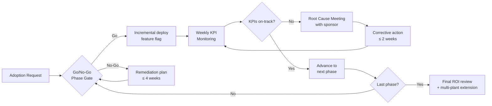
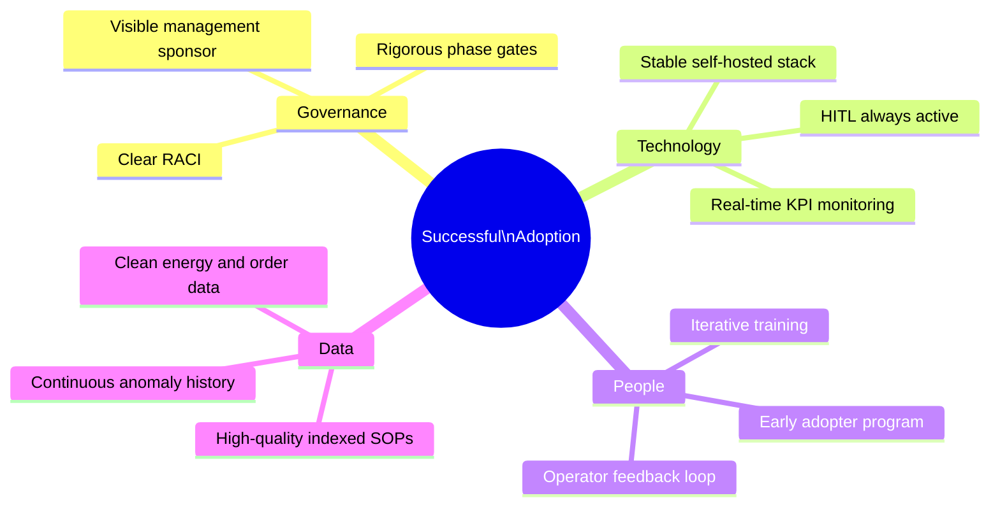

# Adoption Roadmap

Progressive adoption plan for the Smart Factory Transformation platform in three phases aligned to the [Use Case](../use-cases/index.md) time horizons. Each phase includes success KPIs, specific risks and corresponding mitigations. Numeric targets are **SIMULATED TARGETS** derived from the synthetic Mantis dataset (Phase 9) — they do not constitute contractual promises.

---

## Phase Overview

---

## Phase 1 — Pilot (months 0–3)

**Objective:** Demonstrate platform value on a single pilot plant with core features (UC-01, UC-02). Build operator and management trust in the HITL system.

**Organisational prerequisites:**
- Project sponsor appointed at management level
- 2–3 "early adopter" operators identified and available for feedback
- Basic HITL training for supervisors (½ day)
- VPN/network access to the pilot plant for the deployment team

### Phase 1 KPIs

| KPI | Baseline (SIMULATED) | Target at month 3 (SIMULATED TARGET) | Measurement method |
|-----|---------------------|--------------------------------------|--------------------|
| Average SOP search time | 8 min/search | ≤ 5.6 min (−30%) | OperatorAssistant interaction logs |
| SOP deviations per shift | 3.2 / shift | ≤ 2.7 (−15%) | HITL audit + supervisor |
| Critical decisions reviewed | 0% (manual process) | 100% | HITL approval queue |
| Operator adoption rate | 0% | ≥ 60% weekly usage | UI session logs |
| Operator satisfaction (NPS) | — | ≥ 40 | Post-pilot survey |

### Phase 1 Milestones

1. **Week 2:** Docker Compose stack live on pilot server; Qdrant indexed with existing SOPs
2. **Week 4:** UC-01 in production; 5 operators trained
3. **Week 6:** UC-02 HITL active; supervisors trained
4. **Month 3:** KPI review; go/no-go for Phase 2

---

## Phase 2 — Scale-up (months 3–9)

**Objective:** Extend the platform to the maintenance and training cluster (UC-03..06). Reduce MTTR and structure shift handover. Increase adoption rate to all departmental staff.

**Organisational prerequisites:**
- OPC-UA simulator (or real sensors) configured for textile signature
- Anomaly history ≥ 30 days (from Phase 1)
- Neo4j populated with plant failure modes YAML
- Dedicated training manager for UC-06

### Phase 2 KPIs

| KPI | Phase 1 Baseline | Target at month 9 (SIMULATED TARGET) | Measurement method |
|-----|-----------------|--------------------------------------|--------------------|
| MTTR (Mean Time To Repair) | 4.8 h | ≤ 3.6 h (−25%) | CMMS / work order log |
| Unplanned failures / month | 12 / month | ≤ 9.6 (−20%) | PredictiveMaintenance audit |
| Plant availability | 82% | ≥ 94% (+15 pp) | Loom/spindle uptime |
| Handover omissions detected | 8 / week | ≤ 2.4 (−70%) | ShiftHandover report |
| New operator certification time | 40 h | ≤ 26 h (−35%) | TrainingCoach tracking |
| Maintenance cluster adoption rate | 0% | ≥ 70% | Technician session logs |

### Phase 2 Milestones

1. **Month 4:** AnomalyDetector + OPC-UA active; first classified anomalies
2. **Month 5:** PredictiveMaintenance HITL in production; RCASpecialist activated
3. **Month 6:** ShiftHandover active; first structured handover sessions
4. **Month 8:** TrainingCoach active; first personalised paths generated
5. **Month 9:** Phase 2 KPI review; go/no-go for Phase 3

---

## Phase 3 — Consolidation (months 9–18)

**Objective:** Activate the SCM cluster (UC-07, UC-08) and capitalise corporate knowledge (UC-09). Evaluate extension to additional plants. Close the value cycle with demonstrable economic optimisation.

**Organisational prerequisites:**
- 18 months of order history in `scm.historical_orders`
- Dedicated energy manager for UC-08
- Knowledge manager for UC-09 governance
- Decision and governance framework for AI approval on purchase orders

### Phase 3 KPIs

| KPI | Phase 2 Baseline | Target at month 18 (SIMULATED TARGET) | Measurement method |
|-----|-----------------|---------------------------------------|--------------------|
| Capital tied up in stock | 100% (base) | −20% | Monthly inventory value comparison |
| Stockouts / quarter | 8 | ≤ 6.8 (−15%) | SCM / ERP |
| Emergency purchasing costs | 100% (base) | −10% | Supplier invoices |
| Annual energy cost | 100% (base) | −12% | Energy bills |
| Off-peak consumption | 55% | ≥ 63% (+8 pp) | TimescaleDB energy_readings |
| SOP documents reused in searches | 30% | ≥ 42% (+40%) | Qdrant retrieval log |
| New SOP production time | 8 h/SOP | ≤ 6 h (−25%) | DocumentationSynthesizer tracking |

### Phase 3 Milestones

1. **Month 10:** DemandForecaster + InventoryManager active; first HITL order proposals
2. **Month 12:** EnergyOptimizer active; off-peak shift plan shared with energy manager
3. **Month 14:** KnowledgeCurator + DocumentationSynthesizer active; first updated SOP batch
4. **Month 16:** Multi-plant extension evaluation (architecture already distributed by design)
5. **Month 18:** Overall KPI review; final ROI report

---

## Governance Flow

---

## Adoption Risk Register

| ID | Category | Risk | Probability | Impact | Mitigation |
|----|----------|------|-------------|--------|------------|
| R-01 | Change Management | Operator resistance to AI system adoption | High | High | Early adopter program (2–3 champions per department); Q&A sessions; AI transparency dashboard; HITL visible as guarantee |
| R-02 | Technical | Insufficient indexed SOP quality for effective RAG | Medium | High | SOP document quality audit before indexing; operator feedback loop to flag incorrect responses |
| R-03 | Organisational | Management sponsor unavailable for escalation decisions | Low | High | Define backup sponsor before Phase 1 start; documented RACI matrix |
| R-04 | Technical | Real OPC-UA integration (vs simulator) more complex than expected | Medium | Medium | Keep simulator in parallel during transition; OT acceptance testing before go-live |
| R-05 | Technical | LLM model drift on textile domain-specific SOPs | Low | Medium | DeepEval CI gate (Phase 11); hallucination rate ≤ 5% continuously monitored; mandatory HITL on critical decisions |
| R-06 | Change Management | Supervisors bypassing HITL queue for perceived urgency | Medium | High | Explicit company policy; complete audit trail; bypass metrics visible on manager dashboard |
| R-07 | Economic | UC-08 energy savings below target due to tariff changes | Low | Medium | Parametric EnergyOptimizer: update time slots and energy prices in params.toml without redeploy |
| R-08 | Organisational | Knowledge manager turnover compromises UC-09 | Low | High | Documented succession planning process; autonomous KnowledgeCurator reduces single-person dependency |
| R-09 | Technical | Docker Compose stack scalability across multiple plants | Medium | Medium | Architecture already designed for multi-tenant; evaluate Kubernetes migration for Phase 3 extension |
| R-10 | Compliance | New EU AI Act regulatory requirements during adoption phase | Low | High | STRIDE threat model and mandatory HITL for critical decisions (Phase 11) already aligned with AI Act principles; monitor updates every 6 months |

---

## Critical Success Factors

> **SIMULATED TARGET note:** all KPI values are estimated on the synthetic Mantis dataset (Phase 9) and Industry 4.0 textile literature benchmarks. They do not constitute contractual guarantees. See the [Assumption Register](../assumptions/index.md) for underlying assumptions.
