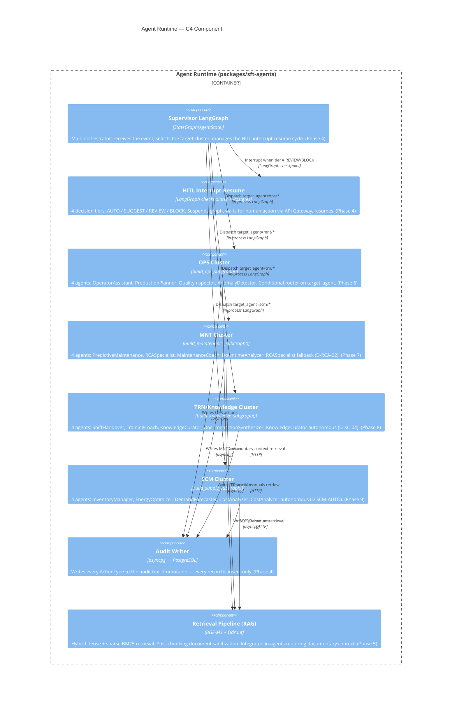

# C4 — Component Diagram

The component level shows the internal structure of the **Agent Runtime**:
LangGraph supervisor, 4 cluster subgraphs, and the HITL interrupt-resume mechanism.

> **SC-3 — Traceability:** every component corresponds to implemented code in
> `packages/sft-agents/` (Phases 4–9). Cluster names correspond to
> `VALID_CLUSTERS` in `sft_agents/runtime/state.py`.

## HITL — Decision Tiers

| Tier | Label | Behaviour |
|------|-------|-----------|
| 0 | AUTO | Executes without approval (autonomous agents: CostAnalyzer, KnowledgeCurator) |
| 1 | SUGGEST | Proposes to operator, executes if not rejected within timeout |
| 2 | REVIEW | Suspends, waits for explicit operator approval |
| 3 | BLOCK | Suspends, requires manager approval |

## C4 Navigation

- [C4 Context](c4-context.md) — actors and boundaries
- [C4 Container](c4-container.md) — applications and databases
