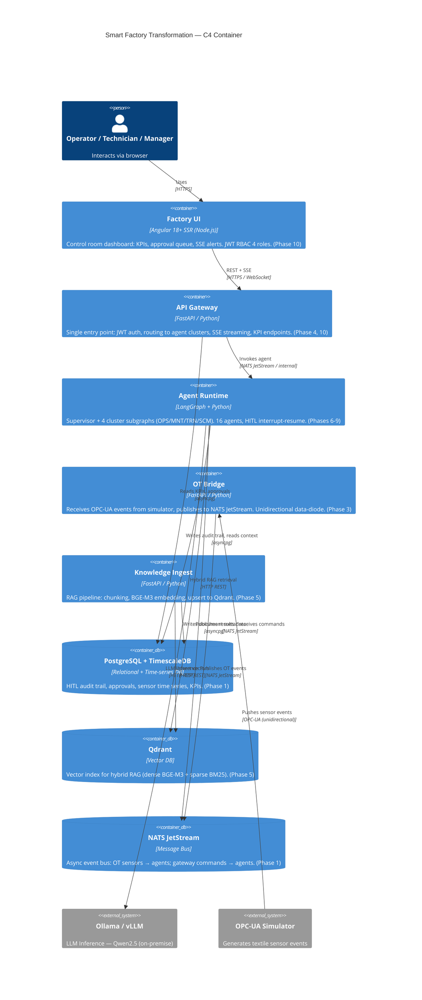

# C4 — Container Diagram

The container level shows the **processes/applications** that make up the platform,
their technologies and main communications.

> **SC-3 — Traceability:** every container corresponds to an application or service
> implemented in Phases 1–11. No planned but unshipped containers.

## Technology Map

| Container | Technology | Phase |
|-----------|-----------|-------|
| Factory UI | Angular 18+ SSR | 10 |
| API Gateway | FastAPI 0.115+ | 4, 10 |
| Agent Runtime | LangGraph 0.4+ | 4, 6–9 |
| OT Bridge | FastAPI / asyncio | 3 |
| Knowledge Ingest | FastAPI + BGE-M3 | 5 |
| PostgreSQL + TimescaleDB | PG 16 + TimescaleDB 2.x | 1 |
| Qdrant | Qdrant 1.x | 5 |
| NATS JetStream | NATS 2.x | 1 |
| Ollama | Ollama — Qwen2.5 | 1 |

## C4 Navigation

- [C4 Context](c4-context.md) — external actors and boundaries
- [C4 Component](c4-component.md) — internal structure of the agent runtime
