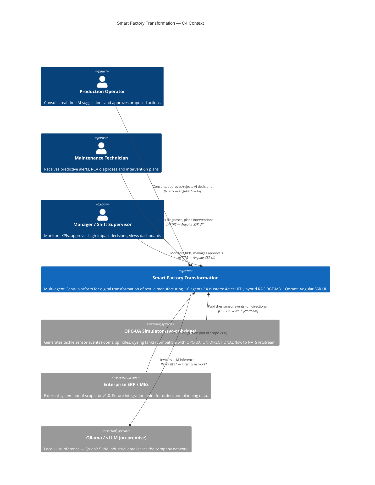

# C4 — Context Diagram

The context level shows **who** interacts with the Smart Factory Transformation platform
and which external systems define its operational boundary.

> **SC-3 — Traceability:** every element corresponds to an implemented component
> (Phase 1–11) or a real external system. No aspirational elements.

## Boundary Principles

| Principle | Implementation |
|-----------|----------------|
| **OT data-diode** | `svc-ot-bridge` receives from OPC-UA and publishes to NATS — reverse flow (agents → OT) blocked at Kubernetes NetworkPolicy level (Phase 1) |
| **Self-hostable** | Ollama/vLLM on-premise: no industrial data leaves the company network |
| **4-tier HITL** | Every critical decision goes through human approval before execution (Phase 4) |

## C4 Navigation

- [C4 Container](c4-container.md) — internal components and their communication
- [C4 Component](c4-component.md) — internal structure of the agent runtime
