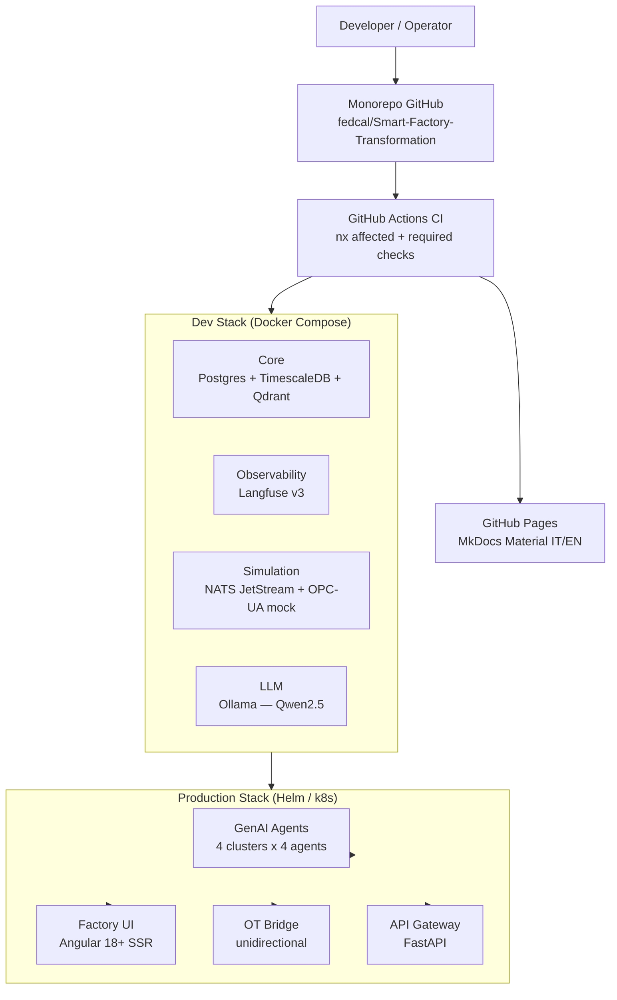

# Architecture: Overview

!!! info "Details Expanding"
    This page shows the system's high-level architecture. Details for each layer
    will be documented in subsequent phases.

## High-Level Diagram

## Guiding Principles

### Human-in-the-Loop (HITL)

The fundamental architectural principle: **no critical action is executed without human approval**. Every agent proposing a relevant action exposes an approval node in its LangGraph state machine. The operator can approve, modify, or reject before execution.

### OT Layer Unidirectionality

The `svc-ot-bridge` component implements a **data-diode** principle: it receives signals from the OT environment (PLCs, sensors, OPC-UA) and publishes them to NATS JetStream toward the agents layer. The reverse flow (agents to OT) is blocked at the Kubernetes NetworkPolicy level — agents cannot send direct commands to simulators or hardware.

### Self-Hostable Stack

The entire stack is designed for **on-premise single-tenant deployment**: no industrial data leaves the company network. LLM models run locally via Ollama/vLLM. The cloud platform (GitHub) is used only for versioning and public CI.

## Architecture Layers

| Layer | Components | Phase Plan |
|-------|-----------|-----------|
| **Monorepo & CI** | Nx, GitHub Actions, pre-commit | Phase 1 |
| **Dev Stack** | Docker Compose, Langfuse, NATS, Qdrant | Phase 1 |
| **OT Simulation** | Textile simulator, mock OPC-UA, NASA C-MAPSS | Phase 3 |
| **Core Agentic** | LangGraph supervisor, SDK, 16 agents | Phase 4 |
| **Frontend** | Angular 18+ SSR, control room dashboard | Phase 5 |
| **Production** | Helm charts, Kubernetes, SealedSecrets | Phase 1 + 6+ |

---

!!! note "Progressive Updates"
    This diagram will be enriched with component details as subsequent phases
    are completed.
