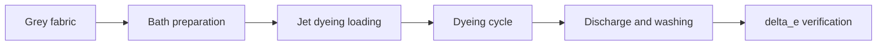

# Dyeing

**Dyeing** is the chemical process of colouring fibres, yarns or fabrics by immersion in a **dye_bath** at controlled temperature and pH. The **jet_dyeing** machine is prevalent for rope-dyeing of fabrics: the **grey_fabric** is transported through the **dye_bath** by high-pressure liquid jets, ensuring uniform contact between fibre and dye. The quality of the result is measured with **delta_e** against the agreed colour standard.

## Process flow

## Assets involved

- **jet_dyeing** — Rope dyeing machine; typical **dye_bath** ratio 1:4-1:8 for synthetics and blends; operating temperature up to 130°C for polyester
- **spectrophotometer** — Instrument for measuring spectral reflectance; measures **delta_e** CMC or CIEDE2000 with precision 0.01 units on fabric samples
- **hygrometer** — Humidity control in fabric storage area pre/post dyeing to avoid dimensional variations
- **automated_warehouse** — Storage of **grey_fabric** rolls pre-dyeing and dyed rolls awaiting **finishing**; mandatory batch traceability

## KPI

- **delta_e** (CMC) — acceptable range <1.0 for standard production, <0.5 for sampling; measures the colour difference between dyed sample and colorimetric standard
- **oee** (%) — range 72-80% for modern **jet_dyeing** plants; main losses are washing cycles and rejections for **shade_deviation**
- **mttr** (hours) — range 1-4 hours for failure of **jet_dyeing** heating system or circulation pump
- **mtbf** (hours) — range 400-800 hours for **jet_dyeing** on cotton; nozzle and gasket wear is the main failure mode

## Pain points

- **shade_deviation** between batches — A **shade_deviation** with **delta_e** CMC >1.0 between rolls of the same batch causes rejection of the dyeing batch; the main causes are variations in pH, temperature or non-constant **dye_bath** ratio during the cycle.
- **streakiness** from slow movement — **Streakiness** (non-uniform colour variation on the surface) occurs when the fabric moves too slowly in the **jet_dyeing** or the bath ratio is not uniform; the defect is detected at **roll_inspection** and requires re-dyeing or downgrading.
- Insufficient colour fastness — A stable **delta_e** after initial measurement can decay during fastness testing (washing, light, rubbing); the cause is the choice of dye or incomplete fixation in the **dyeing** cycle; the damage is rejection of the entire batch.
- Spent **dye_bath** management — Disposal of spent **dye_bath** is subject to environmental regulation; the concentration of residual chemical agents requires treatment before discharge, with variable operating costs depending on the dyeing load.

!!! note "Mantis context"
    The Mantis dyeing department works mainly with reactive dyes (cotton/linen) and acid dyes (wool). The **delta_e** target for outdoor collections is <0.8 CMC to ensure chromatic consistency between seasons. The Thies iMaster **jet_dyeing** is the main machine for mixed technical fabrics. Dyeing operates on 2×12h shifts to optimise long cycles (4-8 hours per complete cycle).

## References

- [Glossary: dyeing, jet_dyeing, delta_e, dye_bath](../../glossary.md)
- [SOP procedures — Dyeing](../../sop/index.md)
