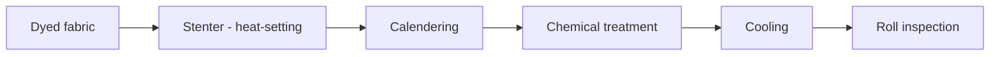

# Finishing

**Finishing** is the set of chemical and mechanical treatments applied to dyed **grey_fabric** to improve handle, appearance, dimensional stability and functional properties (water repellency, anti-crease, antibacterial). The **finishing_plant** is an integrated line that can include stenters, calenders, sanforizing machines and equipment for chemical treatments. **Finishing** is the last production phase before **roll_inspection** and delivery to the customer.

## Process flow

## Assets involved

- **finishing_plant** — Monforts/Brückner line: chain stenter with 8-12 fields, speed 20-80 m/min depending on fabric; heat treatment 130-200°C
- **automated_warehouse** — Storage of finished rolls awaiting shipment; each roll is tracked with batch, **yarn_count** and **finishing** parameters
- **inspection_table** — Illuminated surface for final defect classification (**halo**, **pilling**, **selvedge_defect**) before delivery
- **hygrometer** — Incoming humidity control to ensure dimensional stability during heat-setting; variations >5% RH alter the final shrinkage

## KPI

- **oee** (%) — range 75-85% for modern stenter line; main losses are recipe change setups and stops for **halo** or chemical defects emerging in inspection
- **mtbf** (hours) — range 500-1000 hours for industrial stenter; transport chains and spray nozzles are the most critical components
- **mttr** (hours) — range 1-3 hours for heater or chemical dosing pump failure
- **pilling** (ICI grade) — target ≥4 ICI for Mantis outdoor fabrics; measured on sample at 5000 Martindale cycles

## Pain points

- Post-treatment **halo** — **Halos** caused by dripping of water-repellent agents during stenter passage are major defects that lead to roll downgrading; the origin is often worn spray nozzles or incorrect formulation viscosity.
- High **pilling** — A **pilling** below ICI grade 3 is unacceptable for outdoor apparel; the cause is an insufficient **finishing** formulation or non-optimal calendering tension; the test requires 24-48 hours, extending the qualification cycle.
- **grey_fabric** shrinkage out of tolerance — **Grey_fabric** loses 3-8% in width during heat-setting for cotton; an uncontrolled variation of the stenter temperature produces batches with out-of-tolerance dimensions, leading to customer returns.
- **barring** from stenter — Non-uniform tensions on the lateral stenter pins produce horizontal **barring** in the finished fabric; the defect is detected at **roll_inspection** but originates from incorrect initial setup, making late remediation costly.

!!! note "Mantis context"
    Mantis **finishing** includes DWR (Durable Water Repellency) water-repellent treatments for the outdoor line and antistatic treatments for technical fabrics. The shrinkage target is <1.5% for sanforized cotton. The finishing line operates on a single 8h shift with a weekly stop for nozzle cleaning and chain replacement. Fabrics destined for the sportswear segment require additional **pilling** tests on customer protocol.

## References

- [Glossary: finishing, finishing_plant, pilling, grey_fabric](../../glossary.md)
- [SOP procedures — Finishing](../../sop/index.md)
