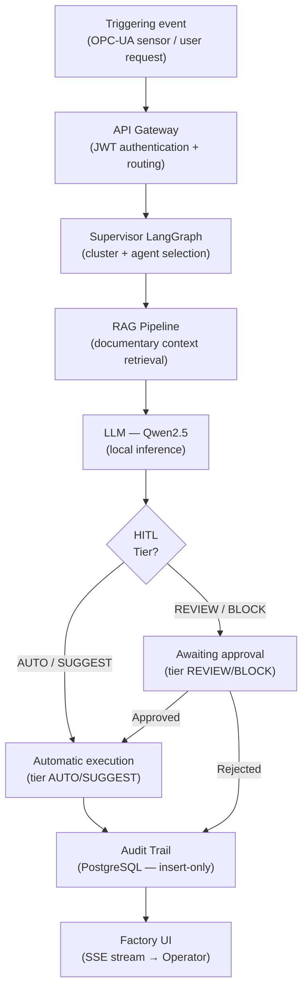

# Functional Analysis

This section documents the end-to-end workflows of the Smart Factory Transformation platform,
organised by functional cluster. Every workflow is traceable to the agents implemented
in the development phases (SC-3).

## The three functional clusters

| Cluster | Implemented agents | Phase | Workflow |
|---------|--------------------|-------|----------|
| **OPS** (Operations) | OperatorAssistant, ProductionPlanner, QualityInspector, AnomalyDetector | 6 | [Operations](operations-workflow.md) |
| **MNT** (Maintenance) | PredictiveMaintenance, RCASpecialist, MaintenanceCoach, DowntimeAnalyzer | 7 | [Maintenance](maintenance-workflow.md) |
| **TRN** (Knowledge/Training) | ShiftHandover, TrainingCoach, KnowledgeCurator, DocumentationSynthesizer | 8 | [Training](training-workflow.md) |

> The fourth cluster **SCM** (InventoryManager, EnergyOptimizer, DemandForecaster, CostAnalyzer)
> is documented in the [Economic Analysis](../economic-analysis/index.md) section because its
> main workflow produces cost/value outputs rather than operational ones.

## Pattern common to all workflows

## Traceability principles

- **OPC-UA → NATS unidirectional:** all sensor events enter the system through `svc-ot-bridge`
  only (data-diode — reverse flow blocked, Phase 1/3)
- **4-tier HITL:** each agent declares its own approval tier; REVIEW/BLOCK tiers
  suspend the LangGraph graph and wait for a response via API Gateway
- **Immutable audit:** every ActionType is recorded in PostgreSQL as insert-only
  before the result is returned to the user (Phase 4)
- **Contextual RAG:** OperatorAssistant, RCASpecialist, MaintenanceCoach, TrainingCoach,
  KnowledgeCurator and DocumentationSynthesizer perform hybrid retrieval on Qdrant
  (BGE-M3 dense + BM25 sparse) to enrich the prompt with documentary context (Phase 5)
