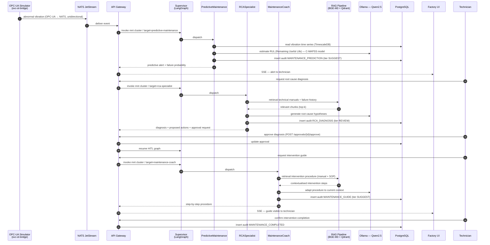
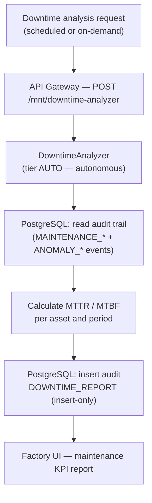

# Maintenance Workflow (MNT)

The Maintenance cluster manages predictive maintenance, root cause analysis and
technical on-the-job training. It is composed of 4 agents implemented in Phase 7.

> **SC-3 — Traceability:** this workflow maps steps to agents in
> `packages/sft-agents/src/sft_agents/` (Phase 7), the `build_maintenance_subgraph()` router
> and the APIs in `apps/api-gateway/src/svc_api_gateway/routers/maintenance_agents.py`.
> RCASpecialist is the router fallback (D-RCA-02): an unknown target is always routed
> to RCA, guaranteeing the HITL gate.

## MNT cluster agents

| Agent | Slug | HITL Tier | Role |
|-------|------|-----------|------|
| PredictiveMaintenance | `predictive-maintenance` | SUGGEST (1) | Failure prediction from time series (NASA C-MAPSS) |
| RCASpecialist | `rca-specialist` | REVIEW (2) | Root cause analysis — router fallback (D-RCA-02) |
| MaintenanceCoach | `maintenance-coach` | SUGGEST (1) | Step-by-step intervention guide (RAG on manuals) |
| DowntimeAnalyzer | `downtime-analyzer` | AUTO (0) | MTTR/MTBF calculation from audit trail (read-only) |

## End-to-end workflow: predictive alert → technical intervention

## Workflow: downtime analysis (autonomous)

> DowntimeAnalyzer operates at tier AUTO: it is a read-only agent that computes
> metrics from historical data without proposing irreversible actions. No human
> approval is required (D-DA pattern, Phase 7).

## Integration points

| Point | System | Notes |
|-------|--------|-------|
| Vibration input | NATS JetStream ← OPC-UA | Unidirectional |
| Manual retrieval | Qdrant + BGE-M3 | Technical manuals, failure history (Phase 5) |
| Predictive model | NASA C-MAPSS | Embeddings for RUL estimation (Phase 3/7) |
| Audit trail | PostgreSQL `audit_log` | Insert-only, typed ActionType |
| Maintenance KPIs | TimescaleDB | MTTR/MTBF computed from hypertable |
