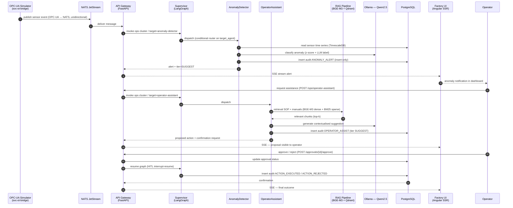
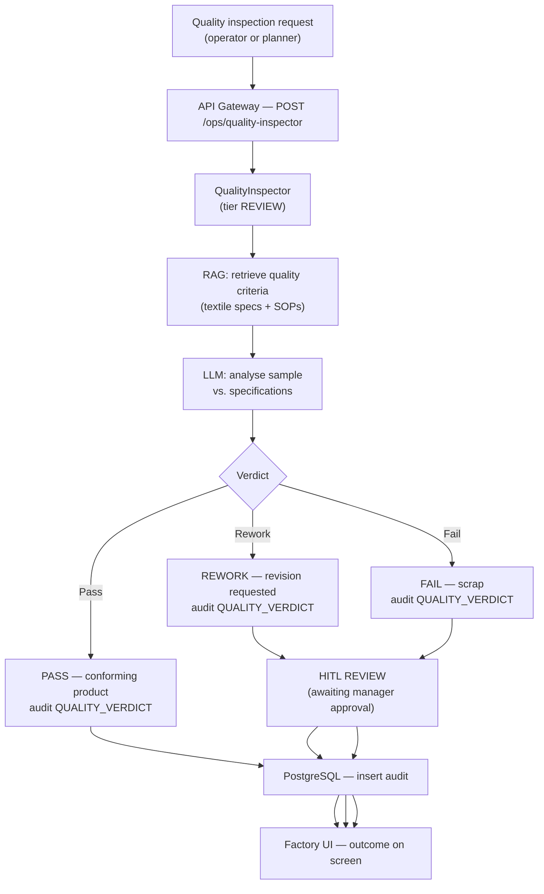

# Operations Workflow (OPS)

The Operations cluster manages real-time production supervision, shift planning and quality control.
It is composed of 4 agents implemented in Phase 6 of the project.

> **SC-3 — Traceability:** this workflow maps steps to agents in
> `packages/sft-agents/src/sft_agents/` (Phase 6), the `build_ops_subgraph()` router
> and the APIs in `apps/api-gateway/src/svc_api_gateway/routers/ops_agents.py`.

## OPS cluster agents

| Agent | Slug | HITL Tier | Role |
|-------|------|-----------|------|
| OperatorAssistant | `operator-assistant` | SUGGEST (1) | Real-time operator support, RAG on SOPs |
| ProductionPlanner | `production-planner` | REVIEW (2) | Shift planning and production targets |
| QualityInspector | `quality-inspector` | REVIEW (2) | Quality inspection, pass/fail/rework verdict |
| AnomalyDetector | `anomaly-detector` | SUGGEST (1) | Sensor anomaly detection, real-time alerts |

## End-to-end workflow: sensor anomaly → operator action

## Workflow: quality control

## Integration points

| Point | System | Notes |
|-------|--------|-------|
| Sensor event input | NATS JetStream ← OPC-UA | Unidirectional — reverse flow blocked |
| Documentary retrieval | Qdrant + BGE-M3 | SOPs, textile quality specs (Phase 5) |
| LLM inference | Ollama — Qwen2.5 | On-premise, internal network |
| Audit trail | PostgreSQL — `audit_log` table | Insert-only, typed ActionType |
| Real-time notifications | SSE stream `GET /sse/events` | Angular SSR receives event stream (Phase 10) |
