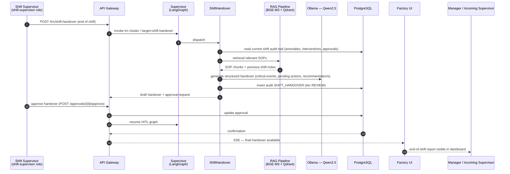
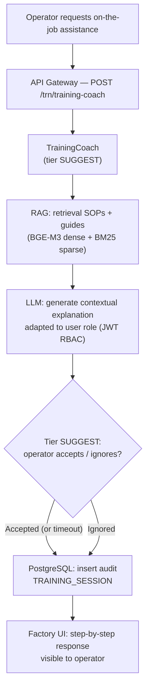
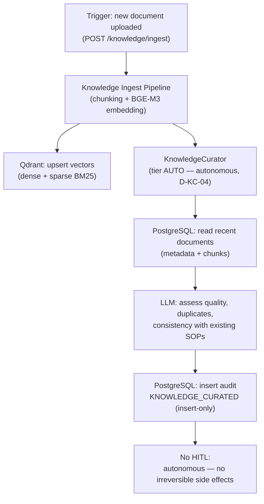
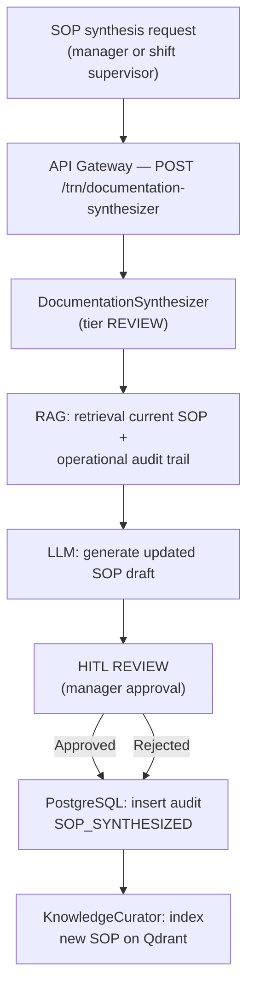

# Training / Knowledge Workflow (TRN)

The Knowledge cluster manages operational knowledge transfer, on-the-job training
and curation of the documentary base. It is composed of 4 agents implemented in Phase 8.

> **SC-3 — Traceability:** this workflow maps steps to agents in
> `packages/sft-agents/src/sft_agents/` (Phase 8), the `build_knowledge_subgraph()` router
> and the APIs in `apps/api-gateway/src/svc_api_gateway/routers/knowledge_agents.py`.
> KnowledgeCurator is the router fallback (D-KC-04): operates at tier AUTO, without
> HITL, without irreversible side effects.

## TRN cluster agents

| Agent | Slug | HITL Tier | Role |
|-------|------|-----------|------|
| ShiftHandover | `shift-handover` | REVIEW (2) | End-of-shift handover summary, knowledge transfer |
| TrainingCoach | `training-coach` | SUGGEST (1) | Contextual operator/technician coaching (RAG on SOPs) |
| KnowledgeCurator | `knowledge-curator` | AUTO (0) | Autonomous document curation, RAG index update |
| DocumentationSynthesizer | `documentation-synthesizer` | REVIEW (2) | SOP synthesis and update from operational experience |

## End-to-end workflow: end of shift → handover report

## Workflow: operator coaching during intervention

## Workflow: autonomous document curation

> KnowledgeCurator has no `/resume` endpoint: it is fully autonomous (D-KC-04).
> The gateway returns HTTP 200 (not 202) because execution is synchronous and
> without HITL suspension (Decision Phase 08-08).

## Workflow: SOP synthesis from operational experience

## Integration points

| Point | System | Notes |
|-------|--------|-------|
| Shift audit trail | PostgreSQL `audit_log` | Data source for ShiftHandover (Phase 4) |
| SOP retrieval | Qdrant + BGE-M3 | SOPs, operational notes, previous handovers (Phase 5) |
| Document ingest | Knowledge Ingest Pipeline | Chunking + embedding + Qdrant upsert (Phase 5) |
| LLM inference | Ollama — Qwen2.5 | On-premise, internal network |
| Contextual RBAC | JWT — 4 roles | Coach response adapts to requester's role (Phase 10) |
