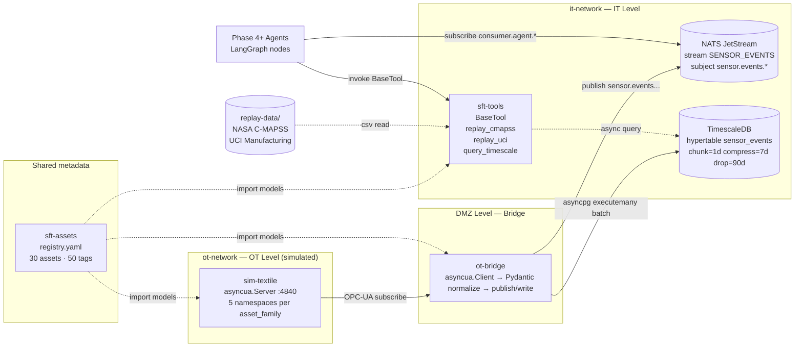

# IT/OT Simulation Layer

The **IT/OT Simulation Layer** (Phase 3) builds the live and historical telemetry substrate that feeds all downstream agents in the Smart Factory Transformation platform (Phase 4-7).

---

## Purpose

Phase 3 delivers three core components:

1. **sim-textile** — Python textile factory simulator that emits realistic sensor streams (including calibrated fault injection for 5 asset families) via OPC-UA on `opc.tcp://sim-textile:4840`.
2. **ot-bridge** — OT Bridge (data-diode) that subscribes to OPC-UA and re-publishes normalized `SensorEvent` events on NATS JetStream (`sensor.events.<family>.<asset_id>.<tag_id>`) and writes them to TimescaleDB.
3. **sft-assets + sft-tools** — registry of real assets (30 assets, 50 tags, 5 families) and LangChain Tools for historical dataset replay (NASA C-MAPSS, UCI Manufacturing).

---

## Architecture



**Data flow:** sim-textile generates events (with fault injection) → OPC-UA server → ot-bridge subscribes → normalizes to Pydantic `SensorEvent` → fan-out to NATS (for agents) and TimescaleDB (for historical queries). Phase 4+ agents read ONLY via NATS subscribe or tool invocation — never directly from OPC-UA.

---

## Key decisions

| ID   | Title                                            | Impact                                                   |
|------|--------------------------------------------------|----------------------------------------------------------|
| D-44 | Fault injection: per-asset YAML profiles         | 5 calibrated profiles per family (loom, spinning, warping, dyeing, finishing) |
| D-45 | Asset registry: `sft-assets` package             | SSOT for platform metadata (30 assets, 50 tags, 5 families) |
| D-48 | Load test: steady-state 60s + realistic mix      | p99 < 200ms at 5,000 msg/s (IOT-10)                     |
| D-49 | TimescaleDB retention: chunk=1d/compress=7d/drop=90d | Hot tier 7d, warm drop 90d (A-007 dataset coverage) |
| D-51 | Data-diode enforcement: 3 layers                 | Docker ACL + pytest + grep static-analysis               |
| D-52 | NATS subject hierarchy locked                    | `sensor.events.<family>.<asset_id>.<tag_id>`             |

---

## Phase 3 success criteria

1. **IOT-01**: sim-textile emits OPC-UA across 5 families with calibrated fault injection (YAML profiles).
2. **IOT-02**: ot-bridge subscribes to OPC-UA and publishes normalized `SensorEvent` on NATS JetStream.
3. **IOT-03**: TimescaleDB hypertable `sensor_events` with compression + retention (D-49).
4. **IOT-09**: Ingest schema documented in bilingual MkDocs (this section) — asset registry, tag dictionary, OPC-UA schema.
5. **IOT-10**: Full load test 5k msg/s × 60s steady-state defined and PR-label gated in CI (D-48).

---

## Sections

- [Ingest Schema](ingest-schema.md) — Asset registry, tag dictionary, units of measure, SensorEvent JSON, NATS subjects, TimescaleDB hypertable.
- [OPC-UA Schema](opcua-schema.md) — Namespace pattern, endpoint, security policy, variable nodes, data-diode enforcement.

---

## Validation

```bash
# End-to-end integration test (IT/OT stack)
make integration-test

# Smoke load test (1k msg/s × 10s — IOT-10 smoke gate)
make smoke-load

# Full load test (5k msg/s × 60s — IOT-10 full gate, gated by PR-label load-test)
make load-test-full
```

---

*Source: `.planning/phases/03-it-ot-simulation-layer/03-CONTEXT.md` — Version: commit annotated `Source: registry.yaml@Phase3`*
