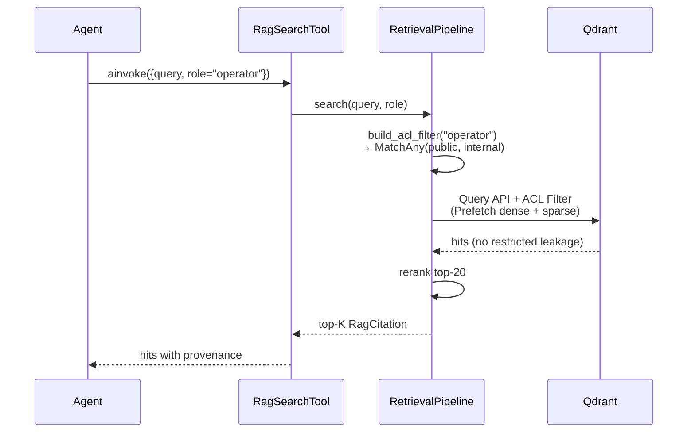

# ACL model — knowledge layer

The knowledge-layer ACL is the mechanism that prevents an agent or user with a given `role` from reading chunks classified out of their scope. The model is enforced **before** retrieval on the Qdrant side (pre-filter), not at the application layer: this eliminates the class of bugs where an agent error would leak restricted content.

---

## Audience → acl_level (D-72)

Every SOP in the corpus declares `acl_level` in its YAML frontmatter. The four values are:

| acl_level | Audience | Example content |
|-----------|----------|-----------------|
| `public` | Anyone (including guests) | Glossary, process overview |
| `internal` | All employees | Standard operating procedures, machine manuals |
| `confidential` | Technical staff + supervisors | Complex fault diagnosis, calibration parameters |
| `restricted` | Supervisors/admins/quality managers only | HSE safety procedures, deviations from customer specs |

**Default fallback (D-67/D-72):** if `acl_level` is absent from the frontmatter, `MarkdownParser` logs `sop_missing_acl_level` at WARN and uses the default `internal` (never `public`, never `restricted`). This choice prioritizes safety: an untagged SOP is treated as employee-only, never public.

---

## ROLE_TO_ACL (constant)

The `sft_knowledge.retrieval` module exposes the `ROLE_TO_ACL` constant:

```python
ROLE_TO_ACL: dict[str, frozenset[str]] = {
    "guest":           frozenset({"public"}),
    "operator":        frozenset({"public", "internal"}),
    "technician":      frozenset({"public", "internal", "confidential"}),
    "shift_supervisor": frozenset({"public", "internal", "confidential"}),
    "quality_manager": frozenset({"public", "internal", "confidential", "restricted"}),
    "admin":           frozenset({"public", "internal", "confidential", "restricted"}),
}
```

The `build_acl_filter(role)` helper produces the matching `qdrant_client.http.models.Filter`:

```python
from sft_knowledge.retrieval import ROLE_TO_ACL, build_acl_filter

flt = build_acl_filter(role="operator")
# Filter(must=[FieldCondition(key='acl_level',
#                             match=MatchAny(any=['public', 'internal']))])
```

---

## End-to-end flow



---

## Non-leak guarantee (Phase 5 SC#2)

Phase 5 success criterion SC#2 requires:

> "A query from an `operator`-role user cannot retrieve `restricted`-tagged chunks."

This guarantee is covered by **integration tests** in `packages/sft-knowledge/tests/test_acl_enforcement.py`:

- Index a mixed corpus with `acl_level` ∈ {`public`, `internal`, `restricted`}
- Run a query with `role="operator"`
- Assert that the top-20 contains NO `restricted` chunks

The test fails immediately if the ACL filter is ever built without `must` clauses, if the `acl_level` payload index is dropped, or if the `ROLE_TO_ACL` map is modified in a non-conservative way.

---

## Threat model

- **T-05-ACL-01 (Information Disclosure):** mitigated by the Qdrant pre-filter. An agent-side bug that forgets to pass `role` is caught by the tool's Pydantic schema (mandatory `role: str` field).
- **T-05-ACL-02 (Elevation of Privilege):** mitigated by the fact that `ROLE_TO_ACL` is an immutable `dict[str, frozenset]` exposed as a module constant: no caller can mutate it at runtime to "promote" a role.
- **T-05-ACL-03 (Audit gap):** every `RagCitation` carries the `acl_level` of the retrieved chunk; the structlog logger emits a `rag_search_done` event with the seen acl_levels. Phase 11 OBS correlates this event with the user role for full audit coverage.

---

## References

- [Architecture](architecture.md)
- [Retrieval pipeline](retrieval-pipeline.md)
- 05-PATTERNS.md Pattern 2 — ACL pre-filter
