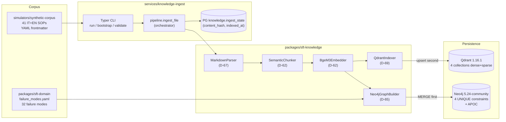

# Knowledge Layer — Architecture

The **Knowledge Layer** (Phase 5) builds the structured-knowledge substrate of the Smart Factory Transformation platform: SOP ingest, hybrid dense+sparse embedding, dual-store Qdrant (vector) + Neo4j (graph), retrieval with re-rank, and LangChain tools consumed by downstream agents (Phase 6-9).

---

## Purpose

Phase 5 delivers six cross-cutting capabilities for every agent that performs retrieval or graph traversal:

1. **`packages/sft-knowledge`** — Python SDK with parser, chunker, embedder, indexer, graph builder, retrieval pipeline, tools.
2. **`services/knowledge-ingest`** — Typer CLI + pipeline orchestrator + GitHub Actions reindex on-push.
3. **Qdrant** — four collections (`sop`, `manuals`, `troubleshooting`, `training`) with named dense (1024D BGE-M3) + sparse (lexical weights) vectors.
4. **Neo4j 5.24-community** — `Machine → Part → FailureMode → SOP` entity graph with idempotent `MERGE` and UNIQUE constraints.
5. **PostgreSQL `knowledge.ingest_state`** — tracking table `(source_uri, content_hash, indexed_at)` for incremental reindex and stale detection.
6. **Documentation + A/B eval** — the deliverable `docs/eval/rag-ab-test-bge-m3-vs-e5.md` closes KNW-03 with metrics and a justified decision.

---

## Architecture



**Atomicity invariant (D-68, PATTERNS.md Pattern 1):** the pipeline writes **Neo4j first** (ACID anchor), then **Qdrant** (eventually consistent), then updates `ingest_state`. On partial Qdrant failure the `ingest_state` is NOT updated; on re-run the `content_hash` is detected as divergent and ingest is rerun with idempotent Neo4j `MERGE` and deterministic Qdrant `point.id`.

---

## The 4 Qdrant collections (D-61)

| Collection | Purpose | Example document |
|------------|---------|------------------|
| `sop` | Standard operating procedures | "SOP-LOOM-001: Broken-end repair" |
| `manuals` | Machine manuals | "Operator manual rapier loom model X" |
| `troubleshooting` | Fault knowledge base | "Shuttle jam recovery on jacquard loom" |
| `training` | Training materials | "Weaving operator onboarding module" |

**Payload schema (KNW-05):** every point carries `text`, `source_uri`, `chunk_idx`, `version`, `lang`, `acl_level`, `asset_family`, `sop_id`, `category`, `heading_path`, `created_at`.

**Vectors (D-61):**
- `dense` — size 1024, distance Cosine, HNSW (m=16, ef_construct=100)
- `sparse` — SparseIndexParams (on_disk=False); BGE-M3 lexical weights → Qdrant token_id

**Payload indexes:** `source_uri`, `acl_level`, `lang`, `category`, `version`, `asset_family`, `sop_id` (all KEYWORD for ACL pre-filter).

---

## Neo4j graph schema (D-65)

```
(Machine {id, family, line_id, opcua_namespace})
  -[:HAS_PART]-> (Part {id="{family}:{name}", name, family})
  -[:HAS_FAILURE_MODE]-> (FailureMode {id, name_it, name_en, severity, asset_families})
  -[:DOCUMENTED_BY]-> (SOP {id="{frontmatter.id}@{version}", version, lang, title, source_uri})
```

**UNIQUE constraints:** `machine_id_unique`, `part_id_unique`, `failure_mode_id_unique`, `sop_id_unique`. **Index:** `sop_version` on `SOP.version`.

**Multi-version SOP:** `SOP.id = "{frontmatter.id}@{version}"` allows coexistence of multiple versions of the same logical `sop_id` (D-69).

---

## Package layout (D-70)

```
packages/sft-knowledge/src/sft_knowledge/
├── parsers/           DocumentParser ABC + MarkdownParser
├── chunking/          SemanticChunker (LlamaIndex SemanticSplitterNodeParser, BGE-M3 judge)
├── embedding/         BgeM3Embedder (FlagEmbedding primary, fastembed fallback)
├── stores/            QdrantIndexer + Neo4jGraphBuilder
├── retrieval/         RetrievalPipeline + BgeReranker + ROLE_TO_ACL
├── tools/             RagSearchTool + TraverseGraphTool (LangChain BaseTool)
└── memory/            QdrantLongTermMemory (Memory ABC impl)

services/knowledge-ingest/src/svc_knowledge_ingest/
├── __main__.py        Typer CLI (run/bootstrap/validate)
├── pipeline.py        ingest_file orchestrator (content_hash gate + dual-write + state UPSERT)
└── state.py           IngestStateStore (asyncpg, parametrized SQL constants)
```

---

## CI and incremental reindex

The `.github/workflows/reindex.yml` workflow watches pushes to `main` on three paths:

- `simulators/synthetic-corpus/**`
- `docs/sops/**`
- `packages/sft-domain/src/sft_domain/failure_modes.yaml`

The job spins up Qdrant/Neo4j/Postgres service containers, runs idempotent bootstraps, and computes the changed files via `git diff --name-only`. The `nx run knowledge-ingest:run --files=<csv>` pipeline ingests only the in-scope files. The `content_hash` gate guarantees unchanged files are skipped without touching Qdrant/Neo4j (KNW-07 SC#3).

---

## Related references

- [Retrieval pipeline](retrieval-pipeline.md) — hybrid dense+sparse+RRF+rerank retrieval flow
- [ACL model](acl-model.md) — role→acl_level mapping and non-leak guarantees
- [Eval results](eval-results.md) — A/B summary BGE-M3 vs multilingual-e5-large
