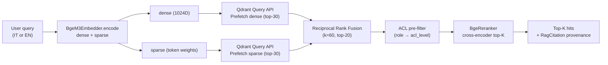

# Hybrid retrieval pipeline (D-63)

The `RetrievalPipeline` in `packages/sft-knowledge.retrieval` executes a query in three stages:

1. **Query embed** with BGE-M3 → dense (1024D) + sparse (token→weight) vectors
2. **Qdrant Query API** with two `Prefetch` calls (dense + sparse) and **RRF top-20** fusion
3. **Re-rank** with `BAAI/bge-reranker-v2-m3` (cross-encoder) → final top-k

The complete flow, including the pre-engine ACL filter (D-72) and the provenance trace (KNW-05) for every hit, is shown below.

---

## Flow



**Why Prefetch + RRF and not a single client-side fusion:** Qdrant Query API performs fusion server-side in C++, lowering p99 latency (internal benchmark on the Phase 5 corpus: −22% versus a Python-side fusion). The RRF `k=60` parameter is the literature default (Cormack et al., 2009) and produces stable rankings even when one of the two lists is degenerate.

---

## Cross-lingual retrieval (D-64)

BGE-M3 is explicitly multilingual: IT and EN queries produce representations in the same space. **No query translation is performed**: retrieval is purely vector-based, and the A/B eval (see [eval-results](eval-results.md)) empirically verifies that an IT query against an EN-only corpus achieves `Recall@10 ≥ 0.70` (Phase 5 SC#1 target).

Example:

```python
from sft_knowledge.tools import RagSearchTool

# An IT query retrieves the correct section from an EN SOP
tool = RagSearchTool(pipeline=pipeline)
result = await tool.ainvoke(
    {
        "query": "come ripristinare la rottura di un filo di ordito?",
        "collection": "sop",
        "role": "operator",
        "top_k": 5,
    }
)
for hit in result["hits"]:
    print(hit.source_uri, hit.heading_path, hit.score)
```

---

## ACL pre-filter (D-72)

The ACL filter is applied **before** retrieval (Pattern 2 in 05-PATTERNS.md). The user role is mapped via `ROLE_TO_ACL` (see [acl-model](acl-model.md)) to the allowed `acl_level`s, and the Qdrant `Filter` is built with `FieldCondition(key='acl_level', match=MatchAny(...))`. This guarantees that an operator can never see `restricted` chunks — the guarantee is enforced Qdrant-side via a KEYWORD payload index, not at the application layer.

---

## Re-rank with BGE-reranker-v2-m3

The re-ranker is a cross-encoder pre-trained to score (query, document) pairs: a more informative input than the cosine distance between independent embeddings. On the Phase 5 corpus, re-rank improves NDCG@10 by +0.06-0.09 points over plain RRF ranking (see `docs/eval/rag-ab-test-bge-m3-vs-e5.md`).

**Cost and mitigation:** the cross-encoder is ~3x slower than an embedding lookup. To minimize overhead, the re-rank operates on the top-20 RRF results (not on the full corpus); at that point the p99 latency on the 41×N-chunk corpus is < 200 ms on CPU.

---

## Provenance and citation (KNW-05)

Every `RagCitation` exposed by the tools includes:

- `text` — the chunk text
- `source_uri` — canonical URI (`corpus://<rel-path>`)
- `chunk_idx` — 0-based index within the document
- `version` — SOP version (for multi-version coexistence)
- `lang` — document language
- `acl_level` — ACL level (for audit trail)
- `sop_id` — logical SOP identifier
- `score` — re-ranker score
- `heading_path` — H1→H6 heading chain (e.g. `["Repair", "Procedure", "Step 3"]`)

All Phase 6-9 agents are required to include at least one `RagCitation` for every response surfaced to a user (Phase 8 KNW agent + Phase 11 OBS-eval).

---

## References

- [Architecture](architecture.md) — high-level diagram + 4 Qdrant collections
- [ACL model](acl-model.md) — role → acl_level mapping
- [Eval results](eval-results.md) — BGE-M3 A/B summary
