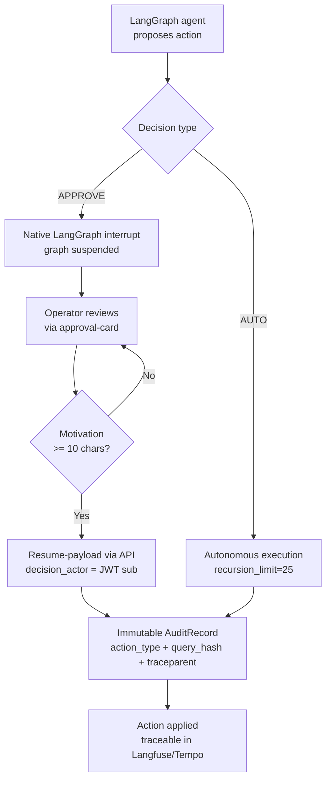

---
tags:
  - security
  - governance
  - explainability
---

# Security & Governance

The Smart Factory Transformation platform adopts a cross-cutting security model
covering the IT/OT boundary, the RAG pipeline and the agentic orchestration. This
section documents the threat model, LLM standards compliance and AI governance
controls **as implemented** in code (DOC-11, SC-3).

## Documents in this section

| Document | Content | Standard |
|----------|---------|----------|
| [STRIDE Threat Model](stride-threat-model.md) | 6×3 matrix (6 categories × 3 surfaces = 18 cells) with code-mapped mitigations | STRIDE, ASVS L2 (SC-4) |
| [OWASP LLM Top 10](owasp-llm.md) | Mapping of the 10 LLM 2025 risks to concrete mitigations | OWASP LLM Top 10 (2025), SEC-02 |

!!! note "Single source of truth"
    The content published in this section is faithfully aligned to the **Phase 11**
    authoritative source (`docs/security/`). Every change must be made in the source
    and re-published here to avoid divergence.

---

## AI Explainability & Governance

AI governance in the platform rests on four implemented and verifiable pillars:
**Human-in-the-Loop (HITL)**, **immutable audit trail**, **decision traceability**
and **autonomy guard-rails**. Together they ensure that every operational decision
derived from an LLM agent is explainable, attributable and reversible.

### 1. HITL approval chain

Agentic actions with operational effect (`Decision.APPROVE`) are never applied
autonomously: the LangGraph supervisor emits a native `interrupt()` and suspends the
graph until a human operator provides the resume-payload via the approvals API. The
chain is organized by role (RBAC):

- **operator** — proposes / executes routine actions within its perimeter
- **technician** — approves technical and maintenance interventions
- **shift supervisor** — approves planning and cross-team actions
- **auditor** — read-only access to the audit trail (SEC-03), no approval power

The frontend enforces a minimum motivation (`MOTIVATION_MIN_LENGTH = 10` characters)
for every approval/rejection, so the human decision is always justified.

Code reference:

- `packages/sft-agents/src/sft_agents/runtime/supervisor.py:safe_invoke` — interrupt + recursion guard
- `apps/factory-ui/src/app/shared/approval-card/approval-card.component.ts:MOTIVATION_MIN_LENGTH`

### 2. Audit trail

Every HITL decision and every access to `restricted` data produces an immutable
`AuditRecord`, typed via `ActionType` (e.g. `RESTRICTED_DOC_ACCESS`). The record
contains `decision`, `motivation`, `decision_actor` (JWT sub) and a SHA-256
`query_hash` instead of plaintext. The `action_type` typing was consolidated in the
Phase 9/11 migration.

Code reference:

- `packages/sft-knowledge/src/sft_knowledge/retrieval/pipeline.py:RetrievalPipeline._write_restricted_audit`

### 3. Decision traceability

End-to-end traceability is guaranteed by propagating the W3C `traceparent` across
the NATS bus (OTEL), correlating each span to Langfuse and Tempo. From an audit
decision it is therefore possible to reconstruct the entire flow (request → agent →
tool → approval → action).

Code reference:

- `packages/sft-agents/src/sft_agents/otel/nats_carrier.py:NatsHeaderCarrier`

### 4. Autonomy guard-rails

To prevent costly loops and excessive-agency behaviour, every agent invocation
enforces a `recursion_limit=25` (default in `build_invocation_config()`;
`_RECURSION_LIMIT=5` more conservative in supply clusters). Exceeding the limit
raises `GraphRecursionError → 503`. Available tools are explicitly declared in the
LangGraph toolspec: no generic shell/file tool.

Code reference:

- `packages/sft-agents/src/sft_agents/llm/langfuse_callback.py:build_invocation_config`

### HITL → audit flow

---

## Evidence (reference phases)

| Control | Implemented in | Evidence |
|---------|----------------|----------|
| HITL 4-tier approval chain | Phase 4 (runtime) + Phase 10 (UI) | supervisor.safe_invoke, approval-card |
| Audit trail `action_type` | Phase 9/11 migration | _write_restricted_audit |
| Decision traceability (OTEL) | Phase 11 | NatsHeaderCarrier |
| recursion_limit=25 | Phase 9/11 | build_invocation_config |
| MOTIVATION_MIN | Phase 10 | approval-card.component.ts |

The full mitigation details and their code mapping are in the
[STRIDE Threat Model](stride-threat-model.md) and [OWASP LLM Top 10](owasp-llm.md) documents.
