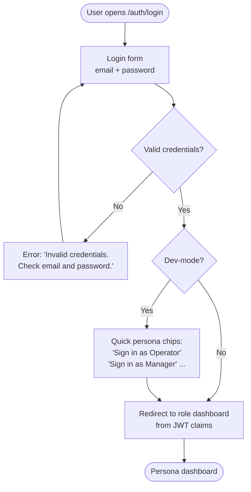
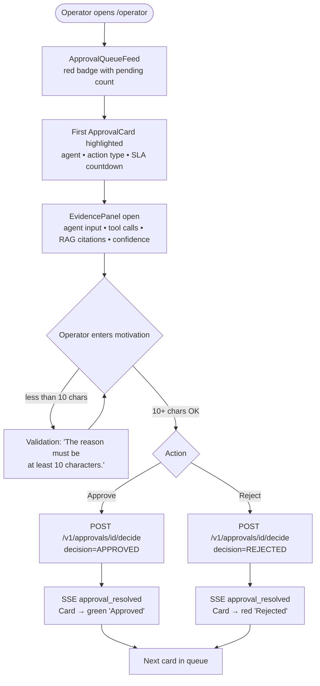
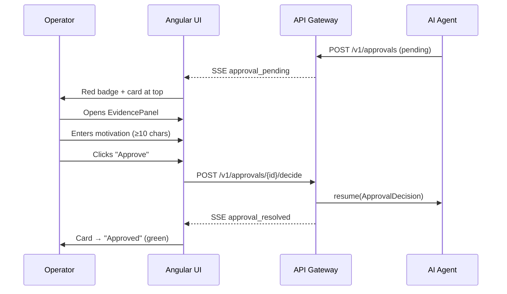
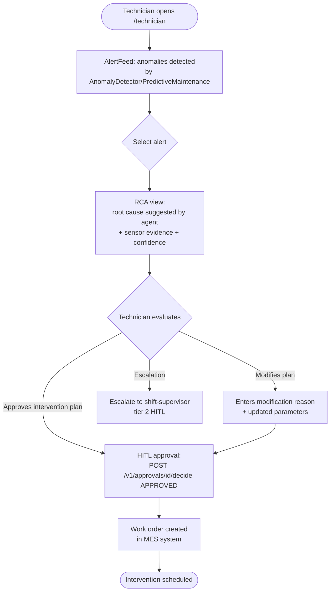
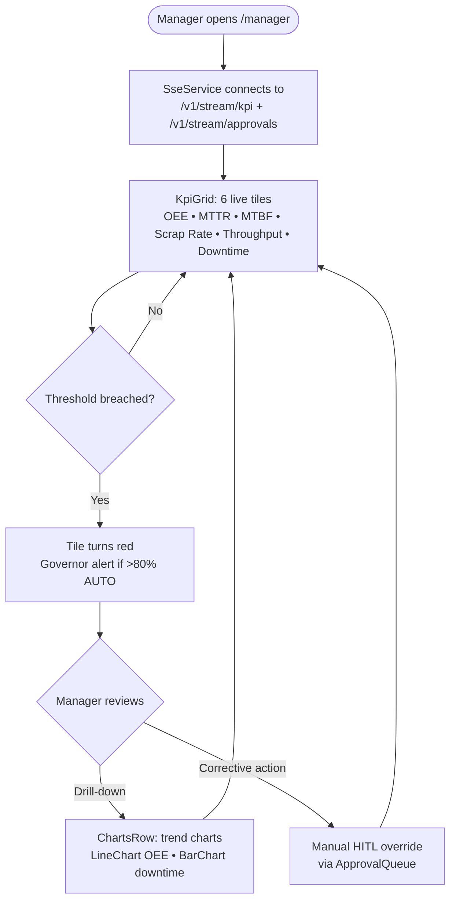

# User Interface — Mock UI

## Overview

This page documents the main user flows of the **Smart Factory Transformation** Angular 19 SSR
application via Mermaid diagrams by persona and Angular SSR component references.
The UI is designed for use on industrial screens and tablets on the factory floor:
touch targets ≥ 64px, WCAG AA contrast, dark theme by default.

!!! note "On-demand screenshots"
    UI screenshots are not included in the static documentation.
    They can be regenerated on-demand from the Playwright spec
    `apps/factory-ui-e2e/src/screenshots.spec.ts` with:

    ```bash
    # Start the full stack
    docker compose up -d

    # Generate screenshots (outside docs/)
    SFT_SKIP_SCREENSHOTS=false nx e2e ui-factory-e2e --spec=screenshots.spec.ts
    ```

---

## Login Screen

**Route:** `/auth/login`
**Component:** `LoginPage`
**Requirement:** UI-01 (design system), UI-09 (mock-UI docs)

The login page is vertically centred on a `--sft-surface` background (`#121418`).
The card has max-width 400px and contains:

- Email field with label "Email address"
- Password field with show/hide toggle
- "Sign In" CTA (mat-flat-button, 64px height, full width)
- Quick chip selectors for the 5 seed personas (dev-mode only)

### Login Flow — Operator



| IT Copy | EN Copy |
|---------|---------|
| "Indirizzo email" | "Email address" |
| "Password" | "Password" |
| "Accedi" | "Sign In" |
| "Credenziali non valide. Controlla email e password." | "Invalid credentials. Check email and password." |
| "Accedi come [Ruolo]" | "Sign in as [Role]" |

**Relevant data-testids:** `email-input`, `password-input`, `login-btn`, `persona-chip-*`

---

## Operator Dashboard — Approval Queue

**Route:** `/operator`
**Component:** `OperatorComponent` → `ApprovalQueueFeed` + `AlertFeed`
**Roles:** `operator`
**Requirements:** UI-03 (approval queue), UI-09

The operator dashboard shows the **HITL approval queue** as the primary focal point
(red badge with count + first pending card highlighted) and `AlertFeed` as secondary.

Each `ApprovalCard` includes:

- Header with agent badge, action type, escalation tier, SLA countdown
- `EvidencePanel` open by default (agent input, tool calls, RAG citations, confidence)
- Motivation textarea (min 10 chars, mandatory)
- Action bar: "Reject" (destructive) + "Approve" (accent)

### Operator Flow — HITL Approval / Rejection



### Full HITL Sequence — Agent → UI → Operator



| IT Copy | EN Copy |
|---------|---------|
| "Approvazioni Pendenti" | "Pending Approvals" |
| "Nessuna approvazione pendente" | "No pending approvals" |
| "Approva azione" | "Approve action" |
| "Rifiuta" | "Reject" |
| "Motivazione" | "Reason" |
| "Inserisci la motivazione (min. 10 caratteri)..." | "Enter your reason (min. 10 characters)..." |
| "La motivazione deve contenere almeno 10 caratteri." | "The reason must be at least 10 characters." |
| "2 min rimasti" | "2 min remaining" |
| "Limite di 12 alert/ora raggiunto. Nuovi alert sospesi temporaneamente." | "12 alerts/hour limit reached. New alerts temporarily suspended." |

**Relevant data-testids:** `approval-queue-feed`, `approval-card`, `evidence-panel`,
`motivation-textarea`, `approve-btn`, `reject-btn`, `alert-feed`

---

## Technician Dashboard — RCA / Maintenance View

**Route:** `/technician`
**Component:** `TechnicianComponent`
**Roles:** `technician`, `maintenance-engineer`
**Requirements:** UI-02, UI-09

The technician dashboard is the entry point for Root Cause Analysis and maintenance
intervention flows suggested by the `RCASpecialist` and `PredictiveMaintenance` agents.

### Technician Flow — RCA and Maintenance



---

## Manager / CIO Dashboard — KPI Control Room

**Route:** `/manager` (CIO Elena also redirected here)
**Component:** `ManagerComponent` → `KpiGrid` + `ChartsRow`
**Roles:** `shift-supervisor`, `manager`, `cio`
**Requirements:** UI-04 (KPI dashboard), UI-09

The manager dashboard shows the **KPI grid** in real time via SSE.
CSS Grid layout: 3 columns on desktop (≥1024px), 2 on tablet, 1 on mobile.

### Manager Flow — Real-Time KPI Monitoring



The 6 monitored KPIs with thresholds:

| KPI | Unit | Green | Warning | Red |
|-----|------|-------|---------|-----|
| OEE | % | ≥ 85% | 80–84% | < 80% |
| MTTR | min | ≤ 30 | 30–60 | > 60 |
| MTBF | hours | ≥ 72h | 48–72h | < 48h |
| Scrap Rate | % | ≤ 2% | 2–5% | > 5% |
| Throughput | kg/h | ≥ baseline | 90–99% | < 90% |
| Downtime | % | ≤ 5% | 5–10% | > 10% |

| IT Copy | EN Copy |
|---------|---------|
| "Sala Controllo" | "Control Room" |
| "In tempo reale" | "Live" |
| "Non connesso" | "Disconnected" |
| "Dati non disponibili. Controlla la connessione al server." | "Data unavailable. Check server connection." |
| "Attenzione: più dell'80% delle azioni recenti è stato auto-approvato." | "Warning: more than 80% of recent actions were auto-approved." |

**Relevant data-testids:** `kpi-grid`, `kpi-tile-oee`, `kpi-tile-mttr`, `charts-row`,
`sse-indicator`, `governor-alert`

### Real-Time KPI via SSE

The `SseService` manages the Server-Sent Events connection with automatic reconnection
(exponential backoff: 1s → 2s → 4s → max 30s).

| SSE Event | Subject | UI Action |
|-----------|---------|-----------|
| `kpi_update` | `/v1/stream/kpi` | Updates KPI Signal in real time |
| `approval_pending` | `/v1/stream/approvals` | Red badge on "Approvals" nav item |
| `alert_new` | `/v1/stream/alerts` | Append to AlertFeed (max 12/hour) |
| `approval_resolved` | `/v1/stream/approvals` | Card → approved/rejected |
| `sse_heartbeat` | all | Reset reconnection timer |

---

## Language Toggle (IT / EN)

**Position:** TopBar, always visible.
**Requirement:** UI-07 (i18n runtime switch)

The language toggle uses `@jsverse/transloco` to switch language at runtime without
a page reload. State is persisted in `localStorage['sft_locale']`.

| Locale | Behaviour |
|--------|-----------|
| IT (default) | SSR rendering in Italian; no browser dependency |
| EN | Lazy-loads the transloco bundle `/en.json` (≤ 500ms) |

**data-testid:** `language-toggle` — used in the screenshot spec and E2E tests.

---

## Component Architecture

```
AppShell
├── TopBar (64px)
│   ├── LanguageToggle [data-testid="language-toggle"]
│   ├── ThemeToggle [data-testid="theme-toggle"]
│   └── SSE LiveIndicator [data-testid="sse-indicator"]
├── NavigationRail (72px desktop) / BottomNav (mobile)
└── RouterOutlet
    ├── /auth/login → LoginPage
    ├── /operator   → OperatorComponent (ApprovalQueueFeed + AlertFeed)
    ├── /manager    → ManagerComponent (KpiGrid + ChartsRow)
    ├── /technician → TechnicianComponent
    ├── /admin      → AdminComponent
    └── /demo       → DemoComponent (PersonaWalkthrough)
```

All components use Angular Signals for reactivity and are protected by
the RBAC guard (`JwtService` via `RBAC_GUARD_SERVICE_TOKEN`).
