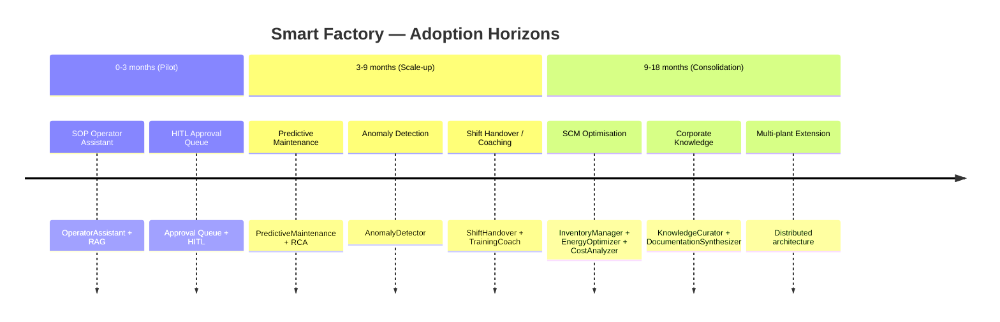
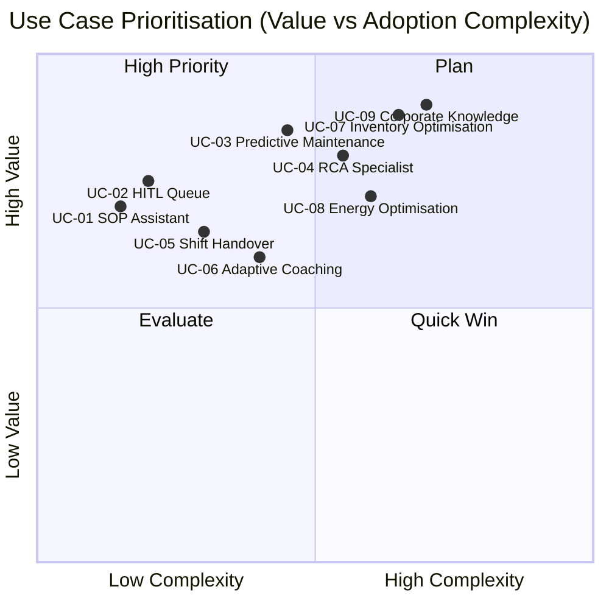

# Prioritised Use Cases

Use cases for the Smart Factory Transformation platform organised by adoption time horizon. Every case is traced to the implemented capability/agent in the corresponding phase. Improvement values are **SIMULATED TARGETS** derived from the synthetic Mantis dataset (Phase 9) and Industry 4.0 textile literature — they do not constitute contractual promises.

---

## Horizon Overview

---

## Horizon 0–3 months — Pilot: Quick Wins

Use cases activatable with minimal installation; measurable within a few production weeks.

### UC-01 · SOP Operator Assistant

| Field | Detail |
|-------|--------|
| **Persona** | Machine operator (textile shift) |
| **Problem** | Consults paper manuals or colleagues for SOP procedures; search delays; variability in responses |
| **Capability / Agent** | `OperatorAssistant` (Phase 6 — `packages/sft-agents/src/ops/`) + BGE-M3 RAG pipeline + Qdrant (Phase 5 — `05-04-qdrant-bootstrap-SUMMARY.md`) |
| **How it works** | The operator types a question in natural language; the system retrieves the relevant SOP chunk via hybrid retrieval and responds in Italian with source reference |
| **Value (SIMULATED TARGET)** | −30% average procedure search time; −15% SOP deviations per shift |
| **Prerequisites** | Docker Compose stack, SOP dataset indexed in Qdrant |
| **Traceability** | Phase 5 QdrantIndexer + RetrievalPipeline; Phase 6 OperatorAssistant agent.py; Phase 10 Angular UI |

### UC-02 · HITL Approval Queue

| Field | Detail |
|-------|--------|
| **Persona** | Shift supervisor / Manager |
| **Problem** | AI decisions on machine stops or maintenance orders must be validated before execution; no structured channel exists |
| **Capability / Agent** | HITL interrupt-to-resume LangGraph (Phase 4) + Angular Approval Queue UI (Phase 10) + SSE real-time |
| **How it works** | Each critical agent decision generates an HITL event; the supervisor receives an SSE notification, sees evidence and rationale, approves or rejects with a note; the agent resumes or is cancelled |
| **Value (SIMULATED TARGET)** | 100% of critical AI decisions submitted for human review; −40% average decision time vs manual process |
| **Prerequisites** | JWT auth, `supervisor` role configured |
| **Traceability** | Phase 4 HITL interrupt/resume; Phase 10 ApprovalCardComponent + SSE; Phase 11 STRIDE-mapped audit trail |

---

## Horizon 3–9 months — Scale-up: Operational Clusters

Activation of the maintenance cluster and training agents after pilot consolidation.

### UC-03 · Predictive Maintenance

| Field | Detail |
|-------|--------|
| **Persona** | Maintenance technician |
| **Problem** | Unplanned failures on looms and spinning machines; reactive interventions with high MTTR; high downtime costs |
| **Capability / Agent** | `PredictiveMaintenance` (Phase 7) + `AnomalyDetector` (Phase 6) + OPC-UA simulator (Phase 3) |
| **How it works** | Synthetic OPC-UA sensor transmits vibration/temperature; AnomalyDetector classifies the anomaly; PredictiveMaintenance generates a work order with urgency score and intervention proposal; HITL notifies the technician for approval |
| **Value (SIMULATED TARGET)** | −25% MTTR; −20% unplanned failures; +15% plant availability |
| **Prerequisites** | UC-01/UC-02 active; OPC-UA simulator configured for textile signature |
| **Traceability** | Phase 3 sim-textile; Phase 6 AnomalyDetector; Phase 7 PredictiveMaintenance + MaintenanceCoach |

### UC-04 · Root Cause Analysis (RCA)

| Field | Detail |
|-------|--------|
| **Persona** | Senior technician / Quality manager |
| **Problem** | After a repeated failure, the root cause must be identified; manual analysis takes hours or days |
| **Capability / Agent** | `RCASpecialist` (Phase 7) with LLM reasoning + Neo4j knowledge graph (Phase 5) |
| **How it works** | RCASpecialist collects the anomaly event audit trail, queries the knowledge graph for historical patterns, generates a structured root-cause report (5-Whys + evidence) |
| **Value (SIMULATED TARGET)** | −60% RCA analysis time; +35% root-cause hypothesis coverage vs manual analysis |
| **Prerequisites** | Neo4j populated with failure modes YAML (Phase 5 `05-03`); anomaly history ≥30 days |
| **Traceability** | Phase 5 Neo4j bootstrap; Phase 7 RCASpecialist + MaintenanceCoach agent.py |

### UC-05 · Structured Shift Handover

| Field | Detail |
|-------|--------|
| **Persona** | Outgoing/incoming shift leader |
| **Problem** | Informal verbal handover between shifts causes omissions; anomalies not passed to the next shift |
| **Capability / Agent** | `ShiftHandover` (Phase 8) with audit anomaly aggregation |
| **How it works** | At end of shift, ShiftHandover automatically aggregates ANOMALY_ALERT events from the audit trail, generates a structured report with open items and priorities; the incoming shift leader receives the briefing via UI with approval capability |
| **Value (SIMULATED TARGET)** | −70% handover omissions; +20% incoming shift onboarding speed |
| **Prerequisites** | UC-02 active (HITL audit trail); anomaly threshold configuration |
| **Traceability** | Phase 8 ShiftHandover/ShiftAggregator + Decision D-SH-02 (audit.actions ANOMALY_ALERT) |

### UC-06 · Adaptive Operator Coaching

| Field | Detail |
|-------|--------|
| **Persona** | Operator in training / Training manager |
| **Problem** | Training is standardised; not adapted to individual profile or gaps emerging in production |
| **Capability / Agent** | `TrainingCoach` (Phase 8) + RAG SOP knowledge base (Phase 5) |
| **How it works** | TrainingCoach analyses operator interactions with OperatorAssistant, identifies recurring gap areas, generates personalised training paths with quizzes and relevant SOP material |
| **Value (SIMULATED TARGET)** | −35% certification time for new operators; −20% SOP deviations for system-trained operators |
| **Prerequisites** | UC-01 active for ≥30 days (interaction history) |
| **Traceability** | Phase 8 TrainingCoach; Phase 5 RetrievalPipeline + QdrantIndexer |

---

## Horizon 9–18 months — Consolidation: Supply Chain & Knowledge

Activation of SCM cluster, economic optimisation, and corporate knowledge capitalisation.

### UC-07 · Inventory & Stock Optimisation

| Field | Detail |
|-------|--------|
| **Persona** | Purchasing manager / Supply chain manager |
| **Problem** | Stock excess on textile raw materials and semi-finished goods; unexpected stockouts; reactive ordering at premium price |
| **Capability / Agent** | `InventoryManager` (Phase 9) + `DemandForecaster` (Phase 9) with TimescaleDB hypertable |
| **How it works** | DemandForecaster publishes the demand plan in state['demand_plan']; InventoryManager calculates the optimal reorder point and generates order proposals submitted to HITL approval |
| **Value (SIMULATED TARGET)** | −20% capital tied up in stock; −15% stockouts; −10% emergency purchasing costs |
| **Prerequisites** | 18 months of order history in scm.historical_orders; UC-02 HITL active |
| **Traceability** | Phase 9 InventoryManager (SCM-01); DemandForecaster state['demand_plan'] (09-05-SUMMARY); TimescaleDB inventory_levels hypertable |

### UC-08 · Energy Optimisation

| Field | Detail |
|-------|--------|
| **Persona** | Plant manager / Energy manager |
| **Problem** | Textile machinery energy consumption not optimised relative to time-of-use tariffs; avoidable peak consumption |
| **Capability / Agent** | `EnergyOptimizer` (Phase 9) + TimescaleDB energy_readings hypertable |
| **How it works** | EnergyOptimizer analyses historical consumption by time slot, identifies off-peak load shift opportunities, calculates expected_savings_pct (clamped [0,100]), proposes optimisation plan with estimated ROI |
| **Value (SIMULATED TARGET)** | −12% annual energy cost; +8 percentage points of consumption shifted to off-peak |
| **Prerequisites** | TimescaleDB energy_readings populated; UC-07 active |
| **Traceability** | Phase 9 EnergyOptimizer (off_peak_kwh_pct over ALL readings, Decision CR-05 clamping) |

### UC-09 · Corporate Knowledge Capitalisation

| Field | Detail |
|-------|--------|
| **Persona** | Knowledge manager / CIO |
| **Problem** | Technical knowledge is scattered across unstructured documents, in senior minds, and uninterpreted audit trails; knowledge drain risk with turnover |
| **Capability / Agent** | `KnowledgeCurator` (Phase 8) autonomous + `DocumentationSynthesizer` (Phase 8) + Qdrant + Neo4j |
| **How it works** | KnowledgeCurator automatically indexes and validates new documents (Decision D-KC-04: autonomous without HITL gating); DocumentationSynthesizer generates updated SOP drafts from production patterns; drafts are submitted for human editorial approval |
| **Value (SIMULATED TARGET)** | +40% reuse of existing documentation in searches; −25% new SOP production time; −50% knowledge drain risk |
| **Prerequisites** | UC-01/UC-05/UC-06 active (data feed for curation) |
| **Traceability** | Phase 8 KnowledgeCurator (D-KC-04 autonomous); Phase 8 DocumentationSynthesizer; Phase 5 Qdrant + Neo4j |

---

## Prioritisation Matrix

---

## Summary Table

| ID | Use Case | Horizon | Agent/Phase | SIMULATED TARGET |
|----|----------|---------|-------------|-----------------|
| UC-01 | SOP Operator Assistant | 0–3 m | OperatorAssistant (Ph.6) + RAG (Ph.5) | −30% SOP search time |
| UC-02 | HITL Approval Queue | 0–3 m | HITL LangGraph (Ph.4) + UI (Ph.10) | 100% critical decisions reviewed |
| UC-03 | Predictive Maintenance | 3–9 m | PredictiveMaintenance (Ph.7) + AnomalyDetector (Ph.6) | −25% MTTR |
| UC-04 | Root Cause Analysis | 3–9 m | RCASpecialist (Ph.7) + Neo4j (Ph.5) | −60% RCA time |
| UC-05 | Shift Handover | 3–9 m | ShiftHandover (Ph.8) | −70% handover omissions |
| UC-06 | Adaptive Coaching | 3–9 m | TrainingCoach (Ph.8) + RAG (Ph.5) | −35% certification time |
| UC-07 | Inventory Optimisation | 9–18 m | InventoryManager (Ph.9) + DemandForecaster (Ph.9) | −20% stock capital |
| UC-08 | Energy Optimisation | 9–18 m | EnergyOptimizer (Ph.9) | −12% energy cost |
| UC-09 | Corporate Knowledge | 9–18 m | KnowledgeCurator (Ph.8) + DocumentationSynthesizer (Ph.8) | −50% knowledge drain risk |

> **SIMULATED TARGET note:** all improvement values are estimated on the synthetic Mantis dataset (Phase 9) and Industry 4.0 textile literature benchmarks. They do not constitute contractual guarantees. See the Assumption Register for underlying assumptions.
