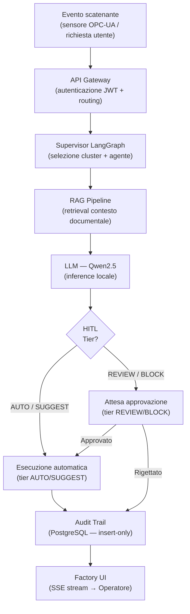

# Analisi Funzionale

Questa sezione documenta i workflow end-to-end della piattaforma Smart Factory Transformation,
organizzati per cluster funzionale. Ogni workflow è tracciabile agli agenti implementati
nelle fasi di sviluppo (SC-3).

## I tre cluster funzionali

| Cluster | Agenti implementati | Fase | Workflow |
|---------|---------------------|------|----------|
| **OPS** (Operations) | OperatorAssistant, ProductionPlanner, QualityInspector, AnomalyDetector | 6 | [Operations](operations-workflow.md) |
| **MNT** (Maintenance) | PredictiveMaintenance, RCASpecialist, MaintenanceCoach, DowntimeAnalyzer | 7 | [Maintenance](maintenance-workflow.md) |
| **TRN** (Knowledge/Training) | ShiftHandover, TrainingCoach, KnowledgeCurator, DocumentationSynthesizer | 8 | [Training](training-workflow.md) |

> Il quarto cluster **SCM** (InventoryManager, EnergyOptimizer, DemandForecaster, CostAnalyzer)
> è documentato nella sezione [Analisi Economica](../economic-analysis/index.md) poiché il
> suo workflow principale produce output di costo/valore piuttosto che operativi.

## Pattern comune a tutti i workflow

## Principi di tracciabilità

- **OPC-UA → NATS unidirezionale:** tutti gli eventi di sensore entrano nel sistema
  dal solo `svc-ot-bridge` (data-diode — flusso inverso bloccato, Fase 1/3)
- **HITL 4-tier:** ogni agente dichiara il proprio tier di approvazione; i tier
  REVIEW/BLOCK sospendono il grafo LangGraph e attendono risposta via API Gateway
- **Audit immutabile:** ogni ActionType è registrato in PostgreSQL come insert-only
  prima che il risultato venga restituito all'utente (Fase 4)
- **RAG contestuale:** OperatorAssistant, RCASpecialist, MaintenanceCoach, TrainingCoach,
  KnowledgeCurator e DocumentationSynthesizer eseguono retrieval ibrido su Qdrant
  (BGE-M3 dense + BM25 sparse) per arricchire il prompt con contesto documentale (Fase 5)
