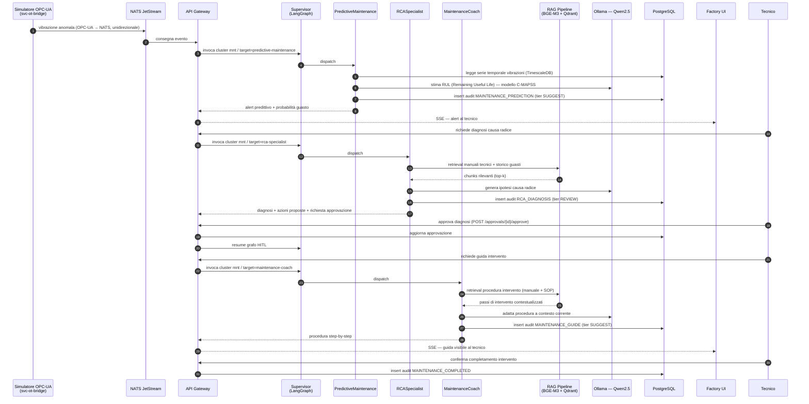
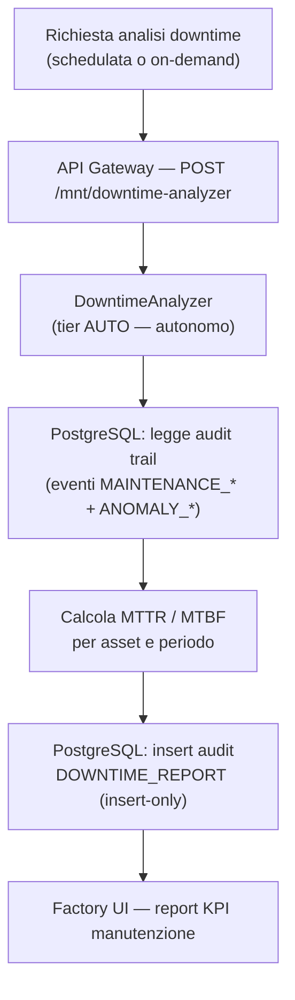

# Workflow Maintenance (MNT)

Il cluster Maintenance gestisce la manutenzione predittiva, la diagnosi di cause radice
e la formazione tecnica on-the-job. È composto da 4 agenti implementati nella Fase 7.

> **SC-3 — Tracciabilità:** questo workflow mappa gli step agli agenti in
> `packages/sft-agents/src/sft_agents/` (Fase 7), al router `build_maintenance_subgraph()`
> e alle API in `apps/api-gateway/src/svc_api_gateway/routers/maintenance_agents.py`.
> RCASpecialist è il fallback del router (D-RCA-02): un target sconosciuto viene
> sempre instradato a RCA, garantendo il gate HITL.

## Agenti del cluster MNT

| Agente | Slug | HITL Tier | Ruolo |
|--------|------|-----------|-------|
| PredictiveMaintenance | `predictive-maintenance` | SUGGEST (1) | Previsione guasti da serie temporali (NASA C-MAPSS) |
| RCASpecialist | `rca-specialist` | REVIEW (2) | Analisi causa radice — fallback del router (D-RCA-02) |
| MaintenanceCoach | `maintenance-coach` | SUGGEST (1) | Guida step-by-step intervento tecnico (RAG su manuali) |
| DowntimeAnalyzer | `downtime-analyzer` | AUTO (0) | Calcolo MTTR/MTBF da audit trail (lettura pura) |

## Workflow end-to-end: alert predittivo → intervento tecnico

## Workflow: analisi downtime (autonomo)

> DowntimeAnalyzer opera in tier AUTO: è un agente di sola lettura che calcola
> metriche da dati storici senza proporre azioni irreversibili. Non richiede
> approvazione umana (D-DA pattern, Fase 7).

## Punti di integrazione

| Punto | Sistema | Note |
|-------|---------|------|
| Ingresso vibrazione | NATS JetStream ← OPC-UA | Unidirezionale |
| Retrieval manuali | Qdrant + BGE-M3 | Manuali tecnici, storico guasti (Fase 5) |
| Modello predittivo | NASA C-MAPSS | Embeddings per stima RUL (Fase 3/7) |
| Audit trail | PostgreSQL `audit_log` | Insert-only, ActionType tipizzato |
| KPI manutenzione | TimescaleDB | MTTR/MTBF calcolati da hypertable |
