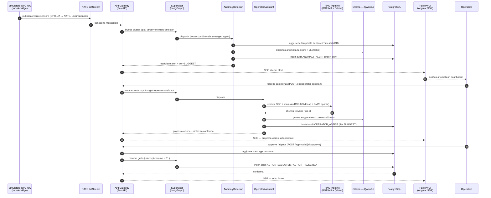
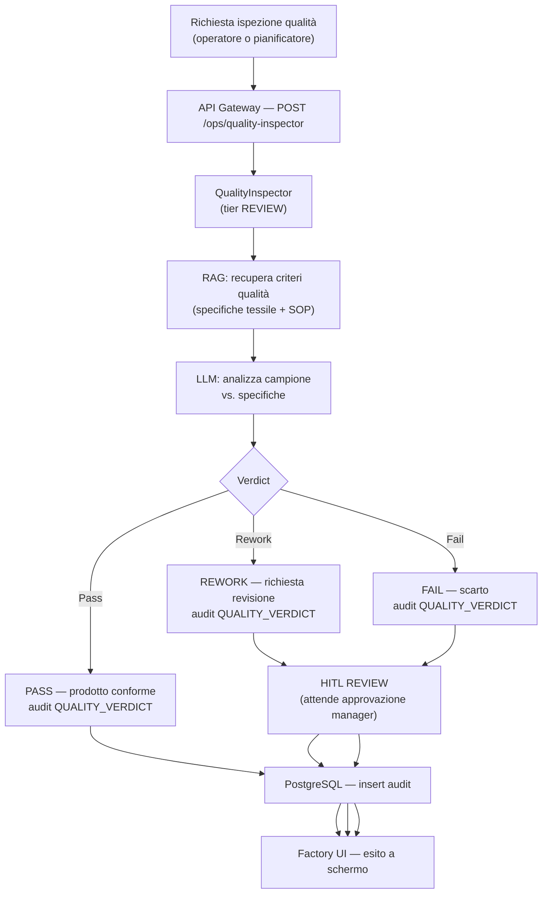

# Workflow Operations (OPS)

Il cluster Operations gestisce la supervisione della produzione in tempo reale,
la pianificazione dei turni e il controllo qualità. È composto da 4 agenti
implementati nella Fase 6 del progetto.

> **SC-3 — Tracciabilità:** questo workflow mappa gli step agli agenti in
> `packages/sft-agents/src/sft_agents/` (Fase 6), al router `build_ops_subgraph()`
> e alle API in `apps/api-gateway/src/svc_api_gateway/routers/ops_agents.py`.

## Agenti del cluster OPS

| Agente | Slug | HITL Tier | Ruolo |
|--------|------|-----------|-------|
| OperatorAssistant | `operator-assistant` | SUGGEST (1) | Supporto in tempo reale all'operatore, RAG su SOP |
| ProductionPlanner | `production-planner` | REVIEW (2) | Pianificazione turni e obiettivi produzione |
| QualityInspector | `quality-inspector` | REVIEW (2) | Ispezione qualità, verdict pass/fail/rework |
| AnomalyDetector | `anomaly-detector` | SUGGEST (1) | Rilevamento anomalie sensori, alert in tempo reale |

## Workflow end-to-end: anomalia sensore → azione operatore

## Workflow: controllo qualità

## Punti di integrazione

| Punto | Sistema | Note |
|-------|---------|------|
| Ingresso evento sensore | NATS JetStream ← OPC-UA | Unidirezionale — flusso inverso bloccato |
| Retrieval documentale | Qdrant + BGE-M3 | SOP, specifiche qualità tessile (Fase 5) |
| Inference LLM | Ollama — Qwen2.5 | On-premise, rete interna |
| Audit trail | PostgreSQL — tabella `audit_log` | Insert-only, ActionType tipizzato |
| Notifiche real-time | SSE stream `GET /sse/events` | Angular SSR riceve event stream (Fase 10) |
