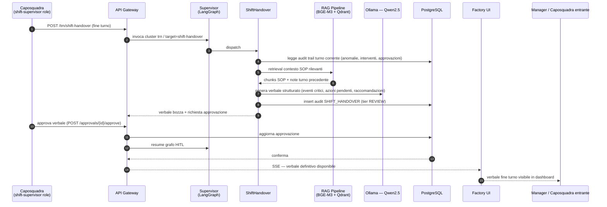
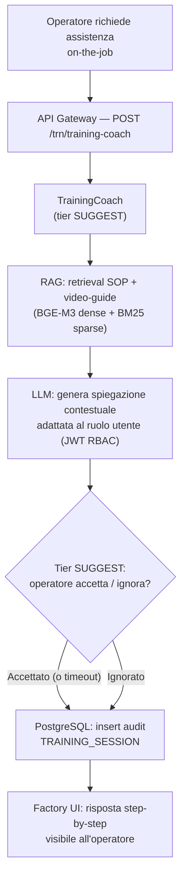
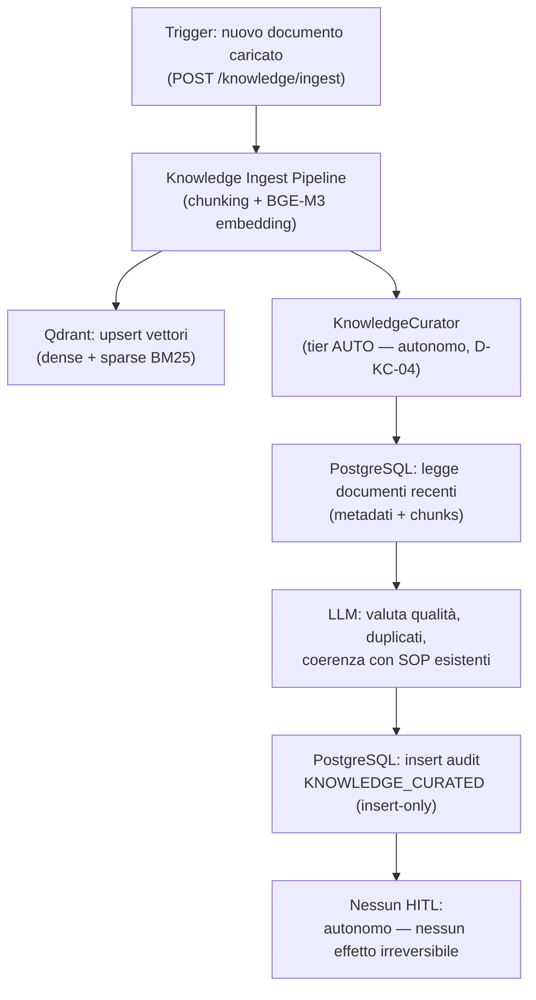
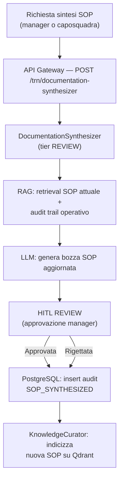

# Workflow Training / Knowledge (TRN)

Il cluster Knowledge gestisce il trasferimento di conoscenza operativa, la formazione
on-the-job e la curazione della base documentale. È composto da 4 agenti
implementati nella Fase 8.

> **SC-3 — Tracciabilità:** questo workflow mappa gli step agli agenti in
> `packages/sft-agents/src/sft_agents/` (Fase 8), al router `build_knowledge_subgraph()`
> e alle API in `apps/api-gateway/src/svc_api_gateway/routers/knowledge_agents.py`.
> KnowledgeCurator è il fallback del router (D-KC-04): opera in tier AUTO, senza
> HITL, senza effetti irreversibili.

## Agenti del cluster TRN

| Agente | Slug | HITL Tier | Ruolo |
|--------|------|-----------|-------|
| ShiftHandover | `shift-handover` | REVIEW (2) | Sintesi verbale fine-turno, trasferimento conoscenza |
| TrainingCoach | `training-coach` | SUGGEST (1) | Coaching contestuale operatore / tecnico (RAG su SOP) |
| KnowledgeCurator | `knowledge-curator` | AUTO (0) | Curazione autonoma documenti, aggiornamento indice RAG |
| DocumentationSynthesizer | `documentation-synthesizer` | REVIEW (2) | Sintesi e aggiornamento SOP da esperienze operative |

## Workflow end-to-end: fine turno → verbale di consegna

## Workflow: coaching operatore durante intervento

## Workflow: curazione autonoma documenti

> KnowledgeCurator non ha endpoint `/resume`: è completamente autonomo (D-KC-04).
> Il gateway restituisce HTTP 200 (non 202) perché l'esecuzione è sincrona e
> senza sospensione HITL (Decisione Fase 08-08).

## Workflow: sintesi SOP da esperienze operative

## Punti di integrazione

| Punto | Sistema | Note |
|-------|---------|------|
| Audit trail turno | PostgreSQL `audit_log` | Base dati per ShiftHandover (Fase 4) |
| Retrieval SOP | Qdrant + BGE-M3 | SOP, note operative, verbali precedenti (Fase 5) |
| Ingest documenti | Knowledge Ingest Pipeline | Chunking + embedding + upsert Qdrant (Fase 5) |
| Inference LLM | Ollama — Qwen2.5 | On-premise, rete interna |
| RBAC contestuale | JWT — 4 ruoli | La risposta del coach si adatta al ruolo del richiedente (Fase 10) |
