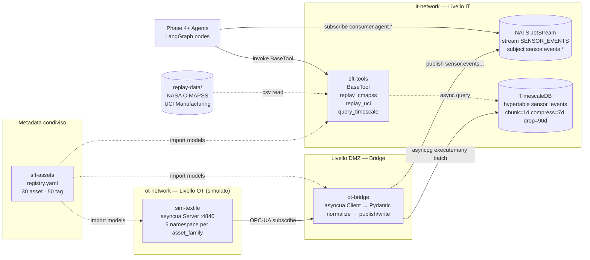

# IT/OT Simulation Layer

Il **IT/OT Simulation Layer** (Phase 3) costruisce il substrato di telemetria live e storica che alimenta tutti gli agenti downstream della piattaforma Smart Factory Transformation (Phase 4-7).

---

## Scopo

La Phase 3 produce tre componenti fondamentali:

1. **sim-textile** — simulatore Python di fabbrica tessile che emette stream di sensori realistici (inclusi fault injection calibrati per 5 famiglie di asset) via OPC-UA su `opc.tcp://sim-textile:4840`.
2. **ot-bridge** — data-diode OT Bridge che sottoscrive l'OPC-UA e ri-pubblica eventi normalizzati `SensorEvent` su NATS JetStream (`sensor.events.<family>.<asset_id>.<tag_id>`) e li scrive su TimescaleDB.
3. **sft-assets + sft-tools** — registry degli asset reali (30 asset, 50 tag, 5 famiglie) e LangChain Tools per il replay dei dataset storici (NASA C-MAPSS, UCI Manufacturing).

---

## Architettura



**Flusso dati:** sim-textile genera eventi (con fault injection) → server OPC-UA → ot-bridge sottoscrive → normalizza in `SensorEvent` Pydantic → fan-out a NATS (per agents) e TimescaleDB (per query storiche). Gli agenti Phase 4+ leggono SOLO via NATS subscribe o tool invocation — mai direttamente da OPC-UA.

---

## Decisioni chiave

| ID  | Titolo                                            | Impatto                                                  |
|-----|---------------------------------------------------|----------------------------------------------------------|
| D-44 | Fault injection: profili YAML per-asset           | 5 profili calibrati per family (loom, spinning, warping, dyeing, finishing) |
| D-45 | Asset registry: package `sft-assets`              | SSOT per metadata piattaforma (30 asset, 50 tag, 5 famiglie) |
| D-48 | Load test: steady-state 60s + mix realistico      | p99 < 200ms a 5000 msg/s (IOT-10)                        |
| D-49 | TimescaleDB retention: chunk=1d/compress=7d/drop=90d | Hot tier 7d, warm drop 90d (A-007 dataset coverage)  |
| D-51 | Data-diode enforcement: 3 layer                   | Docker ACL + pytest + grep static-analysis               |
| D-52 | NATS subject hierarchy bloccata                   | `sensor.events.<family>.<asset_id>.<tag_id>`             |

---

## Success criteria Phase 3

1. **IOT-01**: sim-textile emette OPC-UA su 5 famiglie con fault injection calibrata (YAML profiles).
2. **IOT-02**: ot-bridge sottoscrive OPC-UA e pubblica `SensorEvent` normalizzati su NATS JetStream.
3. **IOT-03**: TimescaleDB hypertable `sensor_events` con compression + retention (D-49).
4. **IOT-09**: Ingest schema documentato in MkDocs bilingue (questa sezione) — asset registry, tag dictionary, schema OPC-UA.
5. **IOT-10**: Full load test 5k msg/s × 60s steady-state definito e PR-label gated in CI (D-48).

---

## Sezioni

- [Schema ingest](ingest-schema.md) — Asset registry, tag dictionary, unità di misura, SensorEvent JSON, NATS subjects, hypertable TimescaleDB.
- [Schema OPC-UA](opcua-schema.md) — Namespace pattern, endpoint, security policy, variable nodes, data-diode enforcement.

---

## Validazione

```bash
# Integration test end-to-end (stack IT/OT)
make integration-test

# Smoke load test (1k msg/s × 10s — IOT-10 smoke gate)
make smoke-load

# Full load test (5k msg/s × 60s — IOT-10 full gate, gated da PR-label load-test)
make load-test-full
```

---

*Fonte: `.planning/phases/03-it-ot-simulation-layer/03-CONTEXT.md` — Versione: commit annotato `Source: registry.yaml@Phase3`*
