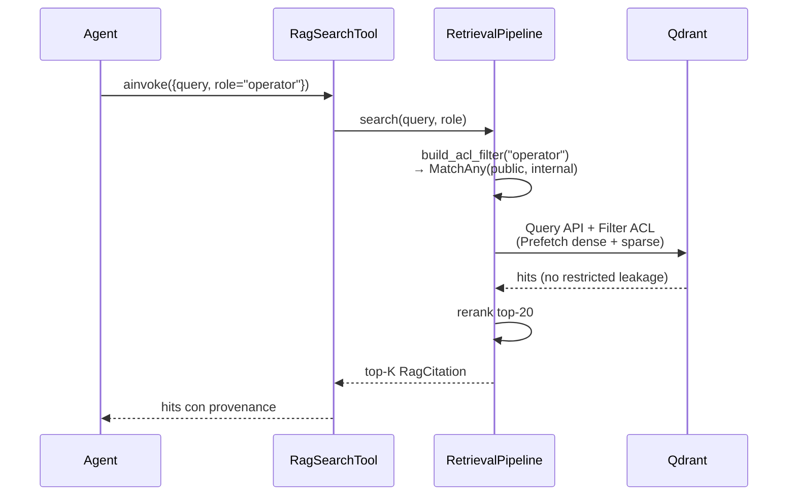

# Modello ACL — knowledge layer

L'ACL del knowledge layer è il meccanismo che impedisce a un agent o utente con un determinato `role` di leggere chunk classificati come fuori scope. Il modello è enforced **prima** del retrieval lato Qdrant (pre-filter), non lato applicazione: questo elimina la classe di errori in cui un bug in un agent leakerebbe contenuti restricted.

---

## Audience → acl_level (D-72)

Ogni SOP del corpus dichiara `acl_level` nel frontmatter YAML. I quattro valori sono:

| acl_level | Audience | Esempio di contenuto |
|-----------|----------|----------------------|
| `public` | Chiunque (anche guest) | Glossario, panoramica processi |
| `internal` | Tutti i dipendenti | SOP operative standard, manuali macchina |
| `confidential` | Reparto tecnico + supervisor | Diagnosi guasti complessi, parametri di taratura |
| `restricted` | Solo supervisor/admin/quality manager | Procedure di sicurezza HSE, deviazioni dal capitolato cliente |

**Default fallback (D-67/D-72):** se `acl_level` è assente dal frontmatter, `MarkdownParser` logga `sop_missing_acl_level` con WARN e usa il default `internal` (mai `public`, mai `restricted`). Questa scelta privilegia la safety: un SOP non taggato è trattato come riservato ai dipendenti, mai pubblicato.

---

## ROLE_TO_ACL (costante)

Il modulo `sft_knowledge.retrieval` espone la costante `ROLE_TO_ACL`:

```python
ROLE_TO_ACL: dict[str, frozenset[str]] = {
    "guest":           frozenset({"public"}),
    "operator":        frozenset({"public", "internal"}),
    "technician":      frozenset({"public", "internal", "confidential"}),
    "shift_supervisor": frozenset({"public", "internal", "confidential"}),
    "quality_manager": frozenset({"public", "internal", "confidential", "restricted"}),
    "admin":           frozenset({"public", "internal", "confidential", "restricted"}),
}
```

L'helper `build_acl_filter(role)` produce il `qdrant_client.http.models.Filter` corrispondente:

```python
from sft_knowledge.retrieval import ROLE_TO_ACL, build_acl_filter

flt = build_acl_filter(role="operator")
# Filter(must=[FieldCondition(key='acl_level',
#                             match=MatchAny(any=['public', 'internal']))])
```

---

## Flusso end-to-end



---

## Non-leak guarantee (Phase 5 SC#2)

Il success criterion SC#2 della Phase 5 richiede:

> "A query from an `operator`-role user cannot retrieve `restricted`-tagged chunks."

Questa garanzia è coperta da **test di integrazione** in `packages/sft-knowledge/tests/test_acl_enforcement.py`:

- Indicizza un corpus misto con `acl_level` ∈ {`public`, `internal`, `restricted`}
- Esegue una query come `role="operator"`
- Verifica che il top-20 NON contenga NESSUN chunk `restricted`

Il test fallisce immediatamente se il filtro ACL viene mai costruito senza `must` clauses, se il payload index `acl_level` viene rimosso, o se la mappa `ROLE_TO_ACL` viene modificata in modo non-conservativo.

---

## Threat model

- **T-05-ACL-01 (Information Disclosure):** mitigato dal pre-filter Qdrant. Un bug agent-side che dimentica di passare `role` viene catturato dallo schema Pydantic del tool (campo `role: str` obbligatorio).
- **T-05-ACL-02 (Elevation of Privilege):** mitigato dal fatto che `ROLE_TO_ACL` è una `dict[str, frozenset]` immutabile esposta come costante di modulo: nessun caller può mutarla a runtime per "promuovere" un role.
- **T-05-ACL-03 (Audit gap):** ogni `RagCitation` include `acl_level` del chunk recuperato; il logger struttogger emette un evento `rag_search_done` con i acl_level visti. Phase 11 OBS correla questo evento con il role utente per audit completo.

---

## Riferimenti

- [Architettura](architecture.md)
- [Retrieval pipeline](retrieval-pipeline.md)
- 05-PATTERNS.md Pattern 2 — ACL pre-filter
