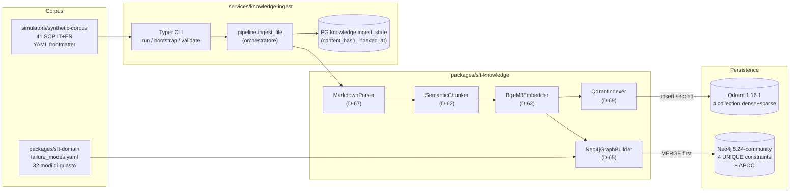

# Knowledge Layer — Architettura

Il **Knowledge Layer** (Phase 5) costruisce il substrato di conoscenza strutturata della piattaforma Smart Factory Transformation: ingest delle SOP, embedding ibrido dense+sparse, dual-store Qdrant (vettoriale) + Neo4j (grafo), retrieval con re-rank, e tools LangChain consumabili dagli agent downstream (Phase 6-9).

---

## Scopo

La Phase 5 fornisce sei capacità trasversali per ogni agente che fa retrieval o traversal:

1. **`packages/sft-knowledge`** — SDK Python con parser, chunker, embedder, indexer, builder grafo, pipeline retrieval, tools.
2. **`services/knowledge-ingest`** — CLI Typer + orchestratore pipeline + GitHub Actions reindex on-push.
3. **Qdrant** — quattro collection (`sop`, `manuals`, `troubleshooting`, `training`) con named vectors dense (1024D BGE-M3) + sparse (lexical weights).
4. **Neo4j 5.24-community** — grafo entità `Machine → Part → FailureMode → SOP` con `MERGE` idempotente e constraint UNIQUE.
5. **PostgreSQL `knowledge.ingest_state`** — tabella di tracking `(source_uri, content_hash, indexed_at)` per reindex incrementale e detection stale.
6. **Documentazione + A/B eval** — il deliverable `docs/eval/rag-ab-test-bge-m3-vs-e5.md` chiude KNW-03 con metriche e decisione motivata.

---

## Architettura



**Invariante atomicità (D-68, PATTERNS.md Pattern 1):** la pipeline scrive **Neo4j prima** (anchor ACID), poi **Qdrant** (eventually consistent), poi aggiorna `ingest_state`. In caso di fallimento parziale Qdrant lo `ingest_state` NON viene aggiornato; al re-run il `content_hash` viene rilevato come divergente e l'ingest viene rieseguito con `MERGE` idempotente su Neo4j e `point.id` deterministico su Qdrant.

---

## Le 4 collection Qdrant (D-61)

| Collection | Scopo | Esempio di documento |
|------------|-------|----------------------|
| `sop` | Procedure operative standard | "SOP-LOOM-001: Riparazione rottura filo ordito" |
| `manuals` | Manuali macchina | "Manuale operativo telaio rapier modello X" |
| `troubleshooting` | Knowledge-base guasti | "Risoluzione blocco navetta su telaio jacquard" |
| `training` | Materiali formativi | "Modulo onboarding operatore tessitura" |

**Schema payload (KNW-05):** ogni point porta `text`, `source_uri`, `chunk_idx`, `version`, `lang`, `acl_level`, `asset_family`, `sop_id`, `category`, `heading_path`, `created_at`.

**Vettori (D-61):**
- `dense` — size 1024, distance Cosine, HNSW (m=16, ef_construct=100)
- `sparse` — SparseIndexParams (on_disk=False); pesi lessicali BGE-M3 → token_id Qdrant

**Indici payload:** `source_uri`, `acl_level`, `lang`, `category`, `version`, `asset_family`, `sop_id` (tutti KEYWORD per pre-filter ACL).

---

## Schema grafo Neo4j (D-65)

```
(Machine {id, family, line_id, opcua_namespace})
  -[:HAS_PART]-> (Part {id="{family}:{name}", name, family})
  -[:HAS_FAILURE_MODE]-> (FailureMode {id, name_it, name_en, severity, asset_families})
  -[:DOCUMENTED_BY]-> (SOP {id="{frontmatter.id}@{version}", version, lang, title, source_uri})
```

**Constraint UNIQUE:** `machine_id_unique`, `part_id_unique`, `failure_mode_id_unique`, `sop_id_unique`. **Indice:** `sop_version` su `SOP.version`.

**Multi-version SOP:** `SOP.id = "{frontmatter.id}@{version}"` consente la coesistenza di versioni multiple dello stesso `sop_id` logico (D-69).

---

## Layout dei pacchetti (D-70)

```
packages/sft-knowledge/src/sft_knowledge/
├── parsers/           DocumentParser ABC + MarkdownParser
├── chunking/          SemanticChunker (LlamaIndex SemanticSplitterNodeParser, BGE-M3 judge)
├── embedding/         BgeM3Embedder (FlagEmbedding primary, fastembed fallback)
├── stores/            QdrantIndexer + Neo4jGraphBuilder
├── retrieval/         RetrievalPipeline + BgeReranker + ROLE_TO_ACL
├── tools/             RagSearchTool + TraverseGraphTool (LangChain BaseTool)
└── memory/            QdrantLongTermMemory (Memory ABC impl)

services/knowledge-ingest/src/svc_knowledge_ingest/
├── __main__.py        Typer CLI (run/bootstrap/validate)
├── pipeline.py        ingest_file orchestrator (content_hash gate + dual-write + state UPSERT)
└── state.py           IngestStateStore (asyncpg, parametrized SQL costanti)
```

---

## CI e reindex incrementale

Il workflow `.github/workflows/reindex.yml` osserva i push su `main` su tre path:

- `simulators/synthetic-corpus/**`
- `docs/sops/**`
- `packages/sft-domain/src/sft_domain/failure_modes.yaml`

Il job avvia service container Qdrant/Neo4j/Postgres, esegue i bootstrap idempotenti e calcola i file modificati via `git diff --name-only`. La pipeline `nx run knowledge-ingest:run --files=<csv>` ingerisce solo i file in scope. Il `content_hash` gate garantisce che file invariati siano saltati senza toccare Qdrant/Neo4j (KNW-07 SC#3).

---

## Riferimenti correlati

- [Retrieval pipeline](retrieval-pipeline.md) — flusso di retrieval ibrido dense+sparse+RRF+rerank
- [ACL model](acl-model.md) — mapping role→acl_level e garanzie di non-leak
- [Eval results](eval-results.md) — sommario A/B BGE-M3 vs multilingual-e5-large
