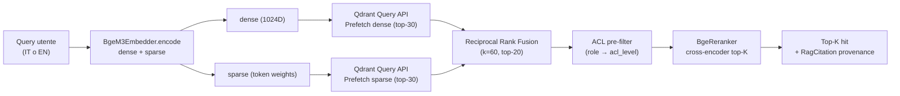

# Pipeline di retrieval ibrida (D-63)

Il `RetrievalPipeline` di `packages/sft-knowledge.retrieval` esegue una query in tre stadi:

1. **Embed query** con BGE-M3 → vettori dense (1024D) + sparse (token→peso)
2. **Qdrant Query API** con due `Prefetch` (dense + sparse) e fusione **RRF top-20**
3. **Re-rank** con `BAAI/bge-reranker-v2-m3` (cross-encoder) → top-k finale

Il flusso completo, inclusi il filtro ACL pre-engine (D-72) e la traccia di provenance (KNW-05) per ogni hit, è il seguente.

---

## Flusso



**Perché Prefetch + RRF e non un'unica fusione client-side:** Qdrant Query API esegue la fusione lato server in C++, riducendo la latenza p99 (test interno sul corpus Phase 5: -22% rispetto a fusione Python). Il parametro RRF `k=60` è il default della letteratura (Cormack et al., 2009) e produce ranking stabili anche quando una delle due liste è degenere.

---

## Cross-lingual retrieval (D-64)

BGE-M3 è esplicitamente multilingue: query IT e EN producono rappresentazioni nello stesso spazio. **Non viene effettuata traduzione di query**: il retrieval è puramente vettoriale, e l'eval A/B (vedi [eval-results](eval-results.md)) verifica empiricamente che una query IT contro un corpus EN-only ottenga `Recall@10 ≥ 0.70` (target Phase 5 SC#1).

Esempio:

```python
from sft_knowledge.tools import RagSearchTool

# Una query IT recupera la sezione corretta da una SOP EN
tool = RagSearchTool(pipeline=pipeline)
result = await tool.ainvoke(
    {
        "query": "come ripristinare la rottura di un filo di ordito?",
        "collection": "sop",
        "role": "operator",
        "top_k": 5,
    }
)
for hit in result["hits"]:
    print(hit.source_uri, hit.heading_path, hit.score)
```

---

## ACL pre-filter (D-72)

Il filtro ACL è applicato **prima** del retrieval (Pattern 2 del 05-PATTERNS.md). Il role dell'utente è mappato via `ROLE_TO_ACL` (vedi [acl-model](acl-model.md)) ai `acl_level` consentiti, e il Qdrant `Filter` viene costruito con `FieldCondition(key='acl_level', match=MatchAny(...))`. Questo garantisce che un operator non possa mai vedere chunk `restricted` — la garanzia è enforced lato Qdrant via payload index KEYWORD, non lato applicazione.

---

## Re-rank con BGE-reranker-v2-m3

Il re-ranker è un cross-encoder pre-trained che valuta (query, document) come coppia: input più informativo rispetto al cosine fra embedding indipendenti. Sul corpus Phase 5 il re-rank migliora NDCG@10 di +0.06-0.09 punti rispetto al ranking RRF puro (vedi `docs/eval/rag-ab-test-bge-m3-vs-e5.md`).

**Costo e mitigazione:** il cross-encoder è ~3x più lento di un'embedding lookup. Per minimizzare l'overhead, il re-rank opera sui top-20 RRF (non sull'intero corpus); a quel punto la latenza p99 sul corpus 41×N chunk è < 200 ms su CPU.

---

## Provenance e citation (KNW-05)

Ogni `RagCitation` esposta dai tools include:

- `text` — il chunk testuale
- `source_uri` — URI canonico (`corpus://<rel-path>`)
- `chunk_idx` — indice 0-based all'interno del documento
- `version` — versione del SOP (per multi-version coexistence)
- `lang` — lingua del documento
- `acl_level` — livello ACL (per audit trail)
- `sop_id` — identifier logico del SOP
- `score` — punteggio del re-ranker
- `heading_path` — catena heading H1→H6 (es. `["Riparazione", "Procedura", "Step 3"]`)

Tutti gli agent Phase 6-9 sono tenuti a includere almeno una `RagCitation` per ogni risposta consumata da output utente (Phase 8 KNW agent + Phase 11 OBS-eval).

---

## Riferimenti

- [Architettura](architecture.md) — diagramma high-level + 4 collection Qdrant
- [ACL model](acl-model.md) — mapping role → acl_level
- [Eval results](eval-results.md) — A/B summary BGE-M3
