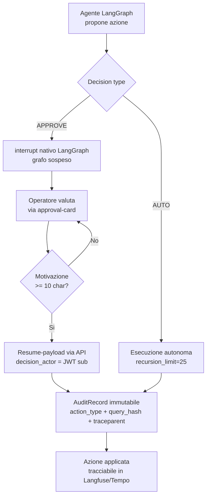

---
tags:
  - security
  - governance
  - explainability
---

# Sicurezza & Governance

La piattaforma Smart Factory Transformation adotta un modello di sicurezza
trasversale (cross-cutting) che copre il confine IT/OT, la pipeline RAG e
l'orchestrazione agentica. Questa sezione documenta il threat model, la conformità
agli standard LLM e i controlli di governance dell'AI **come implementati** nel
codice (DOC-11, SC-3).

## Documenti di questa sezione

| Documento | Contenuto | Standard |
|-----------|-----------|----------|
| [STRIDE Threat Model](stride-threat-model.md) | Matrice 6×3 (6 categorie × 3 superfici = 18 celle) con mitigazione mappata a codice | STRIDE, ASVS L2 (SC-4) |
| [OWASP LLM Top 10](owasp-llm.md) | Mapping dei 10 rischi LLM 2025 alle mitigazioni concrete | OWASP LLM Top 10 (2025), SEC-02 |

!!! note "Single source of truth"
    Il contenuto pubblicato in questa sezione è allineato fedelmente alla fonte
    autoritativa **Phase 11** (`docs/security/`). Ogni modifica va effettuata nella
    fonte e ripubblicata qui per evitare divergenze.

---

## AI Explainability & Governance

La governance dell'AI nella piattaforma si fonda su quattro pilastri implementati e
verificabili: **Human-in-the-Loop (HITL)**, **audit trail immutabile**,
**decision traceability** e **guard-rail di autonomia**. Insieme garantiscono che ogni
decisione operativa derivata da un agente LLM sia spiegabile, attribuibile e reversibile.

### 1. HITL approval chain

Le azioni agentiche con effetto operativo (`Decision.APPROVE`) non vengono mai
applicate autonomamente: il supervisore LangGraph emette un `interrupt()` nativo e
sospende il grafo finché un operatore umano non fornisce il resume-payload tramite
l'API delle approvazioni. La chain è organizzata per ruolo (RBAC):

- **operator** — propone / esegue azioni di routine entro il proprio perimetro
- **technician** — approva interventi tecnici e manutentivi
- **shift supervisor** — approva azioni di pianificazione e cross-team
- **auditor** — accesso in sola lettura all'audit trail (SEC-03), nessun potere di approvazione

Il frontend impone una motivazione minima (`MOTIVATION_MIN_LENGTH = 10` caratteri)
per ogni approvazione/rifiuto, così che la decisione umana sia sempre giustificata.

Riferimento codice:

- `packages/sft-agents/src/sft_agents/runtime/supervisor.py:safe_invoke` — interrupt + recursion guard
- `apps/factory-ui/src/app/shared/approval-card/approval-card.component.ts:MOTIVATION_MIN_LENGTH`

### 2. Audit trail

Ogni decisione HITL e ogni accesso a dati `restricted` produce un `AuditRecord`
immutabile, tipizzato tramite `ActionType` (es. `RESTRICTED_DOC_ACCESS`). Il record
contiene `decision`, `motivation`, `decision_actor` (sub del JWT) e un `query_hash`
SHA-256 al posto del testo in chiaro. La tipizzazione `action_type` è stata
consolidata nella migration Phase 9/11.

Riferimento codice:

- `packages/sft-knowledge/src/sft_knowledge/retrieval/pipeline.py:RetrievalPipeline._write_restricted_audit`

### 3. Decision traceability

La tracciabilità end-to-end è garantita dalla propagazione del W3C `traceparent`
attraverso il bus NATS (OTEL), correlando ogni span a Langfuse e Tempo. Da una
decisione di audit è quindi possibile risalire all'intero flusso (richiesta →
agente → tool → approvazione → azione).

Riferimento codice:

- `packages/sft-agents/src/sft_agents/otel/nats_carrier.py:NatsHeaderCarrier`

### 4. Guard-rail di autonomia

Per impedire loop costosi e comportamenti di excessive agency, ogni invocazione
agente impone un `recursion_limit=25` (default in `build_invocation_config()`;
`_RECURSION_LIMIT=5` più conservativo nei cluster supply). Il superamento del limite
solleva `GraphRecursionError → 503`. I tool disponibili sono dichiarati esplicitamente
nella toolspec LangGraph: nessun tool generico di shell/file.

Riferimento codice:

- `packages/sft-agents/src/sft_agents/llm/langfuse_callback.py:build_invocation_config`

### Flusso HITL → audit

---

## Evidence (fasi di riferimento)

| Controllo | Implementato in | Evidence |
|-----------|-----------------|----------|
| HITL 4-tier approval chain | Phase 4 (runtime) + Phase 10 (UI) | supervisor.safe_invoke, approval-card |
| Audit trail `action_type` | Phase 9/11 migration | _write_restricted_audit |
| Decision traceability (OTEL) | Phase 11 | NatsHeaderCarrier |
| recursion_limit=25 | Phase 9/11 | build_invocation_config |
| MOTIVATION_MIN | Phase 10 | approval-card.component.ts |

I dettagli completi delle mitigazioni e il loro mapping al codice sono nei documenti
[STRIDE Threat Model](stride-threat-model.md) e [OWASP LLM Top 10](owasp-llm.md).
