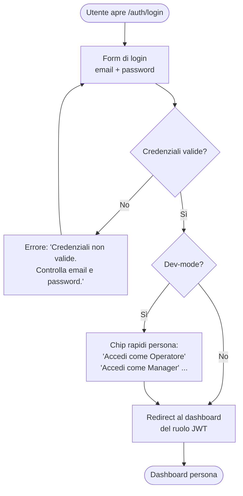
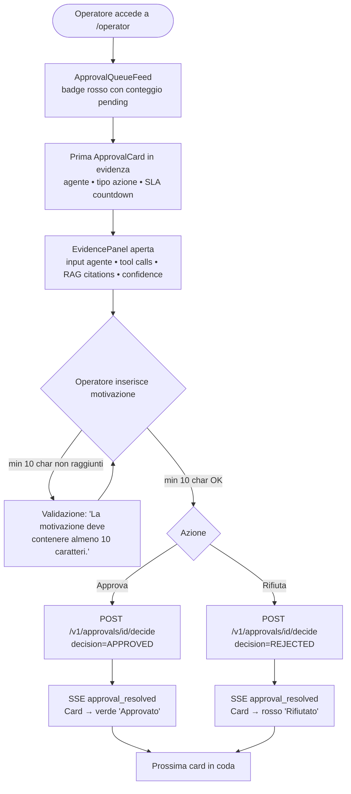
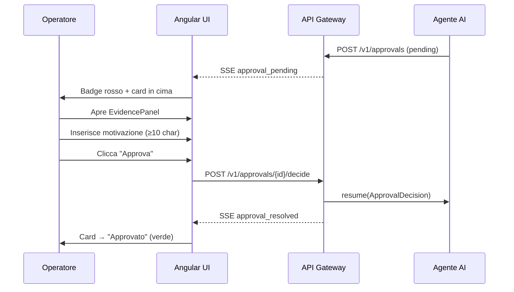
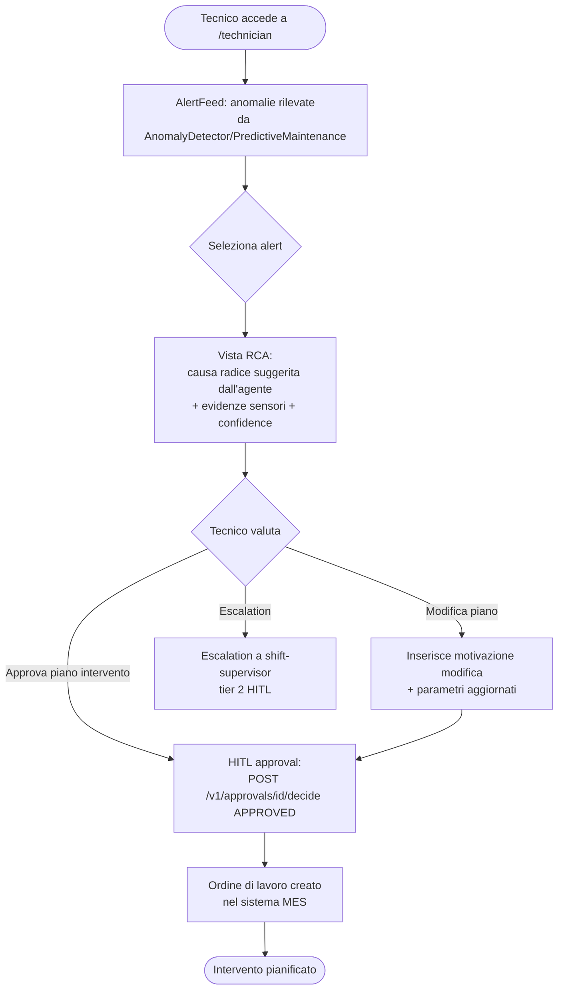
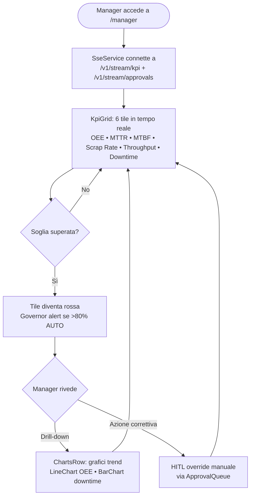

# Interfaccia Utente — Mock UI

## Panoramica

Questa pagina documenta i flussi utente principali dell'applicazione Angular 19 SSR
**Smart Factory Transformation** tramite diagrammi Mermaid per persona e riferimenti
ai componenti Angular SSR. L'interfaccia è progettata per l'uso su schermo industriale
e tablet in ambiente factory-floor: touch target ≥ 64px, contrasto WCAG AA, tema scuro
predefinito.

!!! note "Screenshot on-demand"
    Gli screenshot dell'interfaccia non sono inclusi nella documentazione statica.
    Possono essere rigenerati on-demand dallo spec Playwright
    `apps/factory-ui-e2e/src/screenshots.spec.ts` con il comando:

    ```bash
    # Avvia lo stack completo
    docker compose up -d

    # Genera gli screenshot (fuori da docs/)
    SFT_SKIP_SCREENSHOTS=false nx e2e ui-factory-e2e --spec=screenshots.spec.ts
    ```

---

## Schermata di Login

**Route:** `/auth/login`
**Componente:** `LoginPage`
**Requisito:** UI-01 (design system), UI-09 (mock-UI docs)

La pagina di login è centrata verticalmente su sfondo `--sft-surface` (`#121418`).
La card ha max-width 400px e contiene:

- Campo email con label "Indirizzo email"
- Campo password con toggle show/hide
- CTA "Accedi" (mat-flat-button, 64px height, larghezza 100%)
- Chip rapidi per le 5 persona seed (solo dev-mode)

### Flusso Login — Operatore (IT)



| Elemento | Copy IT | Copy EN |
|----------|---------|---------|
| Campo email | "Indirizzo email" | "Email address" |
| Campo password | "Password" | "Password" |
| CTA | "Accedi" | "Sign In" |
| Errore credenziali | "Credenziali non valide. Controlla email e password." | "Invalid credentials. Check email and password." |
| Dev chip | "Accedi come [Ruolo]" | "Sign in as [Role]" |

**data-testid rilevanti:** `email-input`, `password-input`, `login-btn`, `persona-chip-*`

---

## Dashboard Operatore — Coda Approvazioni

**Route:** `/operator`
**Componente:** `OperatorComponent` → `ApprovalQueueFeed` + `AlertFeed`
**Ruoli:** `operator`
**Requisiti:** UI-03 (approval queue), UI-09

Il dashboard operatore mostra la **coda approvazioni HITL** come focal point principale
(badge rosso con conteggio + prima card pending in evidenza) e l'`AlertFeed` come focal
point secondario.

Ogni `ApprovalCard` include:

- Header con badge agente, tipo azione, tier escalation, countdown SLA
- `EvidencePanel` aperta di default (input agente, tool calls, citazioni RAG, confidence)
- Textarea motivazione (min 10 char, obbligatoria)
- Barra azioni: "Rifiuta" (rosso) + "Approva" (accent)

### Flusso Operatore — Approvazione/Rifiuto HITL



### Flusso HITL — Sequenza Completa Agente → UI → Operatore



| Elemento | Copy IT | Copy EN |
|----------|---------|---------|
| Intestazione | "Approvazioni Pendenti" | "Pending Approvals" |
| Empty state | "Nessuna approvazione pendente" | "No pending approvals" |
| Approva CTA | "Approva azione" | "Approve action" |
| Rifiuta CTA | "Rifiuta" | "Reject" |
| Motivazione label | "Motivazione" | "Reason" |
| Motivazione placeholder | "Inserisci la motivazione (min. 10 caratteri)..." | "Enter your reason (min. 10 characters)..." |
| Validazione | "La motivazione deve contenere almeno 10 caratteri." | "The reason must be at least 10 characters." |
| SLA warning | "2 min rimasti" | "2 min remaining" |
| Rate limit | "Limite di 12 alert/ora raggiunto. Nuovi alert sospesi temporaneamente." | "12 alerts/hour limit reached. New alerts temporarily suspended." |

**data-testid rilevanti:** `approval-queue-feed`, `approval-card`, `evidence-panel`,
`motivation-textarea`, `approve-btn`, `reject-btn`, `alert-feed`

---

## Dashboard Tecnico — Vista RCA/Manutenzione

**Route:** `/technician`
**Componente:** `TechnicianComponent`
**Ruoli:** `technician`, `maintenance-engineer`
**Requisiti:** UI-02, UI-09

Il dashboard tecnico è il punto di accesso per i flussi di Root Cause Analysis e
gestione interventi di manutenzione suggeriti dagli agenti `RCASpecialist` e
`PredictiveMaintenance`.

### Flusso Tecnico — RCA e Manutenzione



---

## Dashboard Manager/CIO — KPI Sala Controllo

**Route:** `/manager` (anche CIO Elena reindirizzata qui)
**Componente:** `ManagerComponent` → `KpiGrid` + `ChartsRow`
**Ruoli:** `shift-supervisor`, `manager`, `cio`
**Requisiti:** UI-04 (KPI dashboard), UI-09

Il dashboard manager mostra la **griglia KPI** in tempo reale via SSE.
Layout CSS Grid: 3 colonne su desktop (≥1024px), 2 su tablet, 1 su mobile.

### Flusso Manager — Monitoraggio KPI in Tempo Reale



I 6 KPI monitorati con soglie:

| KPI | Unità | Verde | Warning | Rosso |
|-----|-------|-------|---------|-------|
| OEE | % | ≥ 85% | 80–84% | < 80% |
| MTTR | min | ≤ 30 | 30–60 | > 60 |
| MTBF | ore | ≥ 72h | 48–72h | < 48h |
| Scrap Rate | % | ≤ 2% | 2–5% | > 5% |
| Throughput | kg/h | ≥ baseline | 90–99% | < 90% |
| Downtime | % | ≤ 5% | 5–10% | > 10% |

| Elemento | Copy IT | Copy EN |
|----------|---------|---------|
| Titolo | "Sala Controllo" | "Control Room" |
| Live indicator | "In tempo reale" | "Live" |
| Disconnected | "Non connesso" | "Disconnected" |
| Empty KPI | "Dati non disponibili. Controlla la connessione al server." | "Data unavailable. Check server connection." |
| Governor alert | "Attenzione: più dell'80% delle azioni recenti è stato auto-approvato. Verifica le soglie di intervento." | "Warning: more than 80% of recent actions were auto-approved. Review intervention thresholds." |

**data-testid rilevanti:** `kpi-grid`, `kpi-tile-oee`, `kpi-tile-mttr`, `charts-row`,
`sse-indicator`, `governor-alert`

### Aggiornamento KPI in Tempo Reale (SSE)

Il componente `SseService` gestisce la connessione Server-Sent Events con riconnessione
automatica (exponential backoff: 1s → 2s → 4s → max 30s).

| Evento SSE | Subject | Azione UI |
|------------|---------|-----------|
| `kpi_update` | `/v1/stream/kpi` | Aggiorna Signal KPI in tempo reale |
| `approval_pending` | `/v1/stream/approvals` | Badge rosso su nav "Approvazioni" |
| `alert_new` | `/v1/stream/alerts` | Append in AlertFeed (max 12/ora) |
| `approval_resolved` | `/v1/stream/approvals` | Card → approvato/rifiutato |
| `sse_heartbeat` | tutti | Reset timer riconnessione |

---

## Toggle Lingua (IT / EN)

**Posizione:** TopBar, sempre visibile.
**Requisito:** UI-07 (i18n runtime switch)

Il toggle lingua usa `@jsverse/transloco` per cambiare lingua a runtime senza page reload.
Lo stato viene persistito in `localStorage['sft_locale']`.

| Locale | Comportamento |
|--------|--------------|
| IT (default) | Rendering SSR in italiano; nessuna dipendenza dal browser |
| EN | Caricamento lazy del bundle transloco `/en.json` (≤ 500ms) |

**data-testid:** `language-toggle` — usato nella screenshot spec e nei test E2E.

---

## Architettura Componenti

```
AppShell
├── TopBar (64px)
│   ├── LanguageToggle [data-testid="language-toggle"]
│   ├── ThemeToggle [data-testid="theme-toggle"]
│   └── SSE LiveIndicator [data-testid="sse-indicator"]
├── NavigationRail (72px desktop) / BottomNav (mobile)
└── RouterOutlet
    ├── /auth/login → LoginPage
    ├── /operator   → OperatorComponent (ApprovalQueueFeed + AlertFeed)
    ├── /manager    → ManagerComponent (KpiGrid + ChartsRow)
    ├── /technician → TechnicianComponent
    ├── /admin      → AdminComponent
    └── /demo       → DemoComponent (PersonaWalkthrough)
```

Tutti i componenti utilizzano Angular Signals per la reattività e sono protetti da
RBAC guard (`JwtService` via `RBAC_GUARD_SERVICE_TOKEN`).
