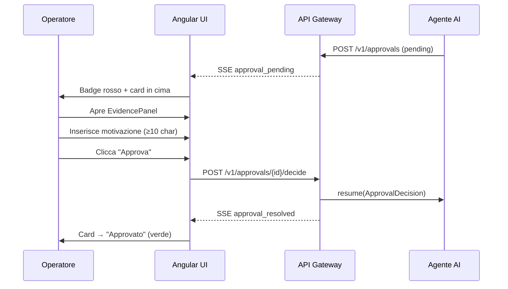

# Interfaccia Utente — Mock UI

## Panoramica

Questa pagina documenta le schermate principali dell'applicazione Angular 19 SSR
**Smart Factory Transformation**, catturate nelle lingue italiano (predefinito) e inglese.
L'interfaccia è progettata per l'uso su schermo industriale e tablet in ambiente factory-floor:
touch target ≥ 64px, contrasto WCAG AA, tema scuro predefinito.

!!! info "Screenshot generati automaticamente"
    Le immagini in questa pagina vengono generate automaticamente dallo spec Playwright
    `apps/factory-ui-e2e/src/screenshots.spec.ts` durante la CI. Per rigenerare manualmente:
    
    ```bash
    # Avvia lo stack completo
    docker compose up -d
    
    # Genera gli screenshot
    SFT_SKIP_SCREENSHOTS=false nx e2e ui-factory-e2e --spec=screenshots.spec.ts
    ```

---

## Schermata di Login

**Route:** `/auth/login`  
**Requisito:** UI-01 (design system), UI-09 (mock-UI docs)

La pagina di login è centrata verticalmente su sfondo `--sft-surface` (`#121418`).
La card ha max-width 400px e contiene:

- Campo email con label "Indirizzo email"
- Campo password con toggle show/hide
- CTA "Accedi" (mat-flat-button, 64px height, larghezza 100%)
- Chip rapidi per le 5 persona seed (solo dev-mode)

=== "Italiano (IT)"

    
    
    | Elemento | Copy IT |
    |----------|---------|
    | Campo email | "Indirizzo email" |
    | Campo password | "Password" |
    | CTA | "Accedi" |
    | Errore credenziali | "Credenziali non valide. Controlla email e password." |
    | Dev chip | "Accedi come [Ruolo]" |

=== "English (EN)"

    
    
    | Element | Copy EN |
    |---------|---------|
    | Email field | "Email address" |
    | Password field | "Password" |
    | CTA | "Sign In" |
    | Error | "Invalid credentials. Check email and password." |
    | Dev chip | "Sign in as [Role]" |

---

## Dashboard Operatore — Coda Approvazioni

**Route:** `/operator`  
**Ruoli:** `operator`  
**Requisiti:** UI-03 (approval queue), UI-09

Il dashboard operatore mostra la **coda approvazioni HITL** come focal point principale
(badge rosso con conteggio + prima card pending in evidenza) e l'`AlertFeed` come focal
point secondario.

Ogni `ApprovalCard` include:

- Header con badge agente, tipo azione, tier escalation, countdown SLA
- `EvidencePanel` aperta di default (input agente, tool calls, citazioni RAG, confidence)
- Textarea motivazione (min 10 char, obbligatoria)
- Barra azioni: "Rifiuta" (rosso) + "Approva" (accent)

=== "Italiano (IT)"

    
    
    | Elemento | Copy IT |
    |----------|---------|
    | Intestazione | "Approvazioni Pendenti" |
    | Empty state | "Nessuna approvazione pendente" |
    | Approva CTA | "Approva azione" |
    | Rifiuta CTA | "Rifiuta" |
    | Motivazione label | "Motivazione" |
    | Motivazione placeholder | "Inserisci la motivazione (min. 10 caratteri)..." |
    | Validazione | "La motivazione deve contenere almeno 10 caratteri." |
    | SLA warning | "2 min rimasti" |
    | Rate limit | "Limite di 12 alert/ora raggiunto. Nuovi alert sospesi temporaneamente." |

=== "English (EN)"

    
    
    | Element | Copy EN |
    |---------|---------|
    | Header | "Pending Approvals" |
    | Empty state | "No pending approvals" |
    | Approve CTA | "Approve action" |
    | Reject CTA | "Reject" |
    | Motivation label | "Reason" |
    | Motivation placeholder | "Enter your reason (min. 10 characters)..." |
    | Validation | "The reason must be at least 10 characters." |
    | SLA warning | "2 min remaining" |
    | Rate limit | "12 alerts/hour limit reached. New alerts temporarily suspended." |

### Flusso HITL — Passi Interazione



---

## Dashboard Manager — KPI Sala Controllo

**Route:** `/manager`  
**Ruoli:** `shift-supervisor`, `manager`  
**Requisiti:** UI-04 (KPI dashboard), UI-09

Il dashboard manager mostra la **griglia KPI** in tempo reale via SSE.
Layout CSS Grid: 3 colonne su desktop (≥1024px), 2 su tablet, 1 su mobile.

I 6 KPI monitorati con soglie:

| KPI | Unità | Verde | Warning | Rosso |
|-----|-------|-------|---------|-------|
| OEE | % | ≥ 85% | 80–84% | < 80% |
| MTTR | min | ≤ 30 | 30–60 | > 60 |
| MTBF | ore | ≥ 72h | 48–72h | < 48h |
| Scrap Rate | % | ≤ 2% | 2–5% | > 5% |
| Throughput | kg/h | ≥ baseline | 90–99% | < 90% |
| Downtime | % | ≤ 5% | 5–10% | > 10% |

=== "Italiano (IT)"

    
    
    | Elemento | Copy IT |
    |----------|---------|
    | Titolo | "Sala Controllo" |
    | Live indicator | "In tempo reale" |
    | Disconnected | "Non connesso" |
    | Empty KPI | "Dati non disponibili. Controlla la connessione al server." |
    | Governor alert | "Attenzione: più dell'80% delle azioni recenti è stato auto-approvato. Verifica le soglie di intervento." |

=== "English (EN)"

    
    
    | Element | Copy EN |
    |---------|---------|
    | Title | "Control Room" |
    | Live indicator | "Live" |
    | Disconnected | "Disconnected" |
    | Empty KPI | "Data unavailable. Check server connection." |
    | Governor alert | "Warning: more than 80% of recent actions were auto-approved. Review intervention thresholds." |

### Aggiornamento KPI in Tempo Reale (SSE)

Il componente `SseService` gestisce la connessione Server-Sent Events con reconnnessione
automatica (exponential backoff: 1s → 2s → 4s → max 30s).

| Evento SSE | Soggetto | Azione UI |
|------------|----------|-----------|
| `kpi_update` | `/v1/stream/kpi` | Aggiorna Signal KPI in tempo reale |
| `approval_pending` | `/v1/stream/approvals` | Badge rosso su nav "Approvazioni" |
| `alert_new` | `/v1/stream/alerts` | Append in AlertFeed (max 12/ora) |
| `approval_resolved` | `/v1/stream/approvals` | Card → approvato/rifiutato |
| `sse_heartbeat` | tutti | Reset timer riconnessione |

---

## Toggle Lingua (IT / EN)

**Posizione:** TopBar, sempre visibile.  
**Requisito:** UI-07 (i18n runtime switch)

Il toggle lingua usa `@jsverse/transloco` per cambiare lingua a runtime senza page reload.
Lo stato viene persistito in `localStorage['sft_locale']`.

| Locale | Comportamento |
|--------|--------------|
| IT (default) | Rendering SSR in italiano; nessuna dipendenza dal browser |
| EN | Caricamento lazy del bundle transloco `/en.json` (≤ 500ms) |

**data-testid:** `language-toggle` — usato nella screenshot spec e nei test E2E.

---

## Architettura Componenti

```
AppShell
├── TopBar (64px)
│   ├── LanguageToggle [data-testid="language-toggle"]
│   ├── ThemeToggle [data-testid="theme-toggle"]
│   └── SSE LiveIndicator [data-testid="sse-indicator"]
├── NavigationRail (72px desktop) / BottomNav (mobile)
└── RouterOutlet
    ├── /auth/login → LoginPage
    ├── /operator   → OperatorComponent (ApprovalQueueFeed + AlertFeed)
    ├── /manager    → ManagerComponent (KpiGrid + ChartsRow)
    ├── /technician → TechnicianComponent
    ├── /admin      → AdminComponent
    └── /demo       → DemoComponent (PersonaWalkthrough)
```

Tutti i componenti utilizzano Angular Signals per la reattività e sono protetti da
RBAC guard (`JwtService` via `RBAC_GUARD_SERVICE_TOKEN`).
