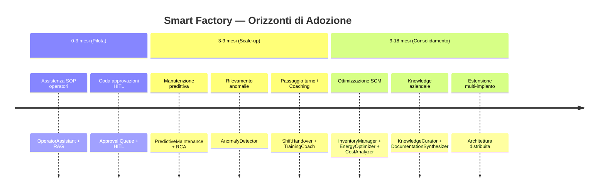
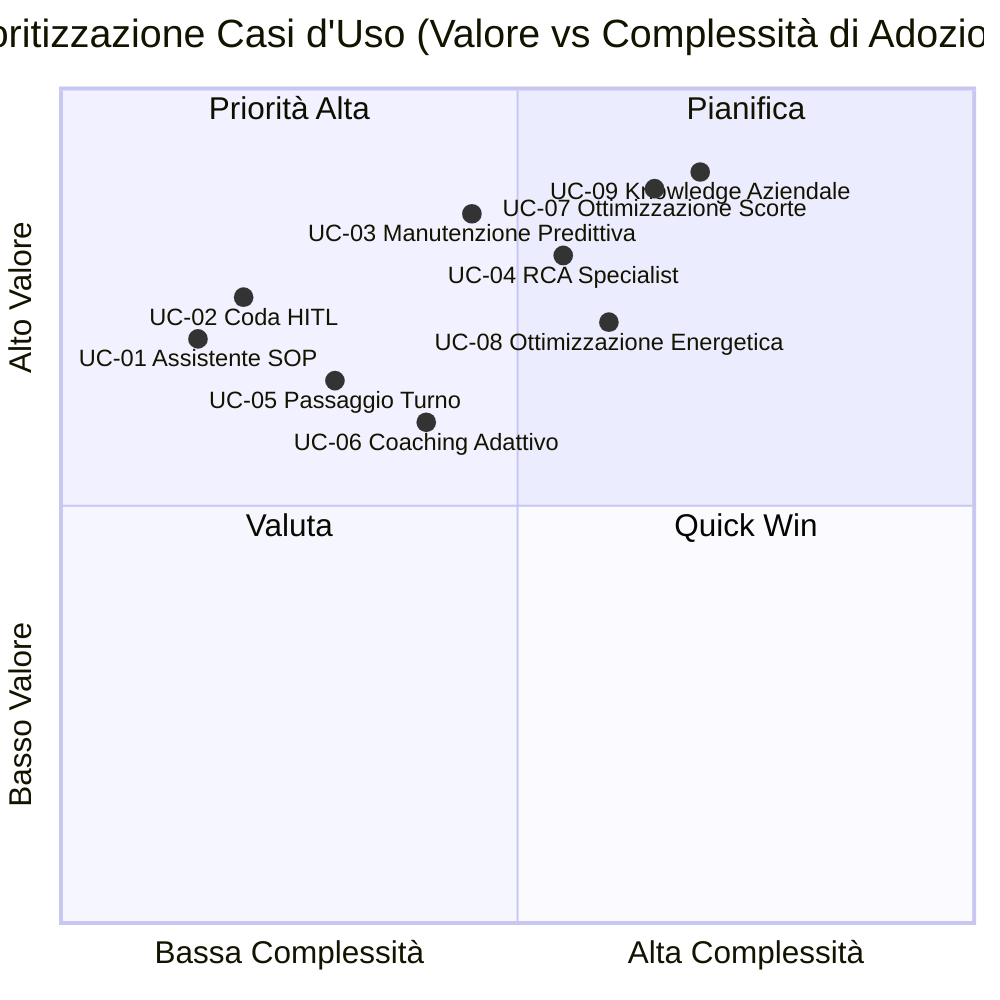

# Casi d'Uso Prioritizzati

Casi d'uso della piattaforma Smart Factory Transformation organizzati per orizzonte temporale di adozione. Ogni caso è tracciato alla capability/agente implementato nella fase corrispondente. I valori di miglioramento sono **SIMULATED TARGET** derivati dal dataset sintetico Mantis (Phase 9) e dalla letteratura Industry 4.0 tessile — non costituiscono promesse contrattuali.

---

## Panoramica degli Orizzonti

---

## Orizzonte 0–3 mesi — Pilota: Valore Rapido

Casi d'uso attivabili con installazione minima; misurabili in poche settimane di produzione.

### UC-01 · Assistente SOP Operatore

| Campo | Dettaglio |
|-------|-----------|
| **Persona** | Operatore macchina (turno tessile) |
| **Problema** | Consulta manuali cartacei o colleghi per procedure SOP; ritardi nelle ricerche; variabilità nelle risposte |
| **Capability / Agente** | `OperatorAssistant` (Phase 6 — `packages/sft-agents/src/ops/`) + pipeline RAG BGE-M3 + Qdrant (Phase 5 — `05-04-qdrant-bootstrap-SUMMARY.md`) |
| **Come funziona** | L'operatore digita la domanda in linguaggio naturale; il sistema recupera il chunk SOP pertinente via hybrid retrieval e risponde in italiano con riferimento alla fonte |
| **Valore (SIMULATED TARGET)** | −30% tempo medio ricerca procedura; −15% deviazioni SOP per turno |
| **Prerequisiti** | Docker Compose stack, dataset SOP indicizzato in Qdrant |
| **Tracciabilità** | Phase 5 QdrantIndexer + RetrievalPipeline; Phase 6 OperatorAssistant agent.py; Phase 10 Angular UI |

### UC-02 · Coda di Approvazione HITL

| Campo | Dettaglio |
|-------|-----------|
| **Persona** | Supervisore / Manager di turno |
| **Problema** | Le decisioni AI su fermi macchina o ordini di manutenzione devono essere validate prima dell'esecuzione; nessun canale strutturato esistente |
| **Capability / Agente** | HITL interrupt-to-resume LangGraph (Phase 4 — `04-HITL-SUMMARY`) + Angular Approval Queue UI (Phase 10) + SSE real-time |
| **Come funziona** | Ogni decisione critica dell'agente genera un evento HITL; il supervisore riceve la notifica via SSE, vede evidenze e motivazione, approva o rifiuta con nota; l'agente riprende o viene annullato |
| **Valore (SIMULATED TARGET)** | 100% delle decisioni critiche AI sottoposte a revisione umana; −40% tempo medio a decisione rispetto al processo manuale |
| **Prerequisiti** | JWT auth, ruolo `supervisor` configurato |
| **Tracciabilità** | Phase 4 HITL interrupt/resume; Phase 10 ApprovalCardComponent + SSE; Phase 11 audit trail STRIDE-mapped |

---

## Orizzonte 3–9 mesi — Scale-up: Cluster Operativi

Attivazione del cluster manutenzione e degli agenti di formazione dopo consolidamento del pilota.

### UC-03 · Manutenzione Predittiva

| Campo | Dettaglio |
|-------|-----------|
| **Persona** | Tecnico manutenzione |
| **Problema** | Guasti non pianificati su telai e filatoi; interventi reattivi con alto MTTR; costi di fermo elevati |
| **Capability / Agente** | `PredictiveMaintenance` (Phase 7 — `07-agents-maintenance-reliability/`) + `AnomalyDetector` (Phase 6 — `ops/`) + simulatore OPC-UA (Phase 3) |
| **Come funziona** | Il sensore sintetico OPC-UA trasmette vibrazioni/temperatura; AnomalyDetector classifica l'anomalia; PredictiveMaintenance genera un work order con urgency score e proposta intervento; HITL notifica il tecnico per approvazione |
| **Valore (SIMULATED TARGET)** | −25% MTTR; −20% guasti non pianificati; +15% disponibilità impianto |
| **Prerequisiti** | UC-01/UC-02 attivi; OPC-UA simulator configurato per firma tessile |
| **Tracciabilità** | Phase 3 sim-textile; Phase 6 AnomalyDetector; Phase 7 PredictiveMaintenance + MaintenanceCoach |

### UC-04 · Analisi Root Cause (RCA)

| Campo | Dettaglio |
|-------|-----------|
| **Persona** | Tecnico senior / Responsabile qualità |
| **Problema** | Dopo un guasto ripetuto occorre identificare la causa radice; analisi manuale richiede ore o giorni |
| **Capability / Agente** | `RCASpecialist` (Phase 7) con LLM reasoning + knowledge graph Neo4j (Phase 5) |
| **Come funziona** | RCASpecialist raccoglie l'audit trail degli eventi anomalia, interroga il knowledge graph per pattern storici, genera un report causa radice strutturato (5-Whys + evidence) |
| **Valore (SIMULATED TARGET)** | −60% tempo analisi RCA; +35% copertura ipotesi cause radice rispetto all'analisi manuale |
| **Prerequisiti** | Neo4j popolato con failure modes YAML (Phase 5 `05-03`); history anomalie ≥30 giorni |
| **Tracciabilità** | Phase 5 Neo4j bootstrap; Phase 7 RCASpecialist + MaintenanceCoach agent.py |

### UC-05 · Passaggio Turno Strutturato

| Campo | Dettaglio |
|-------|-----------|
| **Persona** | Capo turno (uscente/entrante) |
| **Problema** | La comunicazione informale a voce tra turni genera omissioni; anomalie non trasmesse al turno successivo |
| **Capability / Agente** | `ShiftHandover` (Phase 8 — `08-agents-knowledge-training/`) con aggregazione audit anomalie |
| **Come funziona** | A fine turno ShiftHandover aggrega automaticamente gli eventi ANOMALY_ALERT dall'audit trail, genera un report strutturato con open items e priorità; il capo turno entrante riceve il briefing via UI con possibilità di approvazione |
| **Valore (SIMULATED TARGET)** | −70% omissioni di handover; +20% velocità onboarding turno entrante |
| **Prerequisiti** | UC-02 attivo (audit trail HITL); configurazione soglie anomalia |
| **Tracciabilità** | Phase 8 ShiftHandover/ShiftAggregator + Decision D-SH-02 (audit.actions ANOMALY_ALERT) |

### UC-06 · Coaching Operatori e Formazione Adattiva

| Campo | Dettaglio |
|-------|-----------|
| **Persona** | Operatore in formazione / Responsabile formazione |
| **Problema** | La formazione è standardizzata; non adatta al profilo individuale o alle lacune emerse in produzione |
| **Capability / Agente** | `TrainingCoach` (Phase 8) + RAG SOP knowledge base (Phase 5) |
| **Come funziona** | TrainingCoach analizza le interazioni dell'operatore con OperatorAssistant, identifica aree di lacuna ricorrenti, genera percorsi di formazione personalizzati con quiz e materiale SOP pertinente |
| **Valore (SIMULATED TARGET)** | −35% tempo di certificazione nuovi operatori; −20% deviazioni SOP per operatori formati tramite il sistema |
| **Prerequisiti** | UC-01 attivo da ≥30 giorni (storico interazioni); |
| **Tracciabilità** | Phase 8 TrainingCoach; Phase 5 RetrievalPipeline + QdrantIndexer |

---

## Orizzonte 9–18 mesi — Consolidamento: Supply Chain e Knowledge

Attivazione del cluster SCM, ottimizzazione economica e capitalizzazione della conoscenza aziendale.

### UC-07 · Ottimizzazione Scorte e Inventario

| Campo | Dettaglio |
|-------|-----------|
| **Persona** | Responsabile acquisti / Supply chain manager |
| **Problema** | Eccessi di scorta su materie prime e semilavorati tessili; rotture di stock impreviste; ordini reattivi a prezzo premium |
| **Capability / Agente** | `InventoryManager` (Phase 9 — `09-agents-supply-chain-economics/`) + `DemandForecaster` (Phase 9) con TimescaleDB hypertable |
| **Come funziona** | DemandForecaster pubblica il piano domanda in state['demand_plan']; InventoryManager calcola il punto di riordino ottimale e genera proposte ordine sottoposte ad approvazione HITL |
| **Valore (SIMULATED TARGET)** | −20% capitale immobilizzato in scorte; −15% rotture di stock; −10% costi acquisto d'urgenza |
| **Prerequisiti** | 18 mesi di storico ordini in scm.historical_orders; UC-02 HITL attivo |
| **Tracciabilità** | Phase 9 InventoryManager (SCM-01); DemandForecaster state['demand_plan'] (09-05-SUMMARY); TimescaleDB hypertable inventory_levels |

### UC-08 · Ottimizzazione Energetica

| Campo | Dettaglio |
|-------|-----------|
| **Persona** | Responsabile impianto / Energy manager |
| **Problema** | Consumi energetici di macchinari tessili non ottimizzati rispetto alle fasce orarie; picchi di consumo evitabili in fascia peak |
| **Capability / Agente** | `EnergyOptimizer` (Phase 9) + TimescaleDB hypertable energy_readings |
| **Come funziona** | EnergyOptimizer analizza i consumi storici per fascia oraria, identifica shift di carico off-peak, calcola expected_savings_pct (clamped [0,100]), propone piano di ottimizzazione con ROI stimato |
| **Valore (SIMULATED TARGET)** | −12% costo energia annuale; +8 punti % di consumo spostato in fascia off-peak |
| **Prerequisiti** | TimescaleDB energy_readings popolata; UC-07 attivo |
| **Tracciabilità** | Phase 9 EnergyOptimizer (off_peak_kwh_pct su ALL readings, Decision CR-05 clamping) |

### UC-09 · Capitalizzazione della Conoscenza Aziendale

| Campo | Dettaglio |
|-------|-----------|
| **Persona** | Knowledge manager / CIO |
| **Problema** | La conoscenza tecnica è dispersa in documenti non strutturati, nelle menti dei senior, e in audit trail non interpretati; rischio di knowledge drain con turnover |
| **Capability / Agente** | `KnowledgeCurator` (Phase 8) autonomo + `DocumentationSynthesizer` (Phase 8) + Qdrant + Neo4j |
| **Come funziona** | KnowledgeCurator indicizza e valida automaticamente i nuovi documenti (Decision D-KC-04: autonomo senza HITL gating); DocumentationSynthesizer genera bozze SOP aggiornate dai pattern emersi in produzione; i draft sono sottoposti ad approvazione editoriale umana |
| **Valore (SIMULATED TARGET)** | +40% reuse di documentazione esistente nelle ricerche; −25% tempo produzione nuove SOP; −50% rischio knowledge drain |
| **Prerequisiti** | UC-01/UC-05/UC-06 attivi (feed di dati per curazione); |
| **Tracciabilità** | Phase 8 KnowledgeCurator (D-KC-04 autonomous); Phase 8 DocumentationSynthesizer; Phase 5 Qdrant + Neo4j |

---

## Matrice di Prioritizzazione

---

## Tabella Riepilogativa

| ID | Caso d'Uso | Orizzonte | Agente/Fase | SIMULATED TARGET |
|----|-----------|-----------|-------------|-----------------|
| UC-01 | Assistente SOP Operatore | 0–3 m | OperatorAssistant (Ph.6) + RAG (Ph.5) | −30% tempo ricerca SOP |
| UC-02 | Coda Approvazione HITL | 0–3 m | HITL LangGraph (Ph.4) + UI (Ph.10) | 100% decisioni critiche revisionate |
| UC-03 | Manutenzione Predittiva | 3–9 m | PredictiveMaintenance (Ph.7) + AnomalyDetector (Ph.6) | −25% MTTR |
| UC-04 | Analisi Root Cause | 3–9 m | RCASpecialist (Ph.7) + Neo4j (Ph.5) | −60% tempo RCA |
| UC-05 | Passaggio Turno | 3–9 m | ShiftHandover (Ph.8) | −70% omissioni handover |
| UC-06 | Coaching Adattivo | 3–9 m | TrainingCoach (Ph.8) + RAG (Ph.5) | −35% tempo certificazione |
| UC-07 | Ottimizzazione Scorte | 9–18 m | InventoryManager (Ph.9) + DemandForecaster (Ph.9) | −20% capitale scorte |
| UC-08 | Ottimizzazione Energetica | 9–18 m | EnergyOptimizer (Ph.9) | −12% costo energia |
| UC-09 | Knowledge Aziendale | 9–18 m | KnowledgeCurator (Ph.8) + DocumentationSynthesizer (Ph.8) | −50% rischio knowledge drain |

> **Nota SIMULATED TARGET:** tutti i valori di miglioramento sono stimati sul dataset sintetico Mantis (Phase 9) e su benchmark letteratura Industry 4.0 tessile. Non costituiscono garanzie contrattuali. Vedere l'Assumption Register per le assunzioni sottostanti.
